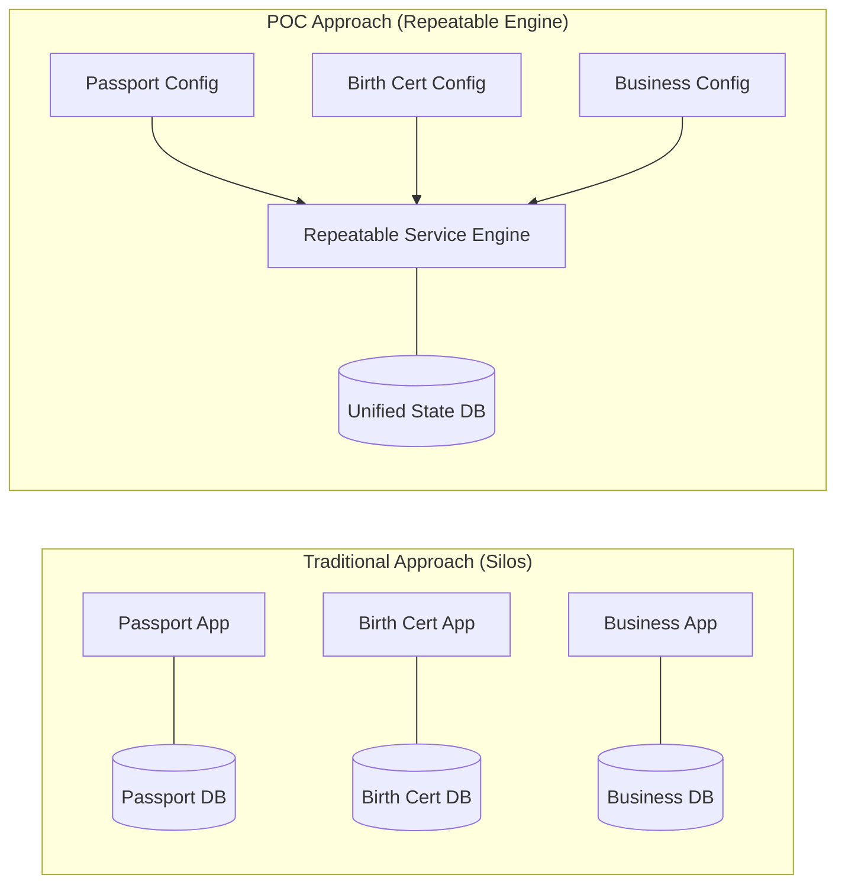
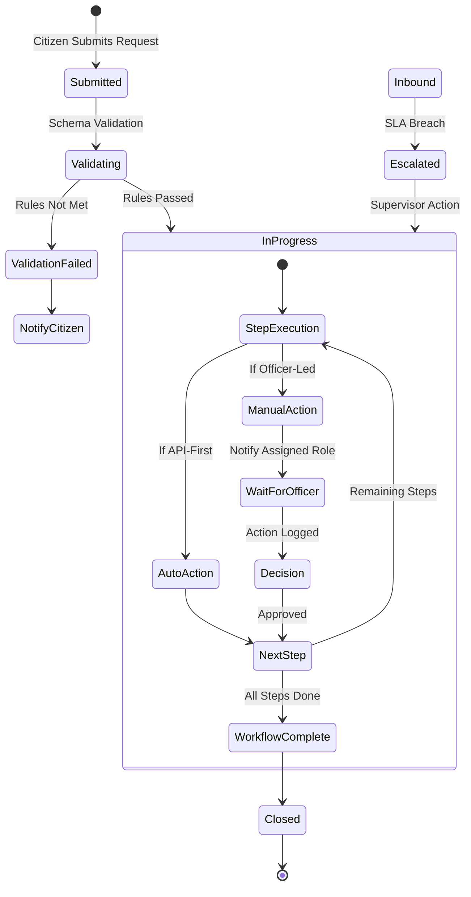
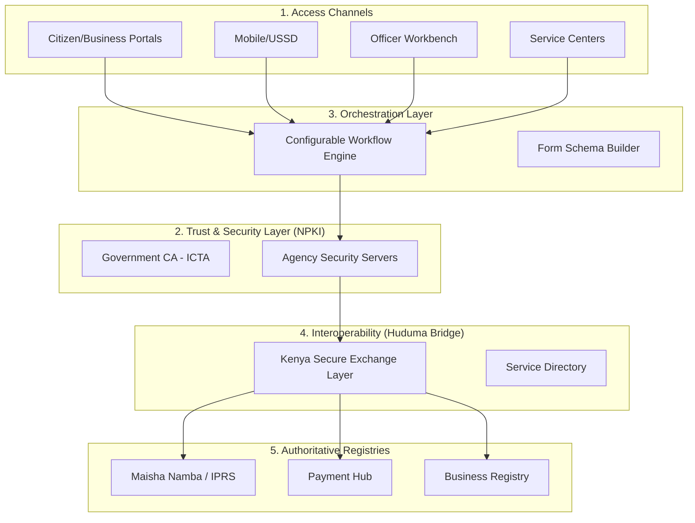
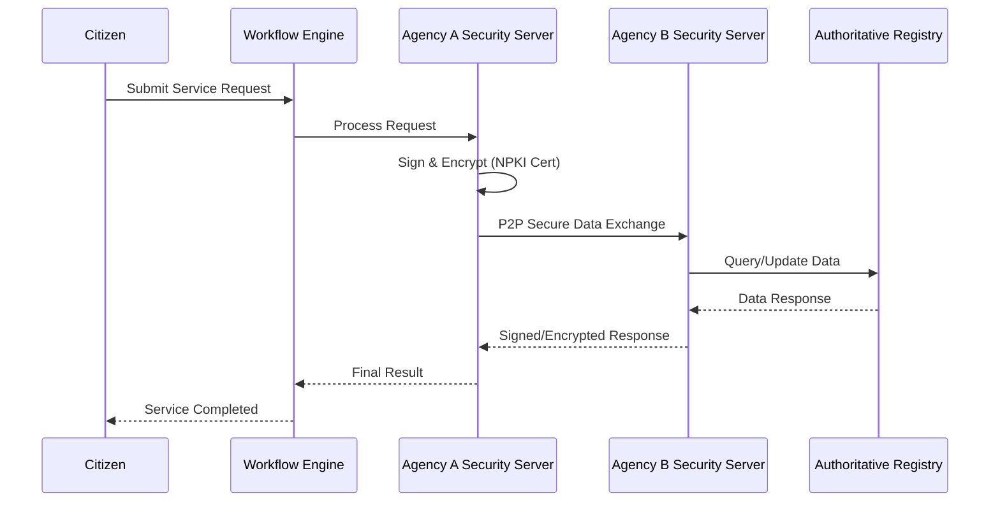
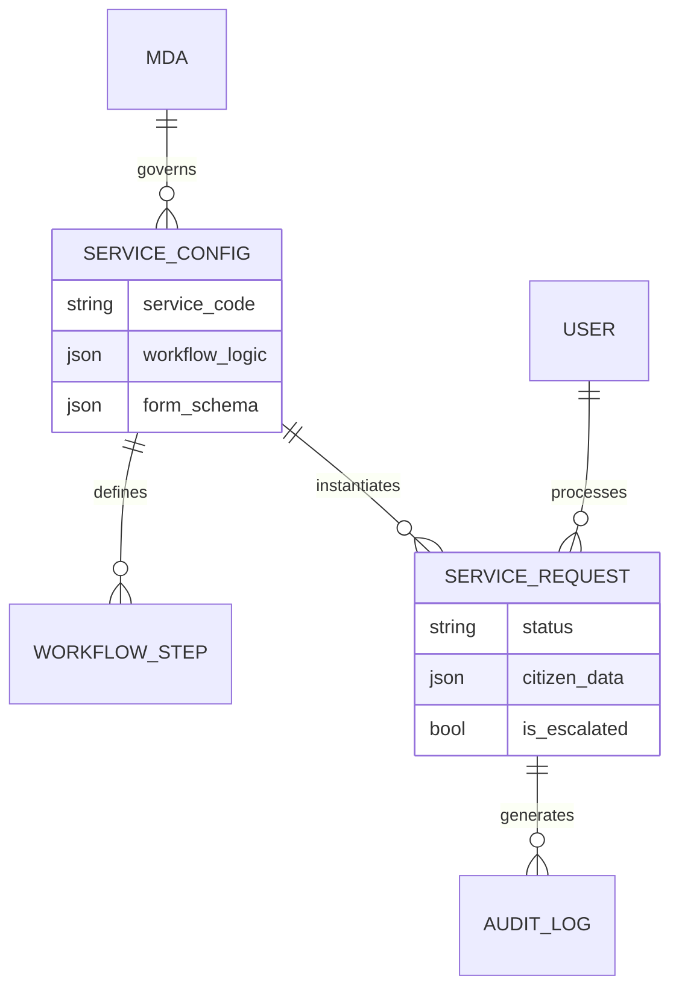

# FINAL REPORT: ASSESSMENT STUDY FOR E-SERVICE DELIVERY, MANUAL RECORDS, AND GOVERNANCE REQUIREMENTS

**Recipient:** Information and Communication Technology Authority (ICTA)  
**Project:** Repeatable Government Services Platform (Production-Centric POC)  
**Date:** February 13, 2026  
**Status:** Final Deliverable / POC Phase Completion  
**Classification:** Internal Government Use – Policy, Planning, and Decision Support

---

## 1. Executive Summary

The Repeatable Government Services Platform Proof of Concept (POC) demonstrates a fundamental shift in how Government of Kenya digital services can be designed, delivered, and scaled. Rather than continuing the historical pattern of building stand-alone, service-specific systems, the POC validates a **configuration-driven, production-centric model** where government services are defined once and executed repeatedly across Ministries, Departments, and Agencies (MDAs).

### POC at a Glance
| Dimension | Summary |
| :--- | :--- |
| **MDAs Covered** | 61 Ministries, Departments, and Agencies mapped and onboarded during the POC |
| **Services Configured** | 132 government services spanning G2C, G2B, and G2G interactions |
| **Service Delivery Model** | Repeatable, configuration-driven execution using standardized service definitions |
| **Architecture Type** | Technology-agnostic, metadata-driven platform with API-first design |
| **Compliance Alignment** | Designed for compliance with the Data Protection Act, 2019, including auditability and PII controls |
| **Deployment Readiness** | Production-ready architecture supporting Government Private Cloud and approved commercial cloud |

The core problem addressed by this POC is structural, not technical. Kenya’s digital government landscape is characterized by fragmented platforms, duplicated investments, and high long-term operational costs. The POC establishes that **government services themselves—not systems—should be the primary unit of digital transformation.**

---

## 2. Introduction & Strategic Alignment

### 2.1 Background and Problem Statement
The Government of Kenya delivers thousands of public services (4,000–6,000) across national and county levels. Historically, digital transformation has followed a project-centric model, leading to:
- **Duplication:** Similar platforms (forms, payments) built repeatedly across MDAs.
- **Inconsistency:** Fragmented user experiences for citizens and businesses.
- **Sustainability Risks:** High recurring costs (OPEX) and vendor lock-in.
- **Integration Deadlock:** Manual, paper-based dependencies between MDAs.

### 2.2 Sectoral Alignment with National Digital Masterplan
| Platform Capability Layer | Description in the POC | National Digital Masterplan Pillar |
| :--- | :--- | :--- |
| **Digital Identity Integration** | Secure authentication through authoritative registries | Secure Digital Identity & Trust Infrastructure |
| **Payments & Transactions** | Support for fees and receipting via shared gateways | Digital Economy & Cashless Govt |
| **Authoritative Registries** | Real-time validation against IPRS, KRA, BRS | Digital Public Infrastructure (DPI) |
| **Service Orchestration** | Execution of services through reusable workflows | Shared Government Platforms |
| **Interoperability & APIs** | API-first integration between MDAs | Data Exchange Framework |
| **Audit & Logging** | End-to-end traceability and immutable audit trails | Trust, Cybersecurity & Data Protection |

---

### 2.3 Strategic Outcomes for ICTA and MDAs
The POC demonstrates a path toward measurable national outcomes:

| Strategic Objective | Outcome Enabled by the POC |
| :--- | :--- |
| **Reduce ICT duplication** | Single execution engine for all services |
| **Improve service consistency** | Standard service definitions and UX |
| **Strengthen governance** | Central Service Catalogue and auditability |
| **Lower lifecycle costs** | Configuration over custom development |
| **Enable future innovation** | AI-ready, API-first architecture |

---

## 3. The "Repeatable Services" Solution

### 3.1 Core Concept: "Service-as-Configuration"
The central innovation is the **Repeatable Services Algorithm**—a model that treats government services as configurable products rather than custom software systems. By using **Metadata Blueprints** (JSON/YAML), the platform decouples service design from software development.

### 3.2 Dynamic Execution Engine
A service is considered **repeatable** when it satisfies three core conditions:
1. **Standardized Structure:** Every service follows the same core definition model (inputs, workflow, roles, outputs, SLAs).
2. **Engine-Driven Execution:** The platform executes services dynamically based on configuration, rather than hard-coded logic.
3. **Decoupling from Institutions:** The same execution logic applies whether the service belongs to a Ministry, State Department, or Agency.

The engine interprets machine-readable service definitions in real-time to manage the service lifecycle:
1. **Intelligent Submission:** Auto-generated forms based on the blueprint (Universal Form Generator).
2. **Automated Orchestration:** Routing requests through automated steps (API checks) and manual reviews.
3. **Governance & Escalation:** Monitoring every step against predefined SLAs.
4. **Immutable Auditing:** Capturing every state change in a tamper-proof log.

#### Universal Form Generator Benefits
- **Consistent User Experience** across all MDAs and services.
- **Built-in Validation Rules** automatically enforced at the point of entry.
- **Faster Service Onboarding** as no UI development is required for new services.
- **Reduced Design Errors** by removing manual form creation processes.

### 3.3 Key Functional Lifecycle Stages
The engine orchestrates the service journey through predefined, yet configurable stages:

| Stage | Description |
| :--- | :--- |
| **Request Submission** | The applicant initiates the service request through a dynamic portal. |
| **Automated Validation** | System performs instant checks on submitted data and document schema. |
| **Officer Review** | Government officer reviews the validated request and supporting files. |
| **Supervisor Approval** | A supervisor authorizes the officer's recommendation or overall request. |
| **Fulfilment** | Service is delivered, and the applicant is automatically notified. |

### 3.4 Role-Based Access Control (RBAC)
The platform enforces institutional roles, ensuring accountability and compliance with public service structures:

| Role | Description |
| :--- | :--- |
| **Citizen / Applicant** | The individual (or business) initiating the service request. |
| **Processing Officer** | Personnel responsible for handling and validating the application data. |
| **Supervisor / Approver** | Officer responsible for reviewing and authorizing the processing officer's actions. |
| **System Administrator** | Personnel responsible for the maintenance and management of platform config. |

---

## 4. Technical Architecture

The POC is built upon a **technology-agnostic, production-centric architecture** designed for high availability and security.

### 4.1 High-Level Architecture Overview
The platform is composed of five logical layers, ensuring separation of concerns:
1. **Presentation Layer:** Decoupled client application for dynamic interface rendering (Web, Mobile, USSD).
2. **Service Execution Layer:** An API-first engine that interprets metadata and orchestrates workflows.
3. **Data Persistence Layer:** Enterprise-grade relational storage for records and audit trails.
4. **Asynchronous Processing Layer:** Handles background tasks like notifications and SLA escalations.
5. **Deployment Layer:** Containerized orchestration framework (Docker-based) for environment portability.

### 4.2 Trust & Interoperability Architecture
The platform integrates with the **Huduma Bridge (KeSEL)** and **National PKI** for secure, decentralized data exchange.

### 4.3 Metadata-Driven Data Model (ERD)
"Repeatability" is achieved by storing service logic as data in the database rather than hardcoding it in the application.

---

## 5. Data Insights & MDA Landscape Analysis

### 5.1 Digital Maturity Distribution
A key finding of the architectural assessment is the uneven distribution of digital readiness across government.

| Maturity Profile | Characteristics | MDA Examples |
| :--- | :--- | :--- |
| **Level 5 (Optimized)** | Fully digitised workflows, API-accessible registries, established security. | KRA, KNEC, BRS |
| **Level 3-4 (Emerging)** | Mixed digital/manual processes, siloed legacy systems, basic APIs. | Education, Health |
| **Levels 1–2 (Ad-hoc)** | Over 90% paper-based records, physical forms, no system interoperability. | State Depts, Regulatory Bodies |

### 5.2 Service Density and Complexity
The POC identified specific complexity tiers that the repeatable engine must handle:

| Service Type | Characteristics |
| :--- | :--- |
| **Low Complexity** | Single-step requests, straight-through document issuance. |
| **Medium Complexity** | Multi-step reviews, internal officer approvals, document attachments. |
| **High Complexity** | Cross-MDA dependencies, external registry validations, multi-level hierarchy. |

### 5.3 Structural Bottlenecks
The POC identified five recurring bottlenecks:
1. **Manual Forms:** Paper dominates service initiation, causing long turnaround times.
2. **Integration Gaps:** Manual memos and letters used for inter-MDA verification instead of APIs.
3. **Approval Delays:** Manual movement of physical files between supervisory levels.
4. **OPEX Challenges:** MDAs struggle to fund recurring cloud hosting and licensing costs.
5. **Digital Skills Gap:** Critical shortage of cloud and cybersecurity specialists.

---

## 6. Functional Results & Deliverables

The POC delivered a fully integrated functional stack:
- **Citizen Portal:** End-to-end service submission and real-time tracking.
- **Officer Workbench:** Role-aware interface for processing and decision-making.
- **Supervisor Monitoring:** Real-time visibility into volume, SLA compliance, and bottlenecks.
- **Audit Module:** Immutable logging for accountability and compliance with the Data Protection Act 2019.
- **Consolidated Service Matrix:** A detailed inventory of 132 services across 61 MDAs, including classification by service type (G2C, G2B, G2G), maturity levels, workflow complexity, and **Data Sensitivity Flags**.

---

## 7. Recommendations for Production Scale-Up

### 7.1 Transition from CAPEX to OPEX-Driven Funding
ICTA should transition to a service-based funding model (recurring SLAs) for cloud hosting, security monitoring (SOC), and platform maintenance.

### 7.2 Enforce an API-First Mandate
issue a Directive requiring MDAs with authoritative registries (Identity, Land, Business) to expose secure RESTful APIs for real-time validation.

### 7.3 Phased AI Integration
1. **Phase 1:** Assisted automation for document validation and duplicate detection.
2. **Phase 2:** Natural language virtual assistants for inclusive citizen guidance.
3. **Phase 3:** Predictive intelligence for SLA breach forecasting and workflow bottleneck detection.

### 7.4 Governance and Ownership Model
To ensure institutional clarity and sustainability:
- **ICTA** should retain **platform ownership and governance**, ensuring standards are upheld.
- **MDAs** should retain **service ownership and policy authority**, maintaining control over their mandates.
- Service onboarding should follow a standardized approval workflow where security and interoperability are centrally enforced.

### 7.5 Recommended Pilot Approach
Transition into a controlled pilot phase with the following strategy:
- **Select 3–5 high-volume, high-impact services** (e.g., Civil Registration, Housing).
- **Prioritize services with cross-MDA dependencies** to validate interoperability.
- **Measure performance, cost, and user experience** to refine rollout and funding models.

---

## 8. Conclusion

The Repeatable Government Services Platform Proof of Concept (POC) has successfully demonstrated that a **configuration-driven, service-centric model** is both technically viable and strategically superior to the traditional approach of siloed system development.

Through the onboarding of **132 real government services across 61 MDAs**, the POC confirms that government services—regardless of complexity, ownership, or maturity level—can be delivered through a single, shared execution platform without recurring software development. This directly addresses long-standing challenges of duplication, interoperability, escalating costs, and inconsistent service delivery across government.

Beyond technical validation, the POC establishes a **new operating model for digital government**:
*   **ICTA governs** standards, execution, and shared infrastructure.
*   **MDAs retain** policy authority and service ownership.
*   Services are digitised as **configurable products** rather than bespoke systems.
*   Compliance, auditability, and performance management are **built in by design**.

The architecture and functional stack delivered under this POC are **production-ready** and aligned with national priorities, including Whole-of-Government Architecture (WoGA), Digital Public Infrastructure (DPI), and sustainable ICT financing models. 

Critically, this POC shifts the national conversation from **"Which system should we build next?"** to **"Which services should we onboard next?"**—a change that is essential for scaling digital government across thousands of services. The evidence presented in this report supports a clear next step: **transitioning the platform into a controlled pilot phase**, focused on high-impact services such as Civil Registration and Housing.

In summary, the platform provides ICTA with a **validated blueprint for sustainable, whole-of-government digital service delivery**—one that reduces cost, increases resilience, and places citizens and service outcomes at the center of digital transformation in Kenya.

---
**Appendices:**
- *Government_Services_List.csv* (Full mapping of 132 services)
- *Service Catalogue* (Detailed MDA-service definitions)
- *Technical Design Package* (Complete ERDs and Sequence Diagrams)
