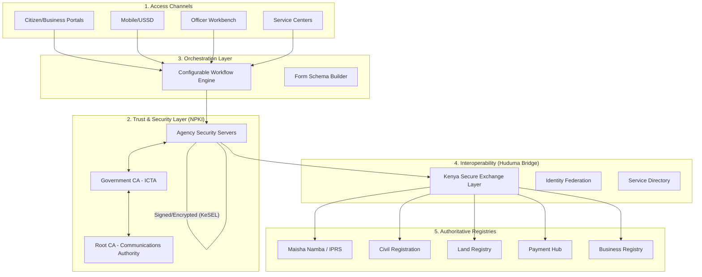
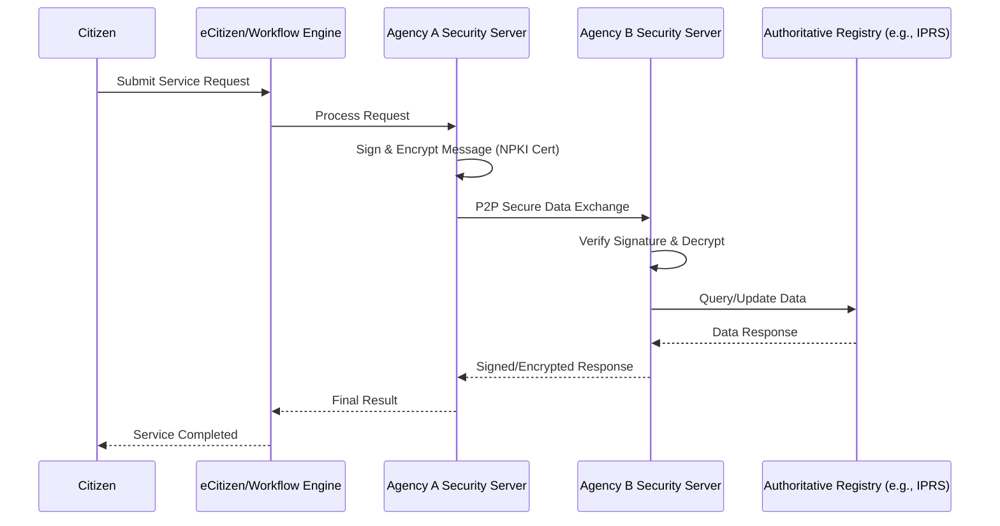

# Kenya DSAP Architecture – Huduma Bridge
## (with NPKI & Decentralized Mediation)

### System Architecture Overview

### Data Flow Pattern (Decentralized Exchange)

### 1. Access Channels
Citizens, businesses, and officers interact with the system through various touchpoints.
- **Citizen/Business Portals**: Unified web access for public services.
- **Mobile/USSD**: Mobile apps and low-bandwidth USSD interfaces.
- **Officer Workbench**: Dedicated interface for government officials to process requests.
- **Service Centers**: Physical locations for assisted government services.

---

### 2. Distributed Security Mediation
*Each agency runs its own Security Server for message signing, encryption, authentication & logging – no central data bottleneck.*
- **Agency Security Servers**: On-premise or cloud-based servers per entity.
- **Peer-to-Peer Exchange**: Direct encrypted communication between agency servers.
- **Distributed Observability**: Local logs synchronized with a central audit system.
> **Note**: Reduces centralization risks by eliminating single points of failure for data flow.

---

### 3. National PKI (NPKI) – Trust Foundation
*Root CA + Government CA (ICTA) – issues and manages digital certificates for all Security Servers.*
- **Digital Certificates**: Used for authentication, signing, and encryption.
- **Certificate Authority (GCA)**: ICTA serves as the government trust anchor.
- **Root CA**: Communications Authority (CA) acts as the national root.
- **Digital Signatures**: Provides legally binding e-signatures for all transactions.
> **Note**: Enables trust, non-repudiation, and secure identity across all layers.

---

### 4. Configurable Workflow Engine
*Core automation with forms, workflow design, and orchestration – certificate-backed authentication.*
- **eCitizen Portal Integration**: Unified entry point for all digital services.
- **Mobile Interaction**: Biometric support and push notifications.
- **USSD & SMS Support**: Accessibility for non-smartphone users.
- **Service Center Support**: Orchestration for assisted service delivery.
> **Note**: Utilizes Huduma Bridge for secure, PKI-signed/encrypted message exchange.

---

### 5. Huduma Bridge
**Kenya Secure Exchange Layer (KeSEL) – Secure Decentralized Data Exchange (X-Road Inspired)**
*Secure interoperability across agencies under Government Enterprise Architecture (GEA) – PKI trust backbone.*
- **Secure Data Exchange**: Decentralized, encrypted pipelines with PKI signatures and auditing.
- **Identity Federation**: National ID / Digital ID integration via NPKI certificates.
- **Service Directory**: Distributed metadata registry of all available government APIs.
> **Note**: Fully Decentralized Exchange via Peer-to-Peer Agency Security Servers (No central data hub).

---

### 6. Shared Services & Authoritative Registries
*Reusable common services and master data sources accessed via PKI-authenticated APIs.*
- **Maisha Namba / IPRS**: Master Population Register and national ID hub.
- **Civil Registration (CRS)**: Authoritative source for Births/Deaths and UPI.
- **Land Registry (NLIMS)**: Property and ownership data.
- **Health (NHIF/SHIF)**: Health insurance and coverage registries.
- **Social Security (NSSF)**: Pensions and social safety net data.
- **Transport (NTSA)**: Drivers' licenses and vehicle registration.
- **Business Registry (BRS)**: Authoritative company and business data.
- **Payment Hub**: Unified gateway for M-Pesa, banks, cards, and aggregators.
- **EDMRS**: Electronic Document & Records Management System for secure archiving.
- **Others**: IEBC (voters), Judiciary (cases), DCI (criminal), etc.

---

### 7. Innovation Sandbox & Ecosystem
*Tools and support for developers and innovators.*
- **API Marketplace**: Documentation and service catalog.
- **Testing Sandbox**: Sample data and test PKI certificates.
- **Innovation Challenges**: Funding and support for civic-tech solutions.
- **Developer Support**: SDKs, training, and technical assistance.

---

**Kenya Digital Service Automation Platform**
*Huduma Bridge – Secure Decentralized Exchange Layer*
*Ministry of ICT • Vision 2030 • Integrated with National PKI (NPKI) & Authoritative Registries*
**Connecting Services, Empowering Lives**
