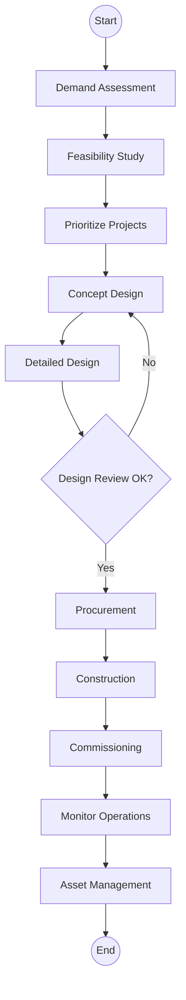
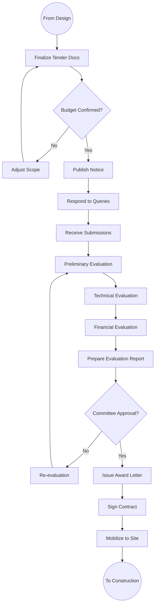
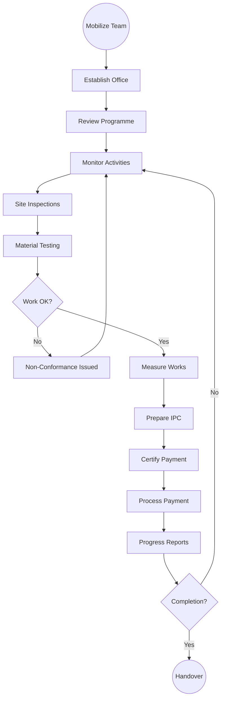

# Athi Water Works Development Agency (AWWDA) - Business Process Mapping

## 1. Overview
AWWDA develops and manages water infrastructure within the Athi River Basin including planning, design, construction, and improvement.

| Attribute | Description |
| :--- | :--- |
| **Mapping Level** | Level 3 - Actor-based Logical Process |
| **Key Actors** | Project Engineers, Design Teams, Contractors, Water Service Providers |
| **Key Systems** | Project Management System, GIS, IFMIS |
| **Digitisation Priority** | High |

---

## 2. Process Definitions

### Process 1: Planning
1. **Demand Assessment:** Conduct studies, analyze projections, assess capacity, identify gaps.
2. **Feasibility Studies:** Technical assessment, Environmental impact, Social impact, Prepare reports.

### Process 2: Design
1. **Concept Design:** Develop concepts, evaluate alternatives, select approach, prepare report.
2. **Detailed Design:** Prepare engineering designs, develop quantities, prepare tenders, obtain approvals.

### Process 3: Build
1. **Procurement:** Issue tenders, evaluate submissions, award contracts, sign agreements.
2. **Construction:** Mobilize supervision, monitor progress, quality assurance, manage variations.
3. **Commissioning:** Testing, documentation, handover, completion certificate.

### Process 4: Improve
1. **Operations Monitoring:** Monitor performance, collect data, identify improvements, plan rehabilitation.

---

## 3. BPMN 2.0 Process Flows

### 3.1 Infrastructure Development Flow (End-to-End)

### 3.2 Procurement Process

### 3.3 Construction Supervision & Payment

