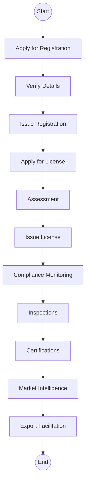
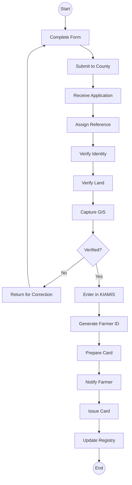
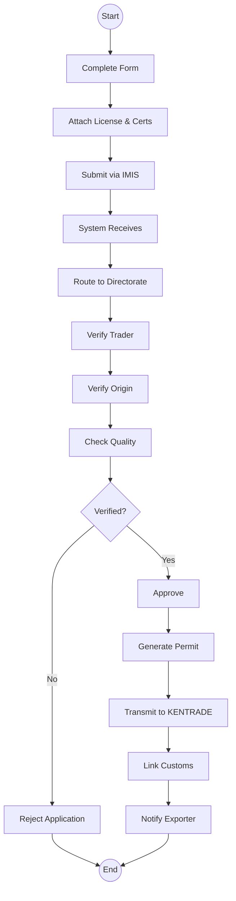

# Authority - Agriculture and Food Authority (AFA) - Business Process Mapping

## 1. Overview
AFA regulates, develops, and promotes scheduled crops in Kenya including coffee, tea, horticulture, sugar, and food crops.

| Attribute | Description |
| :--- | :--- |
| **Mapping Level** | Level 3 - Actor-based Logical Process |
| **Key Actors** | Farmers, Traders, Export Agents, AFA Officers |
| **Key Systems** | KIAMIS, AFA IMIS, KENTRADE |
| **Digitisation Priority** | High |

---

## 2. Process Definitions

### Process 1: Registration
1. **Farmer Registration:** Receive applications, verify identity, capture farm details, register in KIAMIS, issue registration card.
2. **Trader Registration:** Receive applications, verify credentials, assess capacity, register traders.

### Process 2: Licensing
1. **Export Permit:** Receive application, verify origin and quality, check compliance, issue permit, integrate KENTRADE.
2. **Trading License:** Receive application, assess premises, verify capacity, issue license.

### Process 3: Regulation
1. **Inspections:** Receive requests, schedule visits, conduct inspections, issue certificates.

### Process 4: Trade Facilitation
1. **Market Intelligence:** Collect data, analyze trends, disseminate information, support decisions.

---

## 3. BPMN 2.0 Process Flows

### 3.1 AFA Services Flow (End-to-End)

### 3.2 Farmer Registration

### 3.3 Export Permit Process

