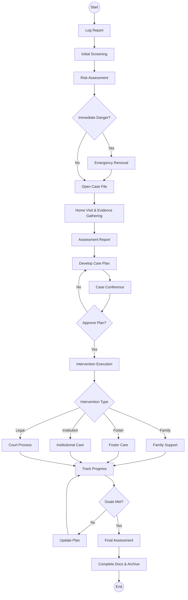
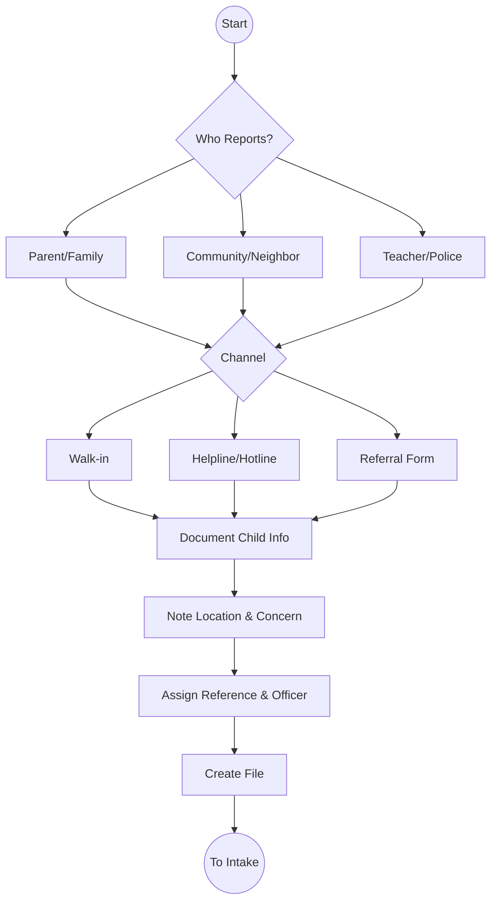
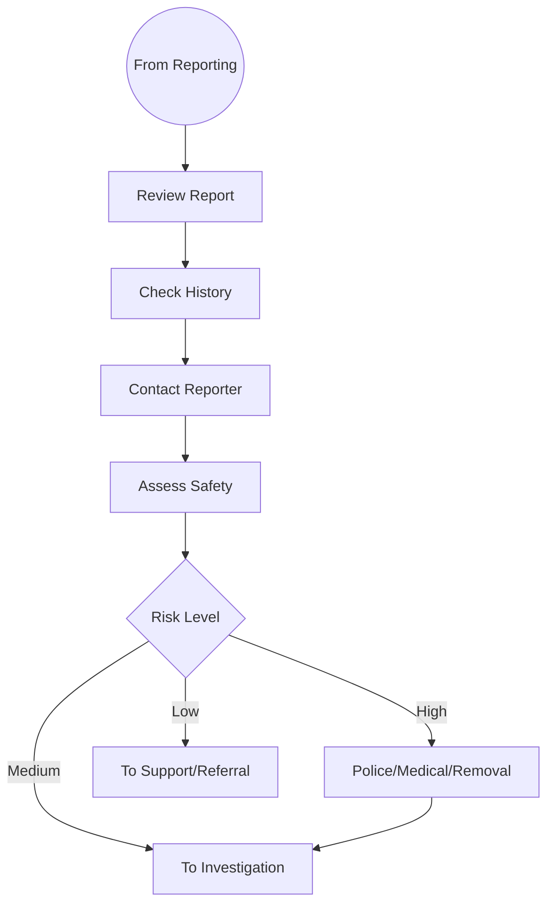

# Ministry of Children Services - Business Process Mapping

## 1. Overview
The Ministry of Children Services is responsible for child welfare, protection, and development in Kenya. The Ministry coordinates child protection interventions, alternative family care, and child participation programmes through a network of Children Officers at national and county levels.

| Attribute | Description |
| :--- | :--- |
| **Mapping Level** | Level 3 - Actor-based Logical Process |
| **Key Actors** | Reporting Party, Children Officers, Case Committees, Courts, Alternative Care Providers |
| **Current State** | Manual paper-based case management |
| **Digitisation Priority** | High |

---

## 2. Process Definitions

### Process 1: Child Protection
1. **Reporting:** Receive and log reports from multiple channels; assign case reference numbers.
2. **Intake Assessment:** Screening, risk determination, and deciding on immediate protective action.
3. **Investigation:** Home visits, interviews, gathering evidence and documentation.
4. **Case Planning:** Development of care plans and coordination with service providers.
5. **Intervention:** Implementing protective measures (Foster, Institutional, Family Support).
6. **Monitoring:** Tracking progress and periodic reviews.
7. **Closure:** Achievement assessment and archiving.

### Process 2: Alternative Family Care
1. **Foster Care:** Assessment, matching, and monitoring of foster family placements.
2. **Adoption:** Processing applications and conducting suitability assessments.

---

## 3. BPMN 2.0 Process Flows

### 3.1 Child Protection (End-to-End)

### 3.2 Reporting Process

### 3.3 Intake & Risk Assessment

