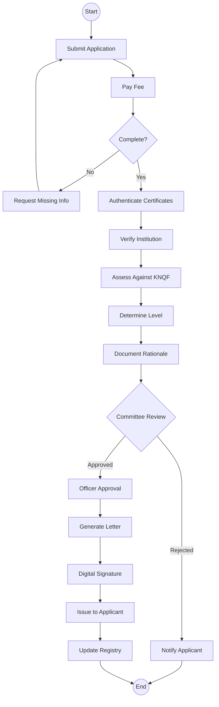
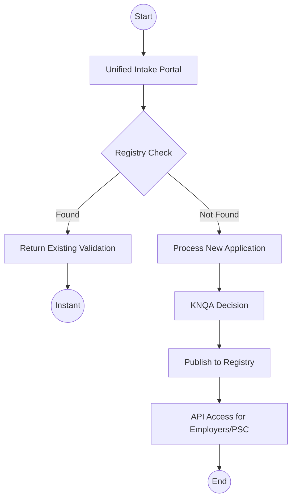

# Ministry of Education (KNQA) - Business Process Mapping

## 1. Overview
Kenya National Qualifications Authority (KNQA) coordinates the national qualifications system through the Kenya National Qualifications Framework. KNQA validates qualifications and recognizes prior learning.

| Attribute | Description |
| :--- | :--- |
| **Mapping Level** | Level 3 - Actor-based Logical Process |
| **Key Actors** | Applicants, Technical Officers, Review Committee |
| **Target System** | National Qualifications Validation Registry |
| **Digitisation Priority** | High |

---

## 2. Process Definitions

### Process 1: Qualification Validation
1. **Application:** Receive applications, verify completeness, process payment.
2. **Verification:** Verify authenticity, confirm institution status, check for fraud.
3. **Alignment:** Assess against KNQF, determine mapping, and assign level.
4. **Committee Review:** Present to committee for recommendation and decision.
5. **Issuance:** Approval, generation of letter with digital signature, and issuance to applicant.

### Process 2: Recognition of Prior Learning (RPL)
1. **RPL Application:** Receive applications and assess claims with evidence.
2. **Certification:** Determine equivalence and issue certificate.

---

## 3. BPMN 2.0 Process Flows

### 3.1 Qualification Validation Flow

### 3.2 Target State - Validation Registry

