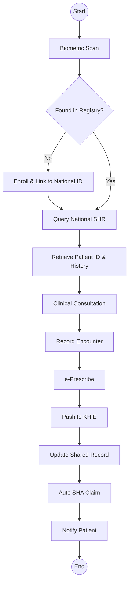

# Ministry of Health (HIS) - Business Process Mapping

## 1. Overview
The Health Information Systems division coordinates health data management including patient identification, health records, and interoperability through the Kenya Health Information Exchange.

| Attribute | Description |
| :--- | :--- |
| **Mapping Level** | Level 2 - System Architecture and Data Flows |
| **Key Actors** | Patients, Health Facilities, County Health Departments, SHA, KHIE |
| **Current State** | Facility-centric, fragmented identifiers |
| **Target State** | Patient-centric, unified health record |
| **Annual Volume** | 55M patients, 300-400M annual encounters |

---

## 2. Strategic Objectives

### 1. Patient Identification (Target State)
- **Biometric Identification:** Single biometric identifier linked to National ID.
- **National Patient Registry:** Unified master index with real-time verification and deduplication.

### 2. Shared Health Records (Target State)
- **Longitudinal Patient Record:** FHIR-based standards for event-driven updates.
- **Kenya Health Information Exchange (KHIE):** Real-time data exchange and SHA claims integration.

---

## 3. BPMN 2.0 Process Flows

### 3.1 Target Patient Journey with Biometric Identification



### 3.2 Kenya Health Information Exchange (KHIE) Architecture

```mermaid
flowchart LR
    subgraph "Data Sources"
        Pub[Public Hospitals]
        Pri[Private Facilities]
        Lab[Laboratories]
        Pha[Pharmacies]
    end

    subgraph "Core Exchange Layer"
        Broker[Message Broker]
        FHIR[FHIR Adapter]
        Val[Data Validation]
        Match[Patient Matching]
    end

    subgraph "Registries"
        PReg[Patient Registry]
        FReg[Facility Registry]
        ProvReg[Provider Registry]
        SHR[Shared Health Record]
    end

    subgraph "Consumers"
        SHA[SHA Claims]
        DS[Disease Surveillance]
        Anal[Health Analytics]
        Port[AfyaYangu Portal]
    end

    Data Sources --> core
    core --> Broker
    Broker --> FHIR
    FHIR --> Val
    Val --> Match
    Match --> Registries
    Registries --> Consumers
```
