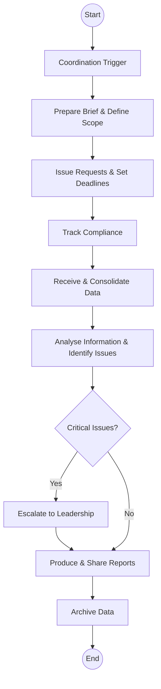
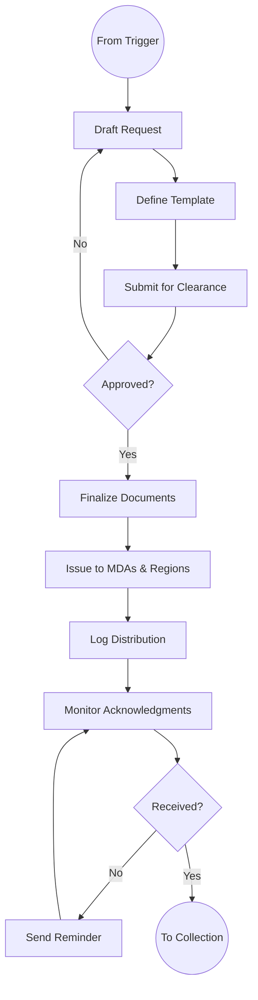
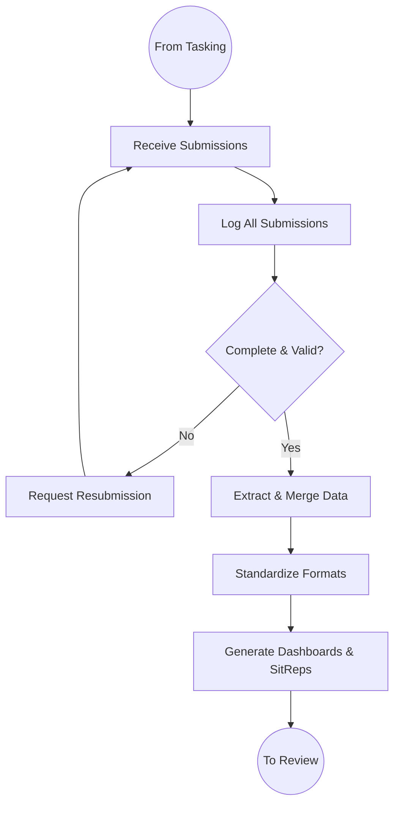

# National Government Co-ordination - Business Process Mapping

## 1. Overview
National Government Coordination provides horizontal coordination across MDAs and sub-national units, ensuring alignment of government operations with national priorities.

| Attribute | Description |
| :--- | :--- |
| **Mapping Level** | Level 2 - Horizontal Coordination Function |
| **Key Actors** | Coordination Officers, MDA Liaison Officers, Regional Coordinators |
| **Function Type** | Non-transactional coordination and oversight |
| **Digitisation Priority** | Medium |

---

## 2. Process Definitions

### Process 1: Coordination Trigger
1. **Trigger Identification:** National priorities, security concerns, inter-governmental programmes.
2. **Brief Preparation:** Prepare briefs, define scope, identify stakeholders, set objectives.

### Process 2: Information Tasking
1. **Formal Requests:** Issue requests to MDAs, distribute circulars, define scope/format, set timelines.
2. **Compliance Tracking:** Monitor distribution, track acknowledgments, follow up pending, escalate non-compliance.

### Process 3: Data Collection
1. **Submission Receipt:** Receive submissions, verify completeness, log responses, identify gaps.
2. **Consolidation:** Consolidate summaries, standardize formats, create dashboards, prepare situation reports.

### Process 4: Review and Escalation
1. **Analysis:** Analyse information, identify gaps, assess risks, formulate observations.
2. **Escalation:** Escalate critical issues, refer to offices, coordinate resolution, track outcomes.

---

## 3. BPMN 2.0 Process Flows

### 3.1 Coordination Cycle Flow (End-to-End)

### 3.2 Information Tasking Process

### 3.3 Data Collection and Consolidation

