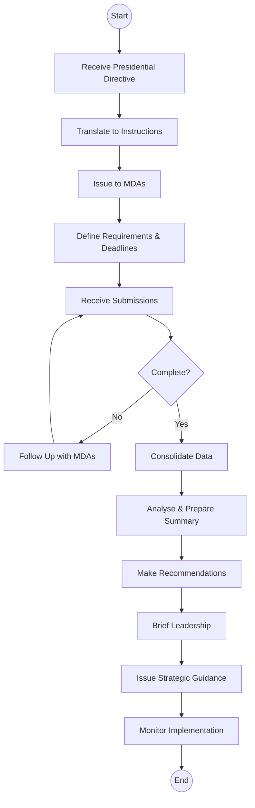

# Office of the Head of Public Service - Business Process Mapping

## 1. Overview
The Office provides strategic coordination and oversight for the national public service, focusing on executive coordination and implementation monitoring.

| Attribute | Description |
| :--- | :--- |
| **Mapping Level** | Level 2 - Major Activities and Hand-offs |
| **Key Actors** | Head of Public Service, Principal Secretaries, Senior Coordinators |
| **Function Type** | Executive Coordination |
| **Digitisation Priority** | High |

---

## 2. Process Definitions

### Process 1: Executive Coordination
1. **Strategic Direction:** Receive presidential directives, translate to instructions, communicate to MDAs, and monitor implementation.
2. **Information Requests:** Issue requests to MDAs, define requirements, set deadlines, and track compliance.

### Process 2: Consolidation & Analysis
1. **Data Aggregation:** Receive submissions, verify completeness, and consolidate reports.
2. **Analysis:** Analyse information and prepare summary briefs for leadership.

### Process 3: Direction & Guidance
1. **Strategic Guidance:** Issue guidance, clarify policy, resolve conflicts, and support decision-making.

---

## 3. BPMN 2.0 Process Flows

### 3.1 Executive Coordination Flow

