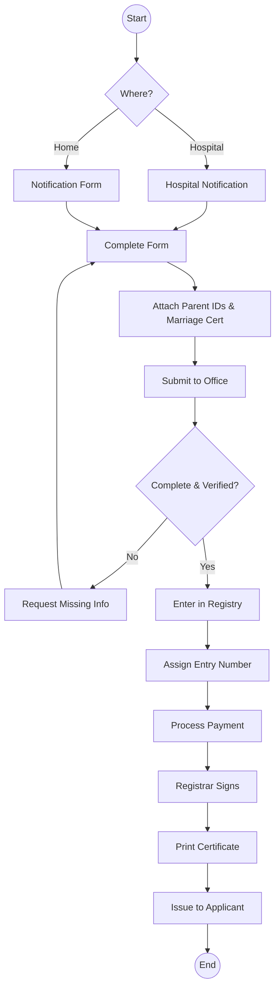
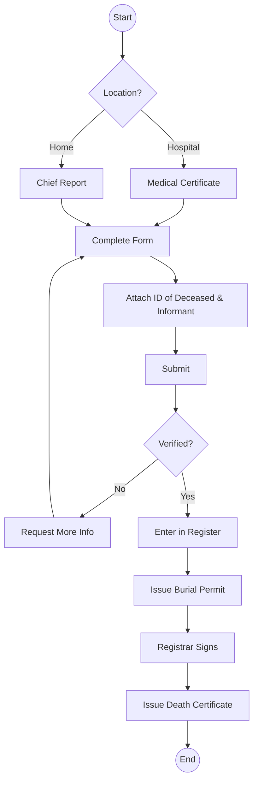
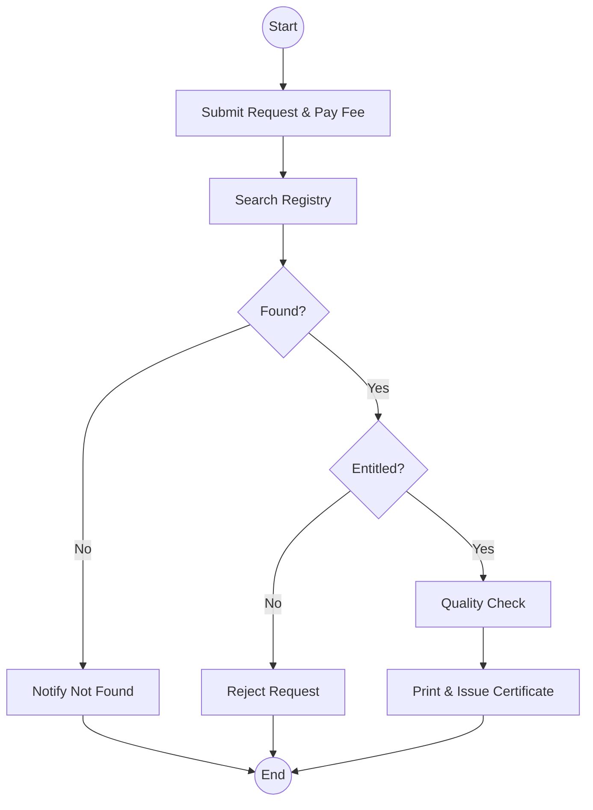

# State Department Civil Registration Services - Business Process Mapping

## 1. Overview
The Department of Civil Registration Services registers vital events including births, deaths, and marriages and maintains the national civil registry for Kenya.

| Attribute | Description |
| :--- | :--- |
| **Mapping Level** | Level 3 - Actor-based Logical Process |
| **Key Actors** | Parents, Informants, Registration Officers, Medical Officers, Chiefs |
| **Key Systems** | CRVS, e-Citizen |
| **Digitisation Priority** | High |

---

## 2. Process Definitions

### Process 1: Birth Registration
1. **Timely Registration:** Receive birth notification from hospital or home, verify details, capture in the register, and issue a certificate.
2. **Late Registration:** Processing applications for events that occurred over 6 months ago, requiring adjudication and additional evidence.

### Process 2: Death Registration
1. **Facility/Community Deaths:** Verify cause of death or chief's report, process registration, and issue burial permits and certificates.

### Process 3: Certificate Services
1. **Retrieval:** Search registry based on request details, verify entitlement, and issue a duplicate or new certificate.

---

## 3. BPMN 2.0 Process Flows

### 3.1 Birth Registration Flow

### 3.2 Death Registration

### 3.3 Certificate Retrieval

