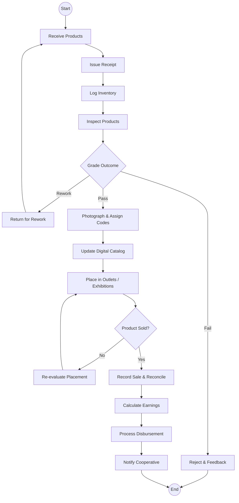

# State Department for Culture, Arts and Heritage (Ushanga Kenya) - Business Process Mapping

## 1. Overview
The Ushanga Kenya Initiative supports women and youth cooperatives producing traditional beadwork by connecting them to national and international markets.

| Attribute | Description |
| :--- | :--- |
| **Mapping Level** | Level 2 - Event-driven Market Facilitation |
| **Key Actors** | Cooperatives, Artisans, Quality Officers, Market Officers |
| **Target Beneficiaries** | Women and youth groups |
| **Quality Target** | >90% product pass rate |
| **Payment Turnaround** | <14 days from sale |

---

## 2. Process Definitions

### Process 1: Product Facilitation
1. **Submission:** Receive products from artisans/cooperatives and log into inventory.
2. **Quality Inspection:** Inspect against initiative standards and provide feedback/grading.
3. **Cataloging:** Photograph approved items, assign codes, and update the digital catalog.

### Process 2: Market Placement & Sales
1. **Placement:** Coordinate with retailers and arrange exhibitions.
2. **Sales:** Record sales and reconcile inventory.

### Process 3: Payment
1. **Calculation:** Calculate earnings minus fees and prepare disbursement schedules.
2. **Disbursement:** Process payments and notify cooperatives.

---

## 3. BPMN 2.0 Process Flows

### 3.1 Ushanga Kenya Product & Sales Flow

