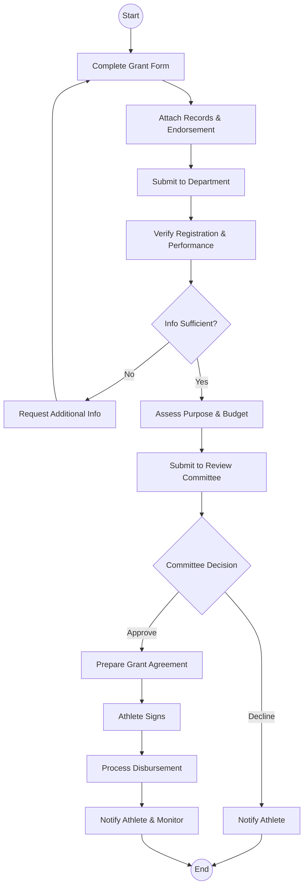
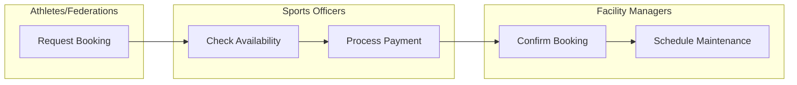

# State Department for Sports - Business Process Mapping

## 1. Overview
The State Department for Sports is responsible for national sports development, athlete support services, and the management of sports facilities across Kenya.

| Attribute | Description |
| :--- | :--- |
| **Mapping Level** | Level 3 - Actor-based Logical Process |
| **Key Actors** | Athletes, Sports Officers, Federation Representatives, Facility Managers |
| **Key Systems** | Sports Registration System, Grants Management |
| **Digitisation Priority** | Medium |

---

## 2. Process Definitions

### Process 1: Federation Management
1. **Registration:** Receive applications, verify compliance with sports regulations, and issue registration certificates.
2. **Oversight:** Monitor federation activities, review annual reports, and conduct performance audits.

### Process 2: Athlete Support
1. **Talent Identification:** Scouting, potential assessment, and registration of talent into support programmes.
2. **Athlete Grants:** Application processing, eligibility assessment, fund disbursement, and utilization monitoring.

### Process 3: Facility Management
1. **Booking:** Managing requests, checking availability, and processing payments for facility use.
2. **Maintenance:** Scheduling repairs and tracking completion of facility improvements.

---

## 3. BPMN 2.0 Process Flows

### 3.1 Athlete Grants Process

### 3.2 Facility Booking & Maintenance Overview

