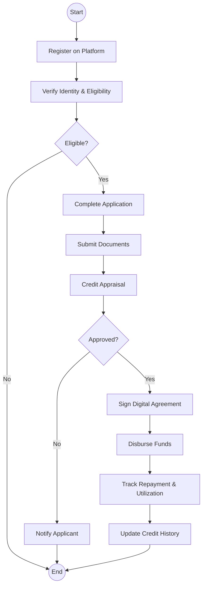
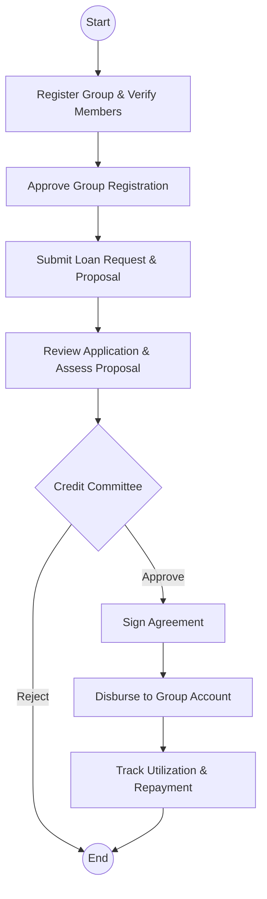

# State Department for MSME Development - Business Process Mapping

## 1. Overview
The State Department promotes the growth of micro, small, and medium enterprises through credit access (e.g., Hustler Fund, Uwezo Fund), capacity building, and market linkages.

| Attribute | Description |
| :--- | :--- |
| **Mapping Level** | Level 3 - Actor-based Logical Process |
| **Key Actors** | MSME Applicants, Fund Officers, Credit Committees |
| **Key Systems** | Hustler Fund Portal, Uwezo Fund System, IFMIS |
| **Digitisation Priority** | High |

---

## 2. Process Definitions

### Process 1: Hustler Fund (Digital Credit)
1. **Application:** Registration on the platform, automated eligibility verification, and instant disbursement.
2. **Repayment:** Automated tracking of repayments and credit history updates.

### Process 2: Uwezo Fund (Group Loans)
1. **Group Registration:** Verification of group composition and registration approval.
2. **Loan Application:** Eligibility checks, project proposal assessment, and credit committee review.

---

## 3. BPMN 2.0 Process Flows

### 3.1 MSME Credit Access Flow

### 3.2 Uwezo Fund - Group Loan Process

