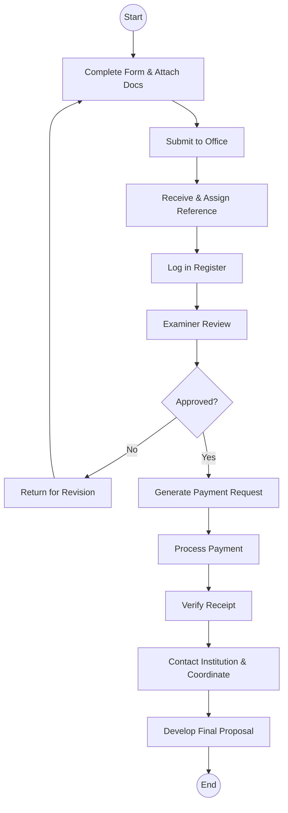

# State Department for Science, Research and Innovation - Business Process Mapping

## 1. Overview
The State Department promotes scientific research, technological development, and innovation in Kenya. Currently, most research applications are processed via a manual, paper-based system.

| Attribute | Description |
| :--- | :--- |
| **Mapping Level** | Level 3 - Actor-based Logical Process |
| **Key Actors** | Researchers, Research Officers, Programme Coordinators |
| **Current State** | Manual paper-based processing |
| **Digitisation Priority** | Medium |

---

## 2. Process Definitions

### Process 1: Research Application
1. **Submission:** Receive forms, log entries into the register, and assign an examiner.
2. **Review:** Examiner recommendations and committee approval against defined criteria.
3. **Payment:** Generate payment request, receive payment, and verify receipt.
4. **Development:** Guide proposal preparation and finalize research agreements.

### Process 2: Public Inquiries
1. **Response:** Receiving, categorizing, and researching information to provide official responses.

---

## 3. BPMN 2.0 Process Flows

### 3.1 Research Application Flow

