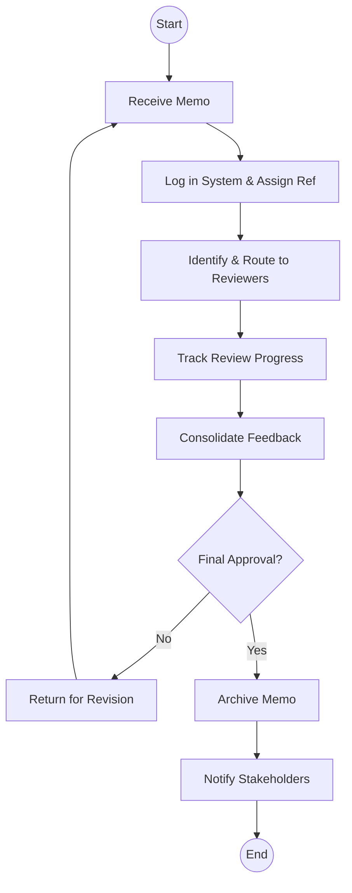
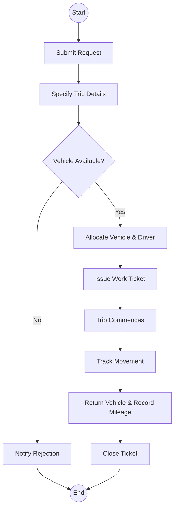

# State Department for Cabinet Affairs - Business Process Mapping

## 1. Overview
The State Department coordinates Cabinet operations and manages government-wide information systems, including the Cabinet Memo system (CABMEMO) and the Government Delivery Management Information System (GDMIS).

| Attribute | Description |
| :--- | :--- |
| **Mapping Level** | Level 3 - Actor-based Logical Process |
| **Key Actors** | Cabinet Affairs Officers, EDRMS Administrators, Fleet Managers |
| **Key Systems** | CABMEMO, EDRMS, GDMIS, Fleet Management |
| **Digitisation Priority** | High |

---

## 2. Process Definitions

### Process 1: Information Management (EDRMS)
1. **CABMEMO:** Receive, route for review, track status, and archive cabinet memoranda.
2. **Correspondence:** Register, classify, and route incoming communications for action.

### Process 2: Delivery Monitoring (GDMIS)
1. **Priority Registration:** Register national priorities and assign deliverables to relevant MDAs.
2. **Monitoring:** Collect progress reports and generate performance dashboards.

### Process 3: Fleet Management
1. **Lifecycle:** Vehicle registration and MDA assignment.
2. **Trip Management:** Processing trip requests, vehicle allocation, and mileage recording.

---

## 3. BPMN 2.0 Process Flows

### 3.1 CABMEMO Review & Archive Flow

### 3.2 Fleet Trip Management

