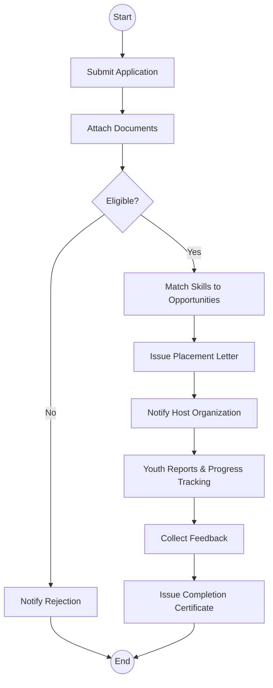
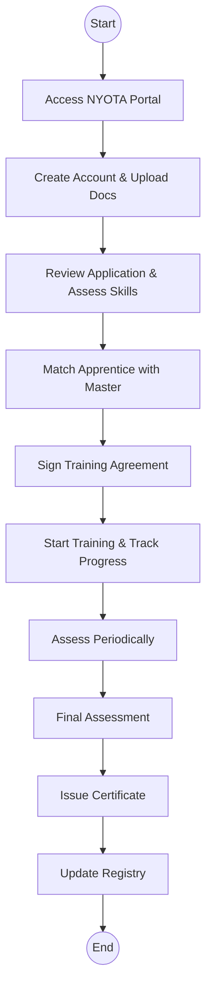
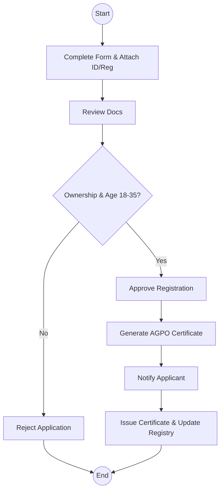

# State Department for Youth Affairs and Creative Economy - Business Process Mapping

## 1. Overview
The State Department for Youth Affairs and Creative Economy is responsible for youth development, employment facilitation (e.g., NYOTA Apprenticeship), and the promotion of Kenya's creative industries, including film licensing and AGPO registration.

| Attribute | Description |
| :--- | :--- |
| **Mapping Level** | Level 3 - Actor-based Logical Process |
| **Key Actors** | Youth Applicants, Programme Officers, NYOTA Coordinators, Film Officers |
| **Key Systems** | e-Citizen, IFMIS, NYOTA Portal |
| **Digitisation Priority** | High |

---

## 2. Process Definitions

### Process 1: Youth Employment Facilitation
1. **Internship Placement:** Receive applications, verify eligibility, and match candidates to host opportunities.
2. **NYOTA Apprenticeship:** Portal registration, skills assessment, matching with master craftspersons, and certification.

### Process 2: Creative Economy Support
1. **Film Licensing:** Reviewing production requirements and coordinating with the Film Commission to issue permits.

### Process 3: AGPO Registration
1. **Youth Enterprise Registration:** Verifying ownership and age (18-35) to issue AGPO certificates for government procurement.

---

## 3. BPMN 2.0 Process Flows

### 3.1 Youth Employment & Internship Flow

### 3.2 NYOTA Apprenticeship Lifecycle

### 3.3 AGPO Registration

