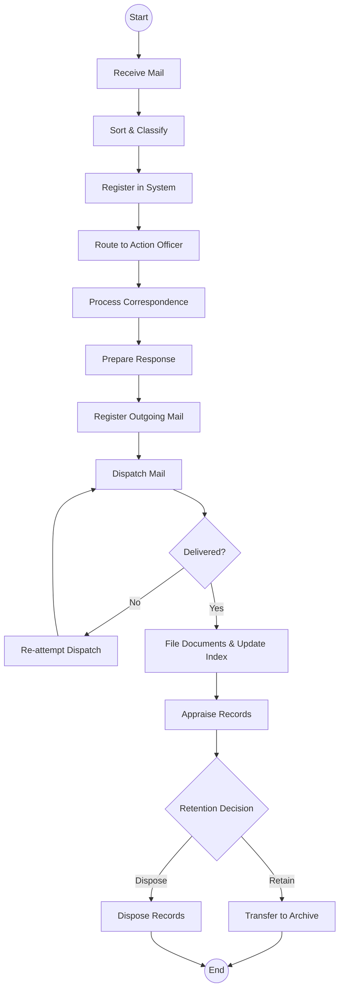
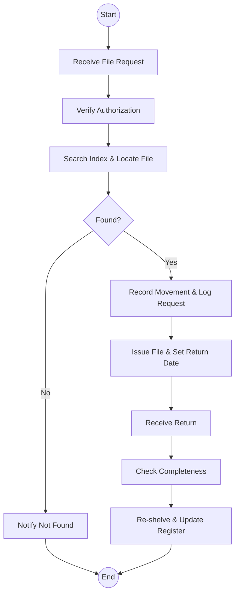

# State Department for Energy (Records Management Unit) - Business Process Mapping

## 1. Overview
The Records Management Unit (RMU) manages the lifecycle of official records for the Ministry, including mail handling, internal file movement, and systematic archival/disposal.

| Attribute | Description |
| :--- | :--- |
| **Mapping Level** | Level 3 - Actor-based Logical Process |
| **Key Actors** | Registry Clerks, Records Officers, Action Officers, Archivists |
| **Current State** | Hybrid paper-digital system |
| **Digitisation Priority** | Medium |

---

## 2. Process Definitions

### Process 1: Mail Handling
1. **Incoming:** Receive, sort, classify, and route mail to relevant action officers.
2. **Outgoing:** Register, prepare for dispatch, and confirm delivery of correspondence.

### Process 2: File Management
1. **Creation:** Verify uniqueness and assign official references for new files.
2. **Movement:** Search index, retrieve files, record movement, and track returns.

### Process 3: Archival & Disposal
1. **Appraisal:** Apply retention schedules and determine the historical/legal value of records for retention or disposal.

---

## 3. BPMN 2.0 Process Flows

### 3.1 Incoming & Outgoing Mail Flow

### 3.2 Internal File Movement

