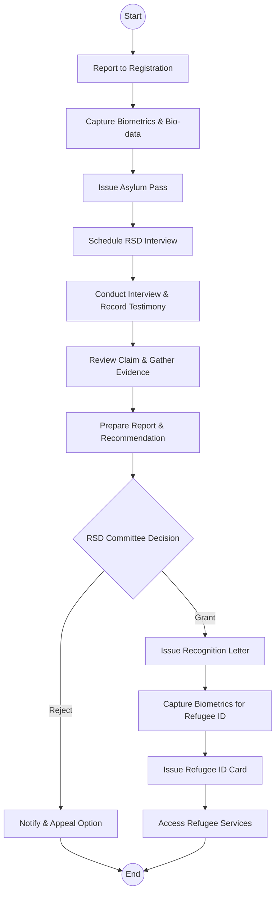
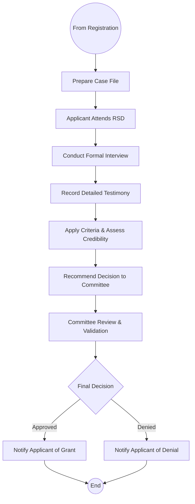

# Department of Refugee Services - Business Process Mapping

## 1. Overview
The Department of Refugee Services handles refugee status determination (RSD), registration, documentation, and protection services for asylum seekers in Kenya.

| Attribute | Description |
| :--- | :--- |
| **Mapping Level** | Level 3 - Actor-based Logical Process |
| **Key Actors** | Asylum Seekers, Refugees, Registration Officers, Eligibility Officers, RSD Committee |
| **Key Systems** | Refugee Registration System, UNHCR proGres |
| **Digitisation Priority** | High |

---

## 2. Process Definitions

### Process 1: Registration
1. **Asylum Pass:** Capture biometric data and issue temporary passes to new arrivals.
2. **Scheduling:** Assign dates for the formal Refugee Status Determination (RSD) interview.

### Process 2: Status Determination (RSD)
1. **Interview:** Collect testimony and evidence regarding the asylum claim.
2. **Assessment:** Review claims against national and international criteria.
3. **Committee Review:** Present recommendations to the RSD committee for a final decision.

### Process 3: Documentation
1. **Refugee ID:** Issuance of secure ID cards to recognized refugees.
2. **Travel Documents:** Processing Convention Travel Documents (CTD).

---

## 3. BPMN 2.0 Process Flows

### 3.1 Refugee Registration & Status Flow

### 3.2 Status Determination Deep-Dive

