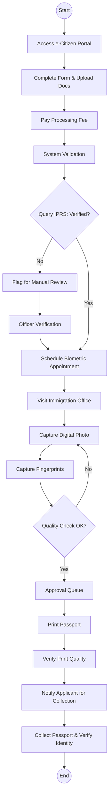
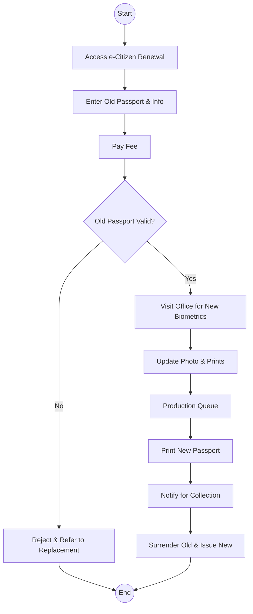

# Directorate of Immigration Services (Passport Division) - Business Process Mapping

## 1. Overview
The Passport Division of the Directorate of Immigration Services is responsible for processing and issuing Kenyan passports, including first-time applications, renewals, and replacements.

| Attribute | Description |
| :--- | :--- |
| **Mapping Level** | Level 3 - Actor-based Logical Process |
| **Key Actors** | Applicants, Immigration Officers, Verification Officers, Production Unit |
| **Key Systems** | e-Citizen, IPRS, Passport Production System |
| **Digitisation Priority** | High |

---

## 2. Process Definitions

### Process 1: First-Time Passport Application
1. **Online Submission:** Application and document upload via e-Citizen.
2. **Identity Verification:** Real-time query against the IPRS database.
3. **Biometrics:** Physical visit for photo and fingerprint capture.
4. **Production:** Quality checks, queue management, and printing.

### Process 2: Passport Renewal
1. **Verification:** Checking eligibility based on existing passport records.
2. **Updates:** Updating biometric data and processing the new booklet.

### Process 3: Replacement (Lost/Mutilated)
1. **Reporting:** Processing police abstracts and verifying original records before re-issuance.

---

## 3. BPMN 2.0 Process Flows

### 3.1 First-Time Passport Application Lifecycle

### 3.2 Passport Renewal Process

