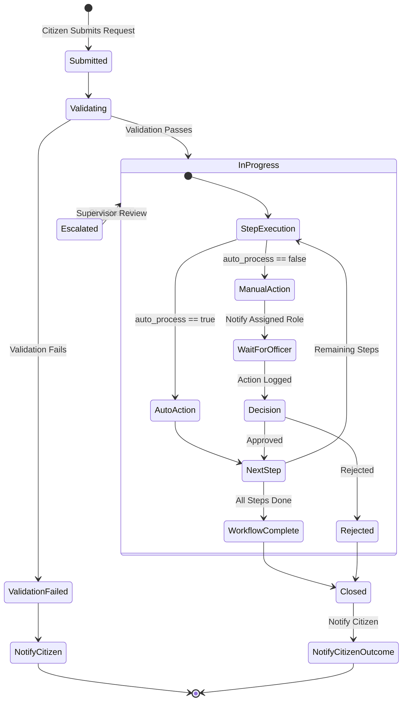
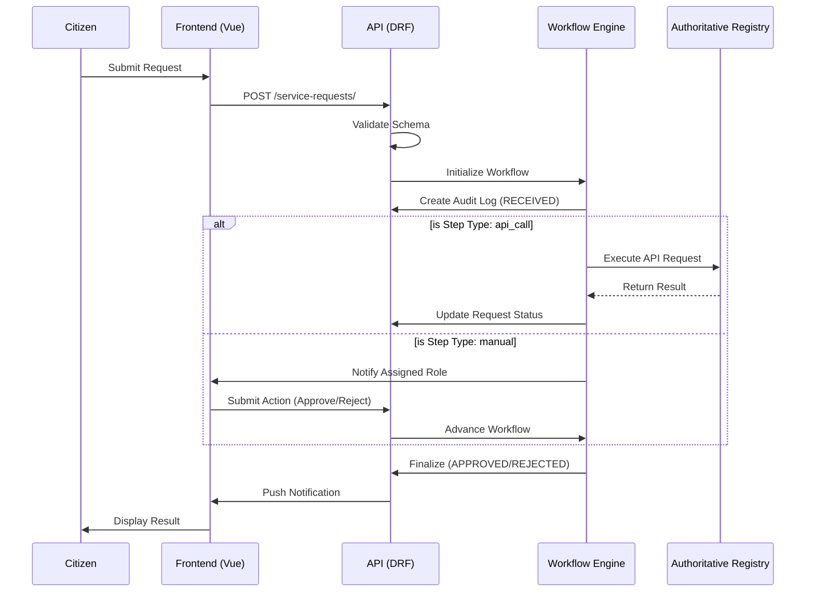
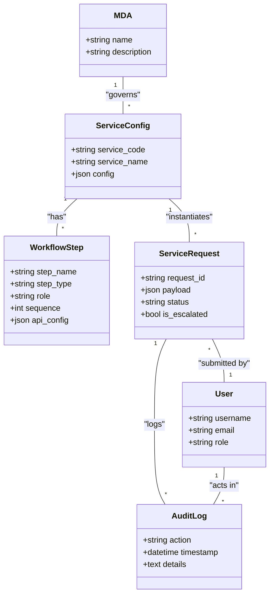

# Algorithm & Workflow Documentation

## Project: Repeatable Government Services Platform (Production-Centric POC)

---

## 1. Pseudo-Code: Service Processing Algorithm
```python
def process_service_request(service_code, citizen_id, payload):
    # Load service configuration
    service_config = load_service_config(service_code)

    # Validate input according to service rules
    if not validate_request(payload, service_config['rules']):
        log_audit(citizen_id, service_code, 'VALIDATION_FAILED')
        return {'status': 'VALIDATION_FAILED', 'message': 'Input validation failed.'}

    # Create service request record
    request = create_service_request(citizen_id, service_code, payload)

    # Execute workflow steps
    for step in service_config['workflow']:
        assigned_role = step['role']
        action_required = step['action']

        # Automatic step (optional AI validation)
        if step.get('auto_process'):
            perform_auto_action(request, step)
            log_audit(citizen_id, service_code, f'AUTO_{action_required}')
            continue

        # Manual review step
        notify_role(assigned_role, request, action_required)
        wait_for_action(request, assigned_role)
        log_audit(citizen_id, service_code, f'MANUAL_{action_required}')

        # Check SLA and escalate if needed
        if step.get('sla') and check_sla(request, step['sla']):
            escalate_request(request, step)
            log_audit(citizen_id, service_code, 'ESCALATED')

    # Close request after workflow completion
    update_request_status(request, 'CLOSED')
    log_audit(citizen_id, service_code, 'CLOSED')
    return {'status': 'CLOSED', 'request_id': request.id}
```

---

## 2. Activity Diagram



---

## 3. Sequence Diagram



---

## 4. Class Diagram


---

## 5. Service Configuration Example (JSON)
```json
{
  "service_code": "BIRTH_REG",
  "workflow": [
    {"step_name": "Initial Validation", "role": "Officer", "action": "validate", "auto_process": true},
    {"step_name": "Approval", "role": "Supervisor", "action": "approve"}
  ],
  "rules": {"required_fields": ["full_name", "dob", "parent_ids"]},
  "sla": 3,
  "output": "Birth Certificate"
}
```

---

## 6. Notes
- Algorithm supports **dynamic services** configured via JSON/YAML.
- Workflow engine handles **manual and automatic steps** with SLA monitoring.
- Audit logging ensures **traceability** of all actions.
- Sequence and activity diagrams provide **full view of request processing**.
- Class diagram captures core entities for **database and API design**.

