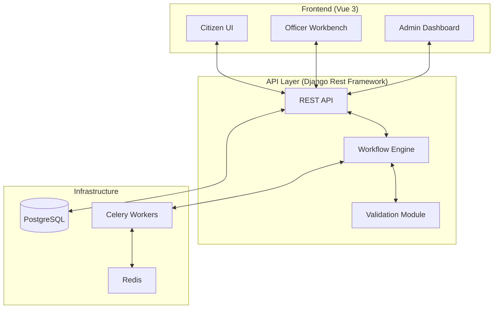
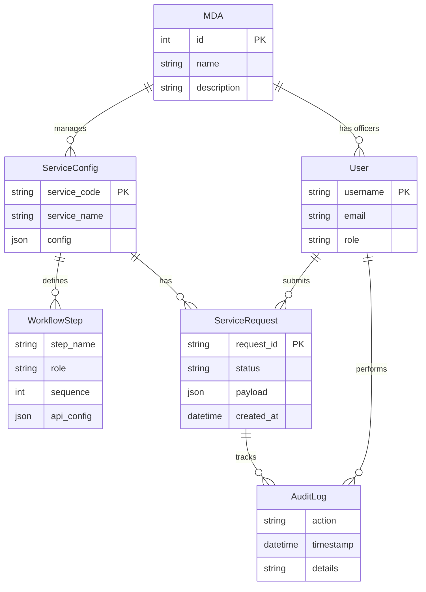

# System Design Documents

## Project: Repeatable Government Services Platform (Production-Centric POC)

---

## 1. High-Level Architecture Diagram

**Components:**
- Citizen UI: Service request submission and tracking
- Frontend Vue3: Dynamic forms, dashboards, notifications
- REST API (DRF): Handles CRUD, authentication, workflow logic
- PostgreSQL: Persistent storage for requests, users, audit logs, MDAs
- Celery/Redis: Asynchronous task processing (workflow automation, notifications)
- Service Config DB: Stores JSON/YAML service definitions and MDA configurations

---

## 2. Detailed Component Design

### 2.1 Backend Components
- **API Layer:** DRF ViewSets for ServiceRequest, ServiceConfig, User, WorkflowStep, MDA
- **Workflow Engine:** Reads service config, executes steps, triggers tasks
- **Validation Module:** Enforces rules defined in service config
- **Audit Module:** Logs all actions and state changes
- **Notification Module:** Sends emails and in-app notifications
- **Authentication Module:** JWT-based, supports role hierarchy
- **Service Configuration Module:** Allows adding/editing services dynamically without code changes
- **MDA Registration Module:** Add or modify Ministries, Departments, and Agencies (MDAs) with role assignments and access control

### 2.2 Frontend Components
- **Dynamic Form Generator:** Reads service config and builds forms for citizens and officers
- **Citizen Dashboard:** Submit and track requests
- **Officer Dashboard:** Review, approve/reject, escalate
- **Supervisor Dashboard:** Monitor workflows, approve escalations, generate reports
- **MDA Management Dashboard:** Register or modify MDAs, assign officers and roles
- **Notifications Module:** Real-time notifications and alerts

---

## 3. Data Model / Entity Relationship Diagram (ERD)

**Notes:**
- `ServiceConfig` drives dynamic workflows.
- `WorkflowStep` defines each stage with assigned roles.
- `ServiceRequest` captures user submissions.
- `User` contains roles for RBAC.
- `MDA` stores all registered Ministries, Departments, and Agencies.
- `AuditLog` captures all activities for traceability.

---

## 4. Service and MDA Configuration
- **Service Registration:** JSON/YAML structure with service code, workflow, validation rules, SLA, and output.
- **MDA Registration:** Add new MDAs with name, description, and role assignments.
- Dynamic assignment of officers to workflow steps.
- Admin interface to modify service configurations and MDA details without code changes.

---

## 5. Assumptions
- AI agent can read JSON/YAML service configurations.
- Dockerized backend mirrors production configuration.
- Sample services and MDAs are sufficient to demonstrate workflows.
- External integrations will be mocked during POC.

---

## 6. Acceptance Criteria
- High-level architecture supports production-centric scalability.
- Backend and frontend modules are defined and mapped.
- Data model supports dynamic workflows, service requests, and MDA management.
- Workflow execution can be simulated using sample service configurations.
- Admins can register MDAs and configure services without code changes.
- Audit logging and notifications are fully functional.

