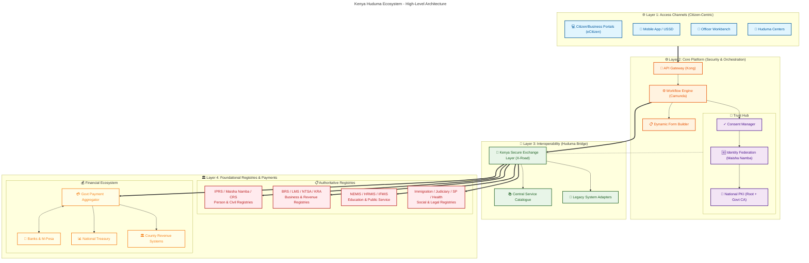
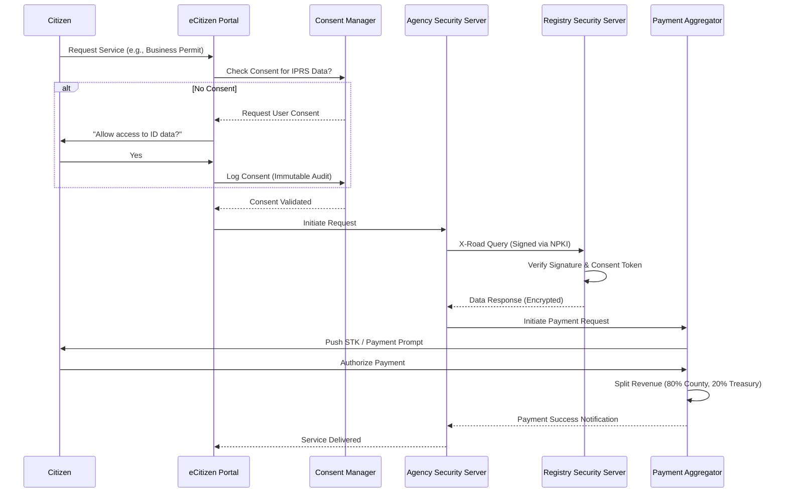

# Kenya DSAP Architecture – Huduma Bridge (GEA Compliant)
## (with NPKI, Decentralized Mediation, and Payment Aggregation)

### System Architecture Overview

### Data Flow Pattern (Decentralized Exchange with Consent)

### 1. Access Channels (Citizen-Centric Design)
Aligned with GEA Principle: **Citizen-Centricity**.
- **Unified Front-End:** Single-window access via eCitizen for all services.
- **Omnichannel:** Seamless experience across Web, Mobile App, USSD, and physical Huduma Centers.
- **Accessibility:** Designed for inclusivity (USSD for feature phones, Assistive Tech for PWDs).

---

### 2. Trust, Security & Consent (Data Protection Act Compliance)
Aligned with GEA Principle: **Security & Privacy by Design**.
- **Consent Manager:** Centralized module to capture, track, and revoke citizen consent for data sharing as required by the **Data Protection Act (2019)**. No data moves without explicit user permission.
- **National PKI (NPKI):** All transactions are digitally signed using certificates issued by the Government CA (ICTA), ensuring non-repudiation.
- **Identity Federation:** Integration with **Maisha Namba** (IPRS) for single sign-on (SSO) and robust identity verification.

---

### 3. Orchestration & Workflow (BPMN 2.0 Standard)
Aligned with GEA Principle: **Standards-Driven & Open Architecture**.
- **Workflow Engine:** Uses **BPMN 2.0** (e.g., Camunda/Flowable) to model long-running government processes. Decouples business logic from code.
- **Dynamic Forms:** JSON-schema driven forms that render automatically on any channel.
- **API Gateway:** Centralized entry point for traffic management, rate limiting, and threat protection (WAF).

---

### 4. Interoperability (GIF & X-Road)
Aligned with GEA Principle: **Interoperability by Design**.
- **Kenya Secure Exchange Layer (KeSEL):** Based on the **X-Road** protocol. Enables secure, peer-to-peer data exchange between agencies without a central data bottleneck.
- **Central Service Catalogue:** A discoverable registry of all available government APIs (G2G) to promote reuse.
- **Legacy Adapters:** Standard wrappers to connect older, monolithic MDA systems to the modern exchange layer.

---

### 5. Government Payment Aggregator (GPA)
Aligned with GEA Principle: **Reuse & Modularity**.
- **Aggregator Model:** A single integration point for all payment providers (M-Pesa, Airtel Money, T-Kash, Equity, KCB, Visa/Mastercard).
- **Split Payments:** Built-in logic to automatically split revenue at the source (e.g., a single permit fee is split into County Revenue, National Treasury, and Regulatory Agency accounts instantly).
- **Reconciliation:** Automated daily reconciliation reports for the Auditor General.
- **Real-Time Settlement:** Instant payment notifications (IPN) to service workflows to prevent service delivery delays.

---

### 6. Authoritative Registries (Single Source of Truth)
Aligned with GEA Principle: **Data as a Strategic Asset**.
The platform integrates directly with the following **Master Data Sources** to ensure data accuracy and eliminate duplication (Once-Only Principle). These registries are accessed via **PKI-authenticated APIs** through the **Kenya Secure Exchange Layer (KeSEL / X-Road)**:

-   **IPRS (Integrated Population Registration System):** Validates identity for all Citizens and Foreign Residents.
-   **Maisha Namba / NIIMS:** The single source of truth for digital identity (National ID).
-   **BRS (Business Registration Service):** Validates Company/Business registration details and beneficial ownership.
-   **NLIMS (National Land Information Management System):** Validates land ownership, parcels, and encumbrances (Ardhisasa).
-   **NTSA (National Transport & Safety Authority):** Validates vehicle ownership, driving licenses, and PSV compliance.
-   **KRA (Kenya Revenue Authority):** Validates Tax Compliance (PIN, TCC) via iTax integration.
-   **NEMIS (National Education Management Information System):** Validates student enrollment and academic records.
-   **HRMIS (Human Resource Management Information System):** Validates public servant employment status (G2E services).
-   **IFMIS (Integrated Financial Management Information System):** Validates budget codes and facilitates G2G payments.
-   **Judiciary Case Management System (CMS):** Validates court cases, fines, and legal status.
-   **Immigration (eFNS):** Validates passport, visa, and work permit status.
-   **Civil Registration (CRS):** Authoritative source for Births and Deaths records.
-   **Social Protection (Inua Jamii):** Registry for vulnerable populations and social safety nets.
-   **Health (NHIF/SHA):** Registry for health insurance coverage and beneficiaries.

---

### 7. Governance & Standards Compliance
- **ISO 27001:** Information Security Management.
- **ISO 20022:** Financial messaging standard for the Payment Aggregator.
- **TOGAF:** Architecture development methodology.
- **GIF v4.3:** Government Interoperability Framework compliance for all APIs.
