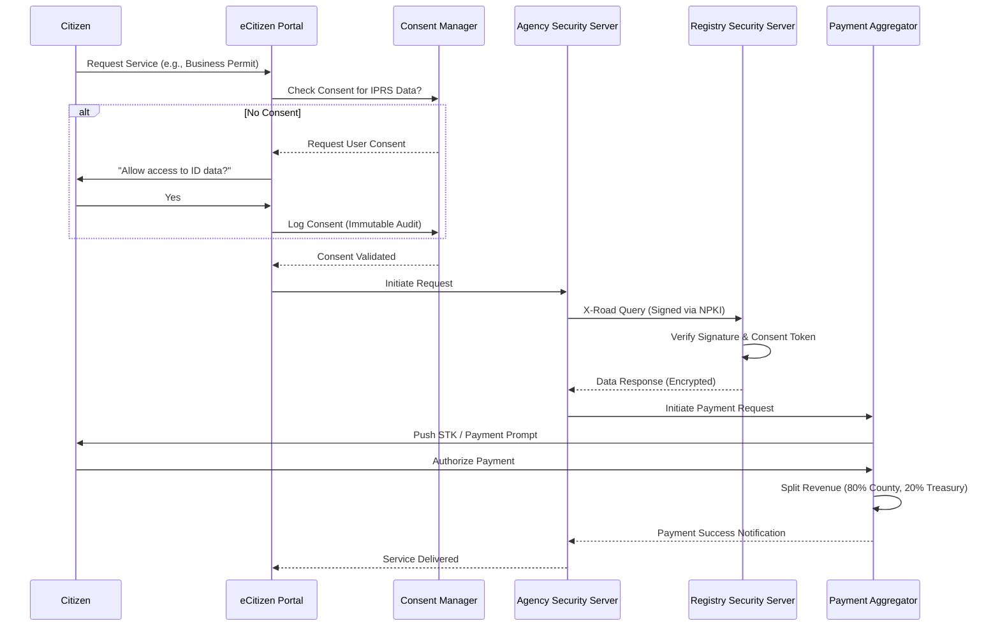

# Kenya DSAP Architecture – Huduma Bridge (GEA Compliant)
## (with NPKI, Decentralized Mediation, and Payment Aggregation)

### System Architecture Overview

```mermaid
---
title: Kenya Huduma Ecosystem - High-Level Architecture (DSAP/KDEAP Compliant)
---
graph TD
    %% Styling
    classDef access fill:#e1f5fe,stroke:#01579b,stroke-width:2px,color:#01579b
    classDef core fill:#fff3e0,stroke:#e65100,stroke-width:2px,color:#e65100
    classDef trust fill:#f3e5f5,stroke:#4a148c,stroke-width:2px,color:#4a148c
    classDef bridge fill:#e8f5e8,stroke:#1b5e20,stroke-width:2px,color:#1b5e20
    classDef registry fill:#ffebee,stroke:#b71c1c,stroke-width:2px,color:#b71c1c
    classDef payment fill:#fffde7,stroke:#f57f17,stroke-width:2px,color:#f57f17
    classDef cross fill:#f1f8e9,stroke:#33691e,stroke-width:2px,color:#33691e

    %% Layer 1: Access Channels
    subgraph Layer1["🌐 Layer 1: Access Channels (Citizen-Centric)"]
        direction TB
        CP["💻 Citizen/Business Portals (eCitizen)"]:::access
        MA["📱 Mobile App / USSD"]:::access
        OW["👤 Officer Workbench"]:::access
        SC["🏢 Huduma Centers"]:::access
    end

    %% Layer 2: Core Platform
    subgraph Layer2["⚙️ Layer 2: Core Platform (Security & Orchestration)"]
        direction TB
        
        AG["🔌 API Gateway (Kong)"]:::core
        WE["⚙️ Workflow Engine (Camunda)"]:::core
        FS["📋 Dynamic Form Builder"]:::core
        OBS["📊 Observability & Monitoring"]:::core
        SSE["🧱 Shared Services Engine"]:::core
        
        subgraph TrustHub["🔐 Trust Hub"]
            direction LR
            CM["✓ Consent Manager"]:::trust
            IDP["🆔 Identity Federation (Maisha Namba)"]:::trust
            NPKI["🔑 National PKI (Root + Govt CA)"]:::trust
        end
        
        %% Internal connections
        AG --> WE
        WE --> FS
        WE --> CM
        CM --> IDP
        IDP --> NPKI
        SSE --> WE
        OBS -.-> AG
        OBS -.-> WE
    end

    %% Layer 3: Interoperability
    subgraph Layer3["🔄 Layer 3: Interoperability (Huduma Bridge)"]
        direction TB
        KeSEL["🌉 Kenya Secure Exchange Layer (X-Road)"]:::bridge
        CSC["📚 Central Service Catalogue"]:::bridge
        Adapters["🔧 Legacy System Adapters"]:::bridge
        
        KeSEL --> CSC
        KeSEL --> Adapters
    end

    %% Layer 4: Registries & Data Analytics
    subgraph Layer4["🏛️ Layer 4: Foundational Registries & Payments"]
        direction TB
        
        subgraph Registries["📋 Authoritative Registries"]
            direction TB
            R1[IPRS / Maisha Namba / CRS<br/>Person & Civil Registries]:::registry
            R2[BRS / LMS / NTSA / KRA<br/>Business & Revenue Registries]:::registry
            R_SEC[Agriculture / Education / Health<br/>World Bank Priority Sectors]:::registry
            R4[Immigration / Judiciary / SP<br/>Social & Legal Registries]:::registry
        end
        
        NDW["🗄️ National Data Warehouse (Analytics)"]:::registry
        
        subgraph Payments["💰 Financial Ecosystem"]
            direction LR
            GPA["💳 Govt Payment Aggregator"]:::payment
            Banks["🏦 Banks & M-Pesa"]:::payment
            Treasury["📊 National Treasury"]:::payment
            Counties["🏛️ County Revenue Systems"]:::payment
        end
        
        %% Payment internal connections
        GPA <--> Banks
        GPA --> Treasury
        GPA --> Counties
    end

    %% Cross-Cutting Layer
    subgraph CrossLayer["🛡️ Cross-Cutting Capabilities (Resilience & Security)"]
        direction LR
        SOC["🛡️ Security Ops Center (SOC)"]:::cross
        DR["🔄 Disaster Recovery (DR/BCP)"]:::cross
        AUD["📝 Centralized Audit Vault"]:::cross
    end

    %% Main Flow - Top to Bottom
    Layer1 ==> AG
    
    WE ==> KeSEL
    
    KeSEL ==> Registries
    KeSEL ==> GPA
    Registries ==> NDW

    %% Connect Trust Hub to Layer 3
    TrustHub -.- KeSEL
    
    %% Resilience links
    CrossLayer -.-> Layer2
    CrossLayer -.-> Layer3
    CrossLayer -.-> Layer4
```

### Data Flow Pattern (Decentralized Exchange with Consent)

### 1. Access Channels (Citizen-Centric Design)
Aligned with GEA Principle: **Citizen-Centricity**.
- **Unified Front-End:** Single-window access via eCitizen for all services.
- **Omnichannel:** Seamless experience across Web, Mobile App, USSD, and physical Huduma Centers.
- **Accessibility:** Designed for inclusivity (USSD for feature phones, Assistive Tech for PWDs).

---

### 2. Trust, Security & Consent (Data Protection Act Compliance)
Aligned with GEA Principle: **Security & Privacy by Design**.
- **Consent Manager:** Centralized module to capture, track, and revoke citizen consent for data sharing as required by the **Data Protection Act (2019)**. No data moves without explicit user permission.
- **National PKI (NPKI):** All transactions are digitally signed using certificates issued by the Government CA (ICTA), ensuring non-repudiation.
- **Identity Federation:** Integration with **Maisha Namba** (IPRS) for single sign-on (SSO) and robust identity verification.

---

### 3. Orchestration & Shared Services
Aligned with GEA Principle: **Standards-Driven & Open Architecture**.
- **Workflow Engine:** Uses **BPMN 2.0** (e.g., Camunda/Flowable) to model long-running government processes. Decouples business logic from code.
- **Dynamic Forms:** JSON-schema driven forms that render automatically on any channel.
- **API Gateway:** Centralized entry point for traffic management, rate limiting, and threat protection (WAF).
- **Shared Services Engine:** Reusable modules (Notification, SMS, Document Management) to drive cost-efficiency.
- **Observability & Analytics:** Real-time monitoring of service KPIs and system health (World Bank mandatory requirement).

---

### 4. Interoperability & Cross-Cutting Resilience
Aligned with GEA Principle: **Interoperability & Resilience by Design**.
- **Kenya Secure Exchange Layer (KeSEL):** Based on the **X-Road** protocol. Enables secure, peer-to-peer data exchange between agencies without a central data bottleneck.
- **Disaster Recovery (DR) & BCP:** Mandatory "Real Active Backup" model ensuring service continuity.
- **Security Operations Center (SOC):** Reactive and proactive threat monitoring across the digital ecosystem.
- **Central Service Catalogue:** A discoverable registry of all available government APIs (G2G) to promote reuse.

---

### 5. Government Payment Aggregator (GPA)
Aligned with GEA Principle: **Reuse & Modularity**.
- **Aggregator Model:** A single integration point for all payment providers (M-Pesa, Airtel Money, T-Kash, Equity, KCB, Visa/Mastercard).
- **Split Payments:** Built-in logic to automatically split revenue at the source (e.g., a single permit fee is split into County Revenue, National Treasury, and Regulatory Agency accounts instantly).
- **Reconciliation:** Automated daily reconciliation reports for the Auditor General.
- **Real-Time Settlement:** Instant payment notifications (IPN) to service workflows to prevent service delivery delays.

---

### 6. Authoritative Registries & Data Analytics
Aligned with GEA Principle: **Data as a Strategic Asset**.
The platform integrates directly with **National Master Data Sources** and a centralized analytics layer to eliminate duplication (Once-Only Principle).

-   **Priority Sector Registries:** Agriculture, Education, and Health registries prioritized as per WB strategic focus.
-   **National Data Warehouse:** Consolidated repository for anonymized data to support Big Data analytics.
-   **IPRS / Maisha Namba:** The single source of truth for digital identity.
-   **BRS (Business Registration):** Validates Company/Business registration details.
-   **NTSA & KRA:** Integration for transport and tax compliance.
-   **NLIMS (Ardhisasa):** Validates land ownership and parcels.
-   **Civil Registration (CRS):** Authoritative source for Births and Deaths records.

---

### 7. Governance & Standards Compliance
- **ISO 27001:** Information Security Management.
- **ISO 22301:** Business Continuity Management (Mandatory for Resilience).
- **ISO 20022:** Financial messaging standard for the Payment Aggregator.
- **Data Protection Act (2019):** Compliance with ODPC regulations on data residency and citizen privacy.
- **Public Archives and Documentation Act (KNAD):** Aligned with gazetted EDRMS standards for long-term record retention.
- **TOGAF:** Architecture development methodology.
- **GIF v4.3:** Government Interoperability Framework compliance for all APIs.
