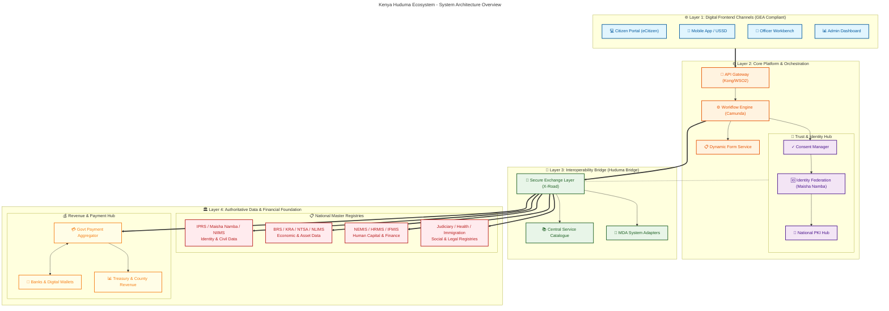
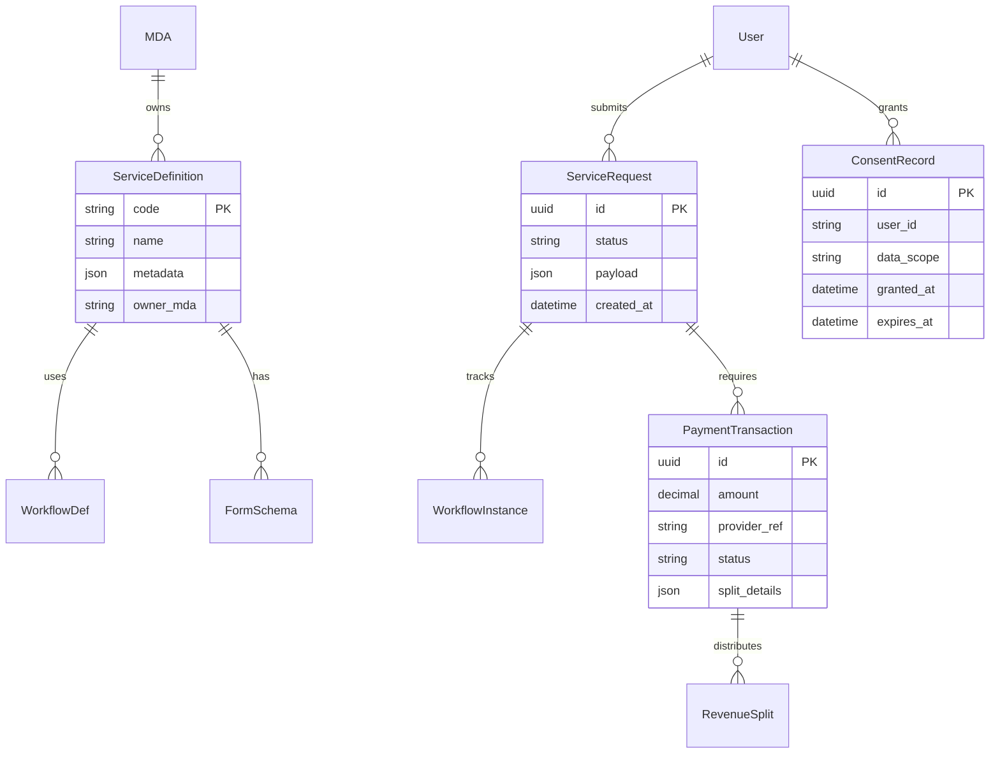

# System Design Documents (GEA Compliant)

## Project: Repeatable Government Services Platform (Production-Grade)

---

## 1. High-Level Architecture Diagram (GEA Aligned)

**Components:**
- **Citizen UI (Micro-Frontend):** Independent deployable modules for different service categories (e.g., Business, Land, Health).
- **API Gateway (Kong):** Centralized entry point for traffic management, rate limiting, and threat protection (WAF).
- **Identity & Access (Keycloak):** Handles authentication (OAuth2/OIDC), SSO with Maisha Namba, and RBAC.
- **Consent Manager:** Manages citizen consent for data sharing as required by the **Data Protection Act (2019)**.
- **Workflow Engine (Camunda):** Orchestrates long-running processes using standard **BPMN 2.0** models.
- **X-Road Security Server:** Enables secure, encrypted data exchange with other government agencies (GIF compliance).
- **Payment Aggregator (GPA):** Handles integrations with M-Pesa, Banks, Cards, and revenue splitting logic.
- **Message Queue (RabbitMQ):** Decouples services for asynchronous processing (notifications, audit logs).

---

## 2. Detailed Component Design

### 2.1 Backend Services (Microservices Pattern)
- **Identity Service:** Wrapper around Keycloak/IPRS for user authentication and profile management.
- **Service Registry:** Stores metadata about available services (fees, requirements, SLAs) in a standard JSON schema.
- **Workflow Service:** Executes BPMN definitions. Handles state transitions (e.g., Submitted -> Review -> Payment -> Approved).
- **Form Service:** Generates UI schemas dynamically based on service configuration.
- **Payment Service (GPA):**
    - **Providers:** M-Pesa (Daraja API), PesaLink, Card Processors.
    - **Logic:** Validates PRN, initiates STK Push, handles callbacks, splits revenue (80/20 rule), reconciles daily.
- **Registry Adapters:** Dedicated microservices that translate X-Road SOAP/REST responses from legacy systems (e.g., IFMIS, NEMIS) into standard JSON for the platform.
- **Notification Service:** Listens to MQ events and sends SMS/Email via Government Notification Gateway.
- **Audit Service:** Immutable logging of every user action and system event for accountability.

### 2.2 Frontend Components
- **Shell Application:** Main container that loads micro-frontends based on user role.
- **Form Renderer:** A smart component that takes JSON schema from the Backend and renders Vue 3 forms with validation.
- **Task List:** Officer's inbox for pending approvals, sorted by SLA priority.
- **Analytics Dashboard:** PowerBI/Superset integration for real-time reporting on service delivery metrics.

---

## 3. Data Model (Domain-Driven Design)

**Key Entities:**
- **ServiceDefinition:** The "Blueprint" of a government service.
- **WorkflowInstance:** The running state of a specific application (e.g., "Pending Approval by Officer A").
- **PaymentTransaction:** Records the financial event, including provider details and status.
- **RevenueSplit:** Tracks how a single payment was divided among beneficiaries (Treasury, County, Agency).
- **ConsentRecord:** Legal proof that a citizen allowed their data to be accessed.

---

## 5. Authoritative Registries Integration (Master List)
The platform is designed to integrate with the following **National Master Data Sources** via PKI-authenticated APIs through the **Kenya Secure Exchange Layer (KeSEL / X-Road)**:

-   **IPRS (Integrated Population Registration System):** Validates identity for all Citizens and Foreign Residents.
-   **Maisha Namba / NIIMS:** The single source of truth for digital identity (National ID).
-   **BRS (Business Registration Service):** Validates Company/Business registration details and beneficial ownership.
-   **NLIMS (National Land Information Management System):** Validates land ownership, parcels, and encumbrances (Ardhisasa).
-   **NTSA (National Transport & Safety Authority):** Validates vehicle ownership, driving licenses, and PSV compliance.
-   **KRA (Kenya Revenue Authority):** Validates Tax Compliance (PIN, TCC) via iTax integration.
-   **NEMIS (National Education Management Information System):** Validates student enrollment and academic records.
-   **HRMIS (Human Resource Management Information System):** Validates public servant employment status (G2E services).
-   **IFMIS (Integrated Financial Management Information System):** Validates budget codes and facilitates G2G payments.
-   **Judiciary Case Management System (CMS):** Validates court cases, fines, and legal status.
-   **Immigration (eFNS):** Validates passport, visa, and work permit status.
-   **Civil Registration (CRS):** Authoritative source for Births and Deaths records.
-   **Social Protection (Inua Jamii):** Registry for vulnerable populations and social safety nets.
-   **Health (NHIF/SHA):** Registry for health insurance coverage and beneficiaries.

---

## 6. Security & Compliance
- **Data Protection:** All PII (Personal Identifiable Information) is encrypted at rest (AES-256) and in transit (TLS 1.3).
- **Audit Trails:** Comprehensive logging of *who* accessed *what* data and *when*.
- **Role-Based Access Control (RBAC):** Granular permissions defined at the API Gateway level.
- **Interoperability:** All external data exchanges occur via the **X-Road** adapter using mutual TLS (mTLS).

---

## 5. Technology Stack (Open Standards)
- **Frontend:** Vue.js 3, Tailwind CSS
- **Backend API:** Python (Django/FastAPI) or Java (Spring Boot)
- **Workflow Engine:** Camunda (BPMN 2.0)
- **API Gateway:** Kong (Open Source)
- **Identity:** Keycloak (OpenID Connect)
- **Database:** PostgreSQL 15+
- **Message Broker:** RabbitMQ / Redis
- **Containerization:** Docker & Kubernetes (K8s)

---

## 6. Deployment Strategy
- **Containerized:** All microservices are Docker images.
- **Orchestration:** Deployed on **Kubernetes (K8s)** for scalability and self-healing.
- **CI/CD:** Automated pipelines (GitHub Actions / Jenkins) for testing, building, and deploying.
- **Environment:** Staging (Sandbox) -> Production (Government Cloud).
