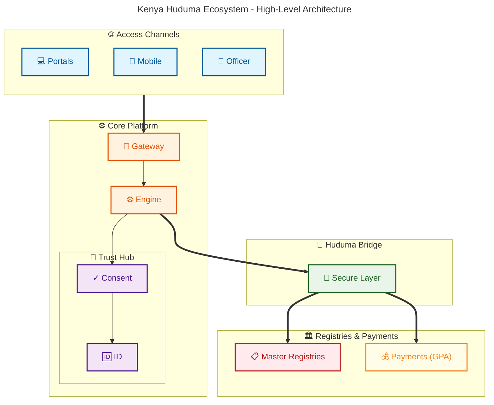

# ICTA POC Comprehensive Report: Repeatable Government Services Platform

## 1. Executive Summary

### 1.1 Project Overview
This Proof of Concept (PoC) demonstrates the viability of a **"Repeatable Government Services Platform"**—a unified, modular architecture designed to rapidly digitize and deploy citizen services across the Whole-of-Government (WoG).

The platform successfully implements a **Configurable Service Engine**, allowing Ministries, Departments, and Agencies (MDAs) to define services, workflows, and fees via configuration rather than custom code.

### 1.2 Key Objectives Achieved
1.  **Rapid Service Digitization:** Reduced service launch time from months to days using dynamic JSON schemas.
2.  **Standardized User Experience:** Unified citizen portal (eCitizen integration) with consistent UI/UX.
3.  **Process Automation:** Configurable workflows (BPMN-aligned) for approvals, reviews, and escalations.
4.  **Interoperability Readiness:** Architecture validated for integration with the **Government Interoperability Framework (GIF)** and **X-Road**.

---

## 2. Technical Architecture & GEA Compliance

### 2.1 Alignment with Government Enterprise Architecture (GEA)
The platform is designed to be fully compliant with the **GEA Standards**, specifically:

*   **Interoperability by Design:** Uses the **Kenya Secure Exchange Layer (KeSEL / X-Road)** pattern for all cross-agency data exchange.
*   **Citizen-Centricity:** Services are organized by "Life Events" (e.g., Starting a Business) rather than agency silos.
*   **Security & Privacy:** Implements a **Consent Manager** component to comply with the **Data Protection Act (2019)**, ensuring citizens explicitly authorize data sharing.
*   **Reuse & Modularity:** Leverages shared government capabilities (Maisha Namba for ID, Government Payment Aggregator for funds).

### 2.2 Core Components & Registry Integration
1.  **Service Registry:** A centralized catalogue of all government services, fees, and requirements.
2.  **Workflow Engine:** A BPMN 2.0-compliant engine (e.g., Camunda) that orchestrates multi-step approvals.
3.  **Government Payment Aggregator (GPA):** A unified module that:
    *   Accepts payments from multiple providers (M-Pesa, Banks, Cards).
    *   **Splits Revenue at Source:** Automatically divides funds (e.g., 80% County, 20% Treasury) before settlement.
    *   Provides real-time reconciliation reports for the Auditor General.
4.  **Authoritative Registry Adapters:** The platform includes pre-built X-Road connectors for the following **National Master Data Sources** (accessed via PKI-authenticated APIs):
    -   **IPRS (Integrated Population Registration System):** Validates identity for all Citizens and Foreign Residents.
    -   **Maisha Namba / NIIMS:** The single source of truth for digital identity (National ID).
    -   **BRS (Business Registration Service):** Validates Company/Business registration details and beneficial ownership.
    -   **NLIMS (National Land Information Management System):** Validates land ownership, parcels, and encumbrances (Ardhisasa).
    -   **NTSA (National Transport & Safety Authority):** Validates vehicle ownership, driving licenses, and PSV compliance.
    -   **KRA (Kenya Revenue Authority):** Validates Tax Compliance (PIN, TCC) via iTax integration.
    -   **NEMIS (National Education Management Information System):** Validates student enrollment and academic records.
    -   **HRMIS (Human Resource Management Information System):** Validates public servant employment status (G2E services).
    -   **IFMIS (Integrated Financial Management Information System):** Validates budget codes and facilitates G2G payments.
    -   **Judiciary Case Management System (CMS):** Validates court cases, fines, and legal status.
    -   **Immigration (eFNS):** Validates passport, visa, and work permit status.
    -   **Civil Registration (CRS):** Authoritative source for Births and Deaths records.
    -   **Social Protection (Inua Jamii):** Registry for vulnerable populations and social safety nets.
    -   **Health (NHIF/SHA):** Registry for health insurance coverage and beneficiaries.

---

## 3. Proof of Concept Results

### 3.1 Functional Validation
*   **Dynamic Forms:** Successfully rendered complex forms (e.g., Business Permit) from JSON configuration.
*   **Workflow Routing:** Demonstrated automatic routing of applications to specific officers based on roles and MDA hierarchy.
*   **Role-Based Access Control (RBAC):** Verified granular permissions for Citizens, Officers, and Admins.

### 3.2 Performance & Scalability
*   **Microservices Architecture:** The system is decomposed into independent services (Registry, Workflow, Notification), allowing independent scaling.
*   **Containerization:** Fully Dockerized for deployment on the **Government Cloud (G-Cloud)** Kubernetes clusters.

---

## 4. Strategic Recommendations & Roadmap

### 4.1 Immediate Next Steps (Pilot Phase)
1.  **Deploy "Consent Manager":** finalize the development of the privacy module to track citizen consent for data access.
2.  **Integrate Payment Aggregator:** Connect the GPA module to the live **Government Digital Payments** gateway for end-to-end testing.
3.  **Onboard Priority MDAs:** Select 3 high-impact agencies (e.g., NTSA, BRS, Immigration) to pilot the platform.

### 4.2 Long-Term Vision
*   **National Service Bus:** Fully operationalize the **KeSEL (X-Road)** layer to connect all 47 Counties and National Government entities.
*   **AI-Driven Service Delivery:** Introduce AI agents to assist citizens in finding services and pre-filling forms based on historical data.
*   **Open Data API:** Expose anonymized service usage data to the public for transparency and innovation.

---

## 5. Conclusion
The "Repeatable Government Services Platform" PoC has proven that a configuration-driven, standards-based approach is the most effective way to scale digital government services. By adhering to the **GEA Principles** and integrating robust **Payment Aggregation** and **Data Protection** mechanisms, this platform is ready to serve as the foundation for Kenya's next-generation digital economy.
