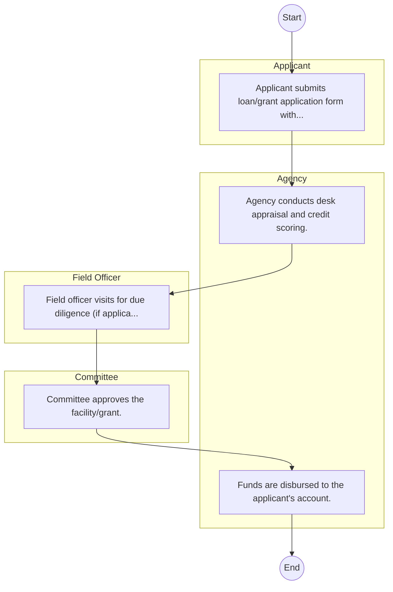

# STANDARD BPM TEMPLATE – Agricultural Development Corporation

## Cover Page
- **Ministry/Department/Agency (MDA):** Agricultural Development Corporation
- **Process Name:** To promote and execute agricultural schemes and reconstruction across Kenya; to initiate, assist, or expand agricultural undertakings and enterprises; to promote the production of essential agricultural inputs for Kenya, such as seeds and pedigree and high-grade livestock; to multiply basic seed to ensure the availability of sufficient quantities of high-quality seed for farmers; to act as the custodian of national livestock studs and work to preserve breeds; to facilitate the transfer of technology from research institutions to farmers; to serve as a testing ground for new agricultural technologies; to provide training to farmers and agribusinesses through various programs; to manage state farms and estates for the production of essential crops; to contribute significantly to national food security and poverty reduction; to support agro-industries that process agricultural goods; to provide financing, technical assistance, and support to farming operations; to support land development, irrigation projects, and improvements in farm infrastructure; to promote environmentally sustainable farming methods and practices; and to support marketing and distribution efforts for agricultural produce.
- **Document Version:** 1.0
- **Date:** 2026-02-14
- **Classification:** Official

---

## Executive Summary
The Agricultural Development Corporation (ADC) Kenya is a government parastatal established in 1965 under an Act of Parliament (Cap 444 of 1986). Its primary mandate is to promote and execute agricultural schemes and reconstruction in Kenya, facilitating the commercialization of agriculture, promoting agro-industrial ventures, and enhancing national food security. ADC plays a crucial role in the production of essential agricultural inputs, particularly quality seeds and pedigree and high-grade livestock, to support farmers and drive agricultural transformation.

---

## Process Flowchart (BPMN 2.0 - Mermaid)
*Guidance: This diagram visualizes the process flow across different actors (Swimlanes).*

---

## Process Overview
### Process Name
To promote and execute agricultural schemes and reconstruction across Kenya; to initiate, assist, or expand agricultural undertakings and enterprises; to promote the production of essential agricultural inputs for Kenya, such as seeds and pedigree and high-grade livestock; to multiply basic seed to ensure the availability of sufficient quantities of high-quality seed for farmers; to act as the custodian of national livestock studs and work to preserve breeds; to facilitate the transfer of technology from research institutions to farmers; to serve as a testing ground for new agricultural technologies; to provide training to farmers and agribusinesses through various programs; to manage state farms and estates for the production of essential crops; to contribute significantly to national food security and poverty reduction; to support agro-industries that process agricultural goods; to provide financing, technical assistance, and support to farming operations; to support land development, irrigation projects, and improvements in farm infrastructure; to promote environmentally sustainable farming methods and practices; and to support marketing and distribution efforts for agricultural produce.

### Service Category
- G2B (Government to Business)

### Process Objective
- To promote and execute agricultural schemes and reconstruction across Kenya; to initiate, assist, or expand agricultural undertakings and enterprises; to promote the production of essential agricultural inputs for Kenya, such as seeds and pedigree and high-grade livestock; to multiply basic seed to ensure the availability of sufficient quantities of high-quality seed for farmers; to act as the custodian of national livestock studs and work to preserve breeds; to facilitate the transfer of technology from research institutions to farmers; to serve as a testing ground for new agricultural technologies; to provide training to farmers and agribusinesses through various programs; to manage state farms and estates for the production of essential crops; to contribute significantly to national food security and poverty reduction; to support agro-industries that process agricultural goods; to provide financing, technical assistance, and support to farming operations; to support land development, irrigation projects, and improvements in farm infrastructure; to promote environmentally sustainable farming methods and practices; and to support marketing and distribution efforts for agricultural produce.

### Scope
- **In Scope:** End-to-end processing within Agricultural Development Corporation.
- **Out of Scope:** External agency approvals.

### Triggers
- Submission of application/request by Applicant.

### End States
- **Successful:** Loan Disbursement / Service Delivery, Statement of Account, Contract / Agreement, Receipt / Invoice
- **Unsuccessful:** Application rejected due to non-compliance.

### Policy Context
- The Agricultural Development Corporation Act; The Constitution of Kenya 2010; Data Protection Act 2019.

---

## Stakeholders
| Stakeholder | Role | Responsibilities |
|---|---|---|
| Applicant | Process Actor | Performs actions as defined in steps. |
| Field Officer | Process Actor | Performs actions as defined in steps. |
| Committee | Process Actor | Performs actions as defined in steps. |
| Agency | Process Actor | Performs actions as defined in steps. |

---

## Inputs & Outputs
- **Inputs:** Loan/Service Application Form, Business Proposal / Plan, Financial Statements / Bank Records, Collateral / Security Documents
- **Outputs:** Loan Disbursement / Service Delivery, Statement of Account, Contract / Agreement, Receipt / Invoice

---

## Detailed Process (AS-IS)
| Step | Role | Action | Tool | Notes |
|---|---|---|---|---|
| 1 | Applicant | Applicant submits loan/grant application form with business proposal. | Manual | |
| 2 | Agency | Agency conducts desk appraisal and credit scoring. | Manual | |
| 3 | Field Officer | Field officer visits for due diligence (if applicable). | Manual | |
| 4 | Committee | Committee approves the facility/grant. | Manual | |
| 5 | Agency | Funds are disbursed to the applicant's account. | Manual | |

---

## Pain Points & Opportunities
### Pain Points
- Lengthy credit appraisal processes.
- Manual debt collection and reconciliation.
- High paperwork for loan processing.
- Lack of 360-degree customer view.

### Opportunities
- Automated Credit Scoring and Appraisal.
- Mobile-based loan application and repayment.
- Customer Relationship Management (CRM) systems.
- Data analytics for risk management.

---

## KPIs
| KPI | Baseline | Target |
|---|---|---|
| Turnaround Time | 30 Days | 5 Days |
| CSAT | 50% | 90% |
