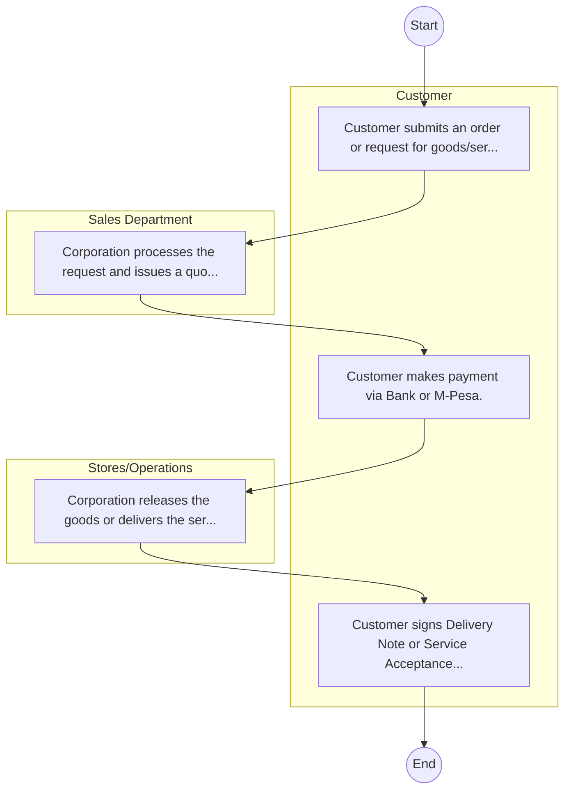

# STANDARD BPM TEMPLATE – Agro-Chemical and Food Company

## Cover Page
- **Ministry/Department/Agency (MDA):** Agro-Chemical and Food Company
- **Process Name:** To produce various grades of spirits for potable, industrial, and domestic applications, including Extra Neutral Spirit, Kenya Methylated Spirit, Industrial Methylated Spirit, potable bottled spirits, pharmaceutical spirits (e.g., surgical spirit, instant hand sanitizer), and denatured ethyl alcohol; to be the sole producer of baker's yeast (Active Dry Yeast and Wet Yeast) in East and Central Africa, satisfying various market segments; to produce beverage-grade liquefied carbon dioxide (LCO2); to efficiently utilize sugarcane molasses procured from various sugar factories as a primary raw material; to continuously embrace technological dynamics to meet customer needs and ensure consistent growth in profitability; and to control, maintain, and improve the environment under its purview, with a strong focus on pollution prevention, regulatory compliance, and addressing customer environmental concerns.
- **Document Version:** 1.0
- **Date:** 2026-02-14
- **Classification:** Official

---

## Executive Summary
The Agro-Chemical and Food Company Limited (ACFC) in Kenya was established in 1978 as a joint venture between the private sector and the Government of Kenya. Its initial mandate was to produce power alcohol from sugarcane molasses. ACFC has since diversified its operations to focus on the production of various grades of spirits (potable, industrial, and pharmaceutical), baker's yeast (as the sole producer in East and Central Africa), and beverage-grade liquefied carbon dioxide (LCO2). The company continuously embraces technological advancements to meet customer needs, ensures consistent profitability, and practices environmental stewardship within its purview.

---

## Process Flowchart (BPMN 2.0 - Mermaid)
*Guidance: This diagram visualizes the process flow across different actors (Swimlanes).*

---

## Process Overview
### Process Name
To produce various grades of spirits for potable, industrial, and domestic applications, including Extra Neutral Spirit, Kenya Methylated Spirit, Industrial Methylated Spirit, potable bottled spirits, pharmaceutical spirits (e.g., surgical spirit, instant hand sanitizer), and denatured ethyl alcohol; to be the sole producer of baker's yeast (Active Dry Yeast and Wet Yeast) in East and Central Africa, satisfying various market segments; to produce beverage-grade liquefied carbon dioxide (LCO2); to efficiently utilize sugarcane molasses procured from various sugar factories as a primary raw material; to continuously embrace technological dynamics to meet customer needs and ensure consistent growth in profitability; and to control, maintain, and improve the environment under its purview, with a strong focus on pollution prevention, regulatory compliance, and addressing customer environmental concerns.

### Service Category
- G2B (Government to Business)

### Process Objective
- To produce various grades of spirits for potable, industrial, and domestic applications, including Extra Neutral Spirit, Kenya Methylated Spirit, Industrial Methylated Spirit, potable bottled spirits, pharmaceutical spirits (e.g., surgical spirit, instant hand sanitizer), and denatured ethyl alcohol; to be the sole producer of baker's yeast (Active Dry Yeast and Wet Yeast) in East and Central Africa, satisfying various market segments; to produce beverage-grade liquefied carbon dioxide (LCO2); to efficiently utilize sugarcane molasses procured from various sugar factories as a primary raw material; to continuously embrace technological dynamics to meet customer needs and ensure consistent growth in profitability; and to control, maintain, and improve the environment under its purview, with a strong focus on pollution prevention, regulatory compliance, and addressing customer environmental concerns.

### Scope
- **In Scope:** End-to-end processing within Agro-Chemical and Food Company.
- **Out of Scope:** External agency approvals.

### Triggers
- Submission of application/request by Customer.

### End States
- **Successful:** Loan Disbursement / Service Delivery, Statement of Account, Contract / Agreement, Receipt / Invoice
- **Unsuccessful:** Application rejected due to non-compliance.

### Policy Context
- The Agro-Chemical and Food Company Act; The Constitution of Kenya 2010; Data Protection Act 2019.

---

## Stakeholders
| Stakeholder | Role | Responsibilities |
|---|---|---|
| Customer | Process Actor | Performs actions as defined in steps. |
| Sales Department | Process Actor | Performs actions as defined in steps. |
| Stores/Operations | Process Actor | Performs actions as defined in steps. |

---

## Inputs & Outputs
- **Inputs:** Loan/Service Application Form, Business Proposal / Plan, Financial Statements / Bank Records, Collateral / Security Documents
- **Outputs:** Loan Disbursement / Service Delivery, Statement of Account, Contract / Agreement, Receipt / Invoice

---

## Detailed Process (AS-IS)
| Step | Role | Action | Tool | Notes |
|---|---|---|---|---|
| 1 | Customer | Customer submits an order or request for goods/services. | Manual | |
| 2 | Sales Department | Corporation processes the request and issues a quotation/proforma invoice. | Manual | |
| 3 | Customer | Customer makes payment via Bank or M-Pesa. | Manual | |
| 4 | Stores/Operations | Corporation releases the goods or delivers the service. | Manual | |
| 5 | Customer | Customer signs Delivery Note or Service Acceptance Form. | Manual | |

---

## Pain Points & Opportunities
### Pain Points
- Lengthy credit appraisal processes.
- Manual debt collection and reconciliation.
- High paperwork for loan processing.
- Lack of 360-degree customer view.

### Opportunities
- Automated Credit Scoring and Appraisal.
- Mobile-based loan application and repayment.
- Customer Relationship Management (CRM) systems.
- Data analytics for risk management.

---

## KPIs
| KPI | Baseline | Target |
|---|---|---|
| Turnaround Time | 30 Days | 5 Days |
| CSAT | 50% | 90% |
