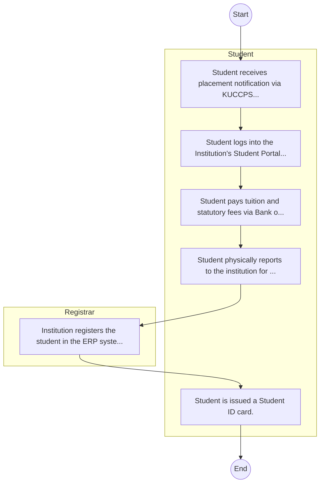

# STANDARD BPM TEMPLATE – Alupe University College

## Cover Page
- **Ministry/Department/Agency (MDA):** Alupe University College
- **Process Name:** To provide high-quality undergraduate, postgraduate, and professional programs across various fields, including health sciences, science, education, social sciences, and business; to conduct research that addresses societal challenges, promotes innovation, and contributes to sustainable development through the discovery, transmission, preservation, and enhancement of knowledge; to actively engage with local communities to foster socio-economic development through education, outreach programs, and research initiatives; to ensure the continuous improvement of academic programs and uphold high standards of teaching, learning, and research; to enhance skills and knowledge among its students and the broader community through capacity building initiatives; to foster entrepreneurship and innovation among students to stimulate job creation and economic growth; to establish partnerships with national and international institutions, businesses, and organizations to enhance research and academic exchange; to contribute to national and international policy development and advocacy in education, development, and research; to promote sustainability and environmental stewardship through research, education, and community projects focused on environmental conservation; and to develop leadership skills in students, preparing them for effective roles in society and the workforce.
- **Document Version:** 1.0
- **Date:** 2026-02-14
- **Classification:** Official

---

## Executive Summary
Alupe University, formerly Alupe University College, is a Kenyan institution of higher learning with a comprehensive mandate focused on education, research, and community outreach. It provides high-quality undergraduate, postgraduate, and professional programs across various fields, conducts research that addresses societal challenges and promotes innovation, and actively engages with local communities to foster socio-economic development. Alupe University contributes significantly to national development agendas like Kenya Vision 2030 and the Bottom-Up Economic Transformation Agenda (BETA) by producing skilled human capital and generating knowledge for sustainable growth.

---

## Process Flowchart (BPMN 2.0 - Mermaid)
*Guidance: This diagram visualizes the process flow across different actors (Swimlanes).*

---

## Process Overview
### Process Name
To provide high-quality undergraduate, postgraduate, and professional programs across various fields, including health sciences, science, education, social sciences, and business; to conduct research that addresses societal challenges, promotes innovation, and contributes to sustainable development through the discovery, transmission, preservation, and enhancement of knowledge; to actively engage with local communities to foster socio-economic development through education, outreach programs, and research initiatives; to ensure the continuous improvement of academic programs and uphold high standards of teaching, learning, and research; to enhance skills and knowledge among its students and the broader community through capacity building initiatives; to foster entrepreneurship and innovation among students to stimulate job creation and economic growth; to establish partnerships with national and international institutions, businesses, and organizations to enhance research and academic exchange; to contribute to national and international policy development and advocacy in education, development, and research; to promote sustainability and environmental stewardship through research, education, and community projects focused on environmental conservation; and to develop leadership skills in students, preparing them for effective roles in society and the workforce.

### Service Category
- G2C (Government to Citizen)

### Process Objective
- To provide high-quality undergraduate, postgraduate, and professional programs across various fields, including health sciences, science, education, social sciences, and business; to conduct research that addresses societal challenges, promotes innovation, and contributes to sustainable development through the discovery, transmission, preservation, and enhancement of knowledge; to actively engage with local communities to foster socio-economic development through education, outreach programs, and research initiatives; to ensure the continuous improvement of academic programs and uphold high standards of teaching, learning, and research; to enhance skills and knowledge among its students and the broader community through capacity building initiatives; to foster entrepreneurship and innovation among students to stimulate job creation and economic growth; to establish partnerships with national and international institutions, businesses, and organizations to enhance research and academic exchange; to contribute to national and international policy development and advocacy in education, development, and research; to promote sustainability and environmental stewardship through research, education, and community projects focused on environmental conservation; and to develop leadership skills in students, preparing them for effective roles in society and the workforce.

### Scope
- **In Scope:** End-to-end processing within Alupe University College.
- **Out of Scope:** External agency approvals.

### Triggers
- Submission of application/request by Student.

### End States
- **Successful:** Admission Letter, Student ID Card, Academic Transcripts, Degree/Diploma Certificate
- **Unsuccessful:** Application rejected due to non-compliance.

### Policy Context
- The Alupe University College Act; The Constitution of Kenya 2010; Data Protection Act 2019.

---

## Stakeholders
| Stakeholder | Role | Responsibilities |
|---|---|---|
| Student | Process Actor | Performs actions as defined in steps. |
| Registrar | Process Actor | Performs actions as defined in steps. |

---

## Inputs & Outputs
- **Inputs:** KCSE/Academic Result Slips, National ID / Birth Certificate, Student Personal Details Form, Fee Payment Receipts
- **Outputs:** Admission Letter, Student ID Card, Academic Transcripts, Degree/Diploma Certificate

---

## Detailed Process (AS-IS)
| Step | Role | Action | Tool | Notes |
|---|---|---|---|---|
| 1 | Student | Student receives placement notification via KUCCPS or applies directly as Self-Sponsored. | Manual | |
| 2 | Student | Student logs into the Institution's Student Portal to accept admission and download Admission Letter. | Digital | |
| 3 | Student | Student pays tuition and statutory fees via Bank or eCitizen. | Manual | |
| 4 | Student | Student physically reports to the institution for document verification (original slips, certs). | Manual | |
| 5 | Registrar | Institution registers the student in the ERP system. | Manual | |
| 6 | Student | Student is issued a Student ID card. | Manual | |

---

## Pain Points & Opportunities
### Pain Points
- Long queues during admission and registration.
- Manual reconciliation of fee payments.
- Delays in processing exam results and transcripts.
- Fragmented student data across departments.

### Opportunities
- Biometric student registration and attendance.
- Integrated ERP for end-to-end student lifecycle management.
- Smart Campus Cards for access control and payments.
- E-learning and digital library integration.

---

## KPIs
| KPI | Baseline | Target |
|---|---|---|
| Turnaround Time | 30 Days | 5 Days |
| CSAT | 50% | 90% |
