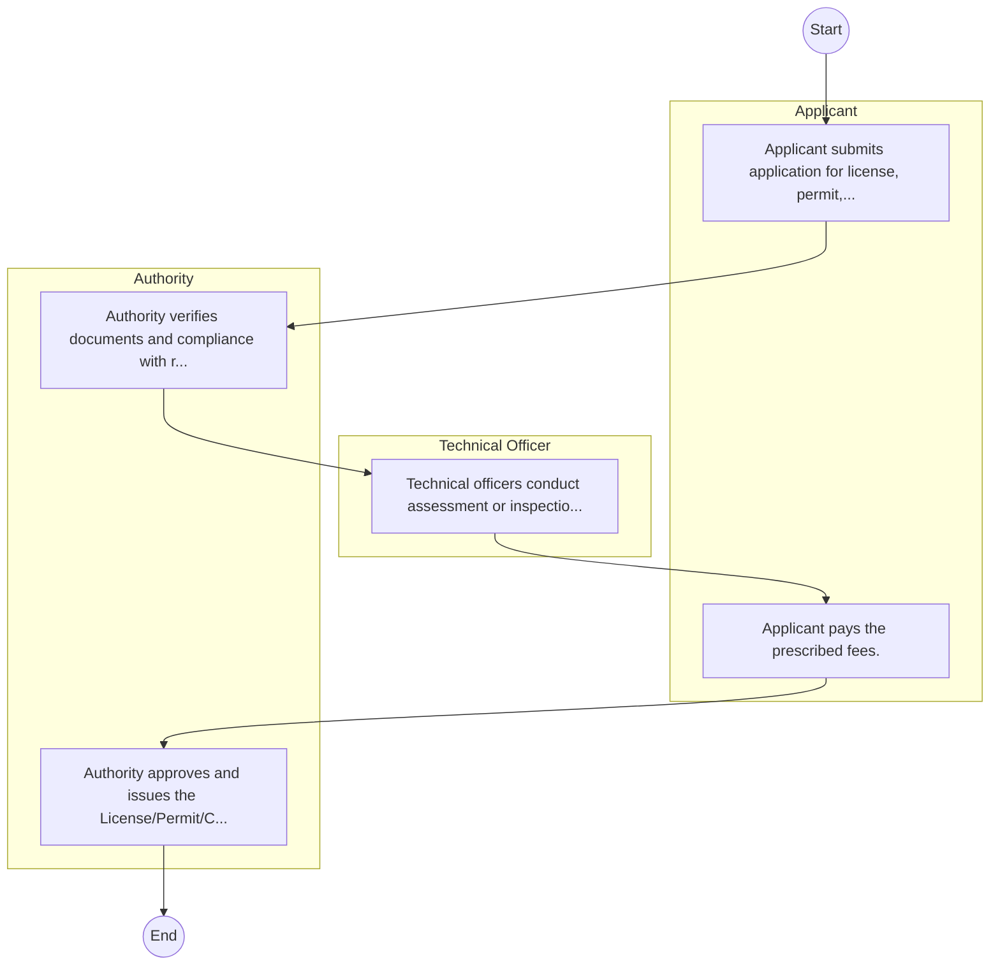

# STANDARD BPM TEMPLATE – Anti-Doping Agency of Kenya

## Cover Page
- **Ministry/Department/Agency (MDA):** Anti-Doping Agency of Kenya
- **Process Name:** To advise the Government on all anti-doping matters; to undertake anti-doping activities in Kenya in consultation and partnership with regional and international anti-doping organizations, including the World Anti-Doping Agency (WADA); to enforce regulations made by ADAK and WADA; to conduct doping control, which involves in- and out-of-competition testing of athletes and safeguarding sample integrity; to undertake research related to anti-doping; to create awareness and implement programs to combat doping through education, sensitization, and awareness campaigns; to liaise with other government agencies to eradicate performance-enhancing substance use among sports persons; to promote the integrity of drug-free sports; to investigate and gather intelligence on anti-doping related offenses, including results management of Anti-Doping Rule Violations (ADRVs); to oversee the prosecution of anti-doping cases; to develop and execute anti-doping rules and regulations; to grant Therapeutic Use Exemptions (TUEs); and to develop a national strategy to address doping in sport.
- **Document Version:** 1.0
- **Date:** 2026-02-14
- **Classification:** Official

---

## Executive Summary
The Anti-Doping Agency of Kenya (ADAK) is an agency mandated to protect the integrity of drug-free sports and the fundamental right of athletes to participate in doping-free activities in Kenya. Established to give effect to the World Anti-Doping Code and the UNESCO Convention Against Doping in Sport, ADAK undertakes comprehensive anti-doping activities. These include enforcing regulations, conducting testing, research, education and awareness campaigns, investigating doping offenses, and managing results of Anti-Doping Rule Violations, thereby ensuring fair play and upholding the ethical values of sports.

---

## Process Flowchart (BPMN 2.0 - Mermaid)
*Guidance: This diagram visualizes the process flow across different actors (Swimlanes).*

---

## Process Overview
### Process Name
To advise the Government on all anti-doping matters; to undertake anti-doping activities in Kenya in consultation and partnership with regional and international anti-doping organizations, including the World Anti-Doping Agency (WADA); to enforce regulations made by ADAK and WADA; to conduct doping control, which involves in- and out-of-competition testing of athletes and safeguarding sample integrity; to undertake research related to anti-doping; to create awareness and implement programs to combat doping through education, sensitization, and awareness campaigns; to liaise with other government agencies to eradicate performance-enhancing substance use among sports persons; to promote the integrity of drug-free sports; to investigate and gather intelligence on anti-doping related offenses, including results management of Anti-Doping Rule Violations (ADRVs); to oversee the prosecution of anti-doping cases; to develop and execute anti-doping rules and regulations; to grant Therapeutic Use Exemptions (TUEs); and to develop a national strategy to address doping in sport.

### Service Category
- G2C/G2B

### Process Objective
- To advise the Government on all anti-doping matters; to undertake anti-doping activities in Kenya in consultation and partnership with regional and international anti-doping organizations, including the World Anti-Doping Agency (WADA); to enforce regulations made by ADAK and WADA; to conduct doping control, which involves in- and out-of-competition testing of athletes and safeguarding sample integrity; to undertake research related to anti-doping; to create awareness and implement programs to combat doping through education, sensitization, and awareness campaigns; to liaise with other government agencies to eradicate performance-enhancing substance use among sports persons; to promote the integrity of drug-free sports; to investigate and gather intelligence on anti-doping related offenses, including results management of Anti-Doping Rule Violations (ADRVs); to oversee the prosecution of anti-doping cases; to develop and execute anti-doping rules and regulations; to grant Therapeutic Use Exemptions (TUEs); and to develop a national strategy to address doping in sport.

### Scope
- **In Scope:** End-to-end processing within Anti-Doping Agency of Kenya.
- **Out of Scope:** External agency approvals.

### Triggers
- Submission of application/request by Applicant.

### End States
- **Successful:** License / Permit / Certificate, Compliance Inspection Report, Official Receipt, Gazette Notice
- **Unsuccessful:** Application rejected due to non-compliance.

### Policy Context
- The Anti-Doping Agency of Kenya Act; The Constitution of Kenya 2010; Data Protection Act 2019.

---

## Stakeholders
| Stakeholder | Role | Responsibilities |
|---|---|---|
| Applicant | Process Actor | Performs actions as defined in steps. |
| Authority | Process Actor | Performs actions as defined in steps. |
| Technical Officer | Process Actor | Performs actions as defined in steps. |

---

## Inputs & Outputs
- **Inputs:** Application Form (License/Permit), Compliance Documents (Tax Compliance, CR12), Technical Reports / Site Plans, Proof of Payment
- **Outputs:** License / Permit / Certificate, Compliance Inspection Report, Official Receipt, Gazette Notice

---

## Detailed Process (AS-IS)
| Step | Role | Action | Tool | Notes |
|---|---|---|---|---|
| 1 | Applicant | Applicant submits application for license, permit, or service. | Manual | |
| 2 | Authority | Authority verifies documents and compliance with regulations. | Manual | |
| 3 | Technical Officer | Technical officers conduct assessment or inspection. | Manual | |
| 4 | Applicant | Applicant pays the prescribed fees. | Manual | |
| 5 | Authority | Authority approves and issues the License/Permit/Certificate. | Manual | |

---

## Pain Points & Opportunities
### Pain Points
- Manual document verification takes time.
- High cost and time for physical inspections.
- Risk of counterfeit licenses/certificates.
- Lack of real-time monitoring of licensees.

### Opportunities
- Online Licensing Management System (LMS).
- Integration with IPRS and BRS for auto-verification.
- Mobile field inspection apps with GIS.
- QR-coded verifiable certificates.

---

## KPIs
| KPI | Baseline | Target |
|---|---|---|
| Turnaround Time | 30 Days | 5 Days |
| CSAT | 50% | 90% |
