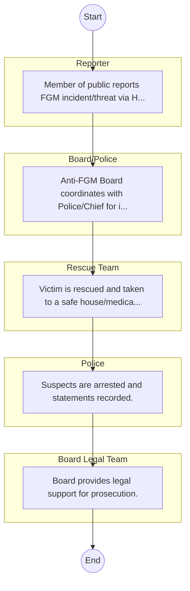

# STANDARD BPM TEMPLATE – Anti-Female Genital Mutilation Board

## Cover Page
- **Ministry/Department/Agency (MDA):** Anti-Female Genital Mutilation Board
- **Process Name:** To design, supervise, and coordinate comprehensive public awareness programs against FGM; to advise the Government on all matters relating to FGM and the effective implementation of the Prohibition of FGM Act; to design and formulate policy on the planning, financing, and coordination of all activities related to FGM eradication; to provide technical and other support to institutions, agencies, and other bodies involved in FGM eradication programs; to design specific programs aimed at the eradication of FGM; to facilitate resource mobilization for programs and activities dedicated to eradicating FGM; to raise awareness and actively campaign against FGM across various communities; and to coordinate and lead efforts on behalf of the Kenyan government to ultimately end FGM.
- **Document Version:** 1.0
- **Date:** 2026-02-14
- **Classification:** Official

---

## Executive Summary
The Anti-Female Genital Mutilation Board is a semi-autonomous government agency in Kenya, established in December 2013 under the Prohibition of Female Genital Mutilation Act, 2011. Its core mandate is to design, supervise, and coordinate public awareness programs against the practice of Female Genital Mutilation (FGM), advise the Government on FGM matters, and lead national efforts to eradicate FGM. The Board plays a crucial role in upholding the dignity and empowerment of girls and women by ensuring the effective implementation of anti-FGM legislation and promoting alternative rites of passage.

---

## Process Flowchart (BPMN 2.0 - Mermaid)
*Guidance: This diagram visualizes the process flow across different actors (Swimlanes).*

---

## Process Overview
### Process Name
To design, supervise, and coordinate comprehensive public awareness programs against FGM; to advise the Government on all matters relating to FGM and the effective implementation of the Prohibition of FGM Act; to design and formulate policy on the planning, financing, and coordination of all activities related to FGM eradication; to provide technical and other support to institutions, agencies, and other bodies involved in FGM eradication programs; to design specific programs aimed at the eradication of FGM; to facilitate resource mobilization for programs and activities dedicated to eradicating FGM; to raise awareness and actively campaign against FGM across various communities; and to coordinate and lead efforts on behalf of the Kenyan government to ultimately end FGM.

### Service Category
- G2B (Government to Business)

### Process Objective
- To design, supervise, and coordinate comprehensive public awareness programs against FGM; to advise the Government on all matters relating to FGM and the effective implementation of the Prohibition of FGM Act; to design and formulate policy on the planning, financing, and coordination of all activities related to FGM eradication; to provide technical and other support to institutions, agencies, and other bodies involved in FGM eradication programs; to design specific programs aimed at the eradication of FGM; to facilitate resource mobilization for programs and activities dedicated to eradicating FGM; to raise awareness and actively campaign against FGM across various communities; and to coordinate and lead efforts on behalf of the Kenyan government to ultimately end FGM.

### Scope
- **In Scope:** End-to-end processing within Anti-Female Genital Mutilation Board.
- **Out of Scope:** External agency approvals.

### Triggers
- Submission of application/request by Reporter.

### End States
- **Successful:** License / Permit / Certificate, Compliance Inspection Report, Official Receipt, Gazette Notice
- **Unsuccessful:** Application rejected due to non-compliance.

### Policy Context
- The Anti-Female Genital Mutilation Board Act; The Constitution of Kenya 2010; Data Protection Act 2019.

---

## Stakeholders
| Stakeholder | Role | Responsibilities |
|---|---|---|
| Police | Process Actor | Performs actions as defined in steps. |
| Board/Police | Process Actor | Performs actions as defined in steps. |
| Reporter | Process Actor | Performs actions as defined in steps. |
| Board Legal Team | Process Actor | Performs actions as defined in steps. |
| Rescue Team | Process Actor | Performs actions as defined in steps. |

---

## Inputs & Outputs
- **Inputs:** Application Form (License/Permit), Compliance Documents (Tax Compliance, CR12), Technical Reports / Site Plans, Proof of Payment
- **Outputs:** License / Permit / Certificate, Compliance Inspection Report, Official Receipt, Gazette Notice

---

## Detailed Process (AS-IS)
| Step | Role | Action | Tool | Notes |
|---|---|---|---|---|
| 1 | Reporter | Member of public reports FGM incident/threat via Hotline/Chief. | Manual | |
| 2 | Board/Police | Anti-FGM Board coordinates with Police/Chief for intervention. | Manual | |
| 3 | Rescue Team | Victim is rescued and taken to a safe house/medical facility. | Manual | |
| 4 | Police | Suspects are arrested and statements recorded. | Manual | |
| 5 | Board Legal Team | Board provides legal support for prosecution. | Manual | |

---

## Pain Points & Opportunities
### Pain Points
- Manual document verification takes time.
- High cost and time for physical inspections.
- Risk of counterfeit licenses/certificates.
- Lack of real-time monitoring of licensees.

### Opportunities
- Online Licensing Management System (LMS).
- Integration with IPRS and BRS for auto-verification.
- Mobile field inspection apps with GIS.
- QR-coded verifiable certificates.

---

## KPIs
| KPI | Baseline | Target |
|---|---|---|
| Turnaround Time | 30 Days | 5 Days |
| CSAT | 50% | 90% |
