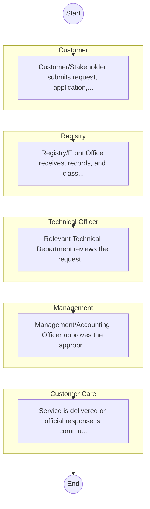

# STANDARD BPM TEMPLATE – ASALs and Regional Development

## Cover Page
- **Ministry/Department/Agency (MDA):** ASALs and Regional Development
- **Process Name:** To coordinate the development of laws, policies, and guidelines for the effective management of devolution and the sustainable development of ASALs; to provide capacity building and technical assistance to counties, particularly those in ASAL regions; to facilitate harmonious intergovernmental relations between national and county governments, and among county governments; to promote public participation in policy and decision-making processes affecting ASALs and regional development; to track and monitor program implementation in counties to ensure alignment with national goals; to coordinate stakeholder engagement for integrated development; to oversee the management of public assets and liabilities at the county level; to facilitate the transfer of functions between national and county governments; to establish and promote systems for efficient and effective implementation of devolution and ASAL programs; to coordinate the implementation of targeted policy interventions for ASALs; to promote socio-economic development in ASALs; to undertake community mobilization for development initiatives; to manage food relief and emergency responses; and to implement special programs for the accelerated development of Northern Kenya and other Arid Lands.
- **Document Version:** 1.0
- **Date:** 2026-02-14
- **Classification:** Official

---

## Executive Summary
The Ministry of ASALs and Regional Development (previously known as the Ministry of Devolution and Arid and Semi-Arid Lands - ASALs) is a key government Ministry in Kenya. Established to coordinate the development of policies and programs for the sustainable development of Kenya's Arid and Semi-Arid Lands and regional authorities, it plays a crucial role in fostering economic growth, social inclusion, and environmental sustainability within these regions. The Ministry's work is vital for integrating marginalized areas into the national development agenda and improving livelihoods.

---

## Process Flowchart (BPMN 2.0 - Mermaid)
*Guidance: This diagram visualizes the process flow across different actors (Swimlanes).*

---

## Process Overview
### Process Name
To coordinate the development of laws, policies, and guidelines for the effective management of devolution and the sustainable development of ASALs; to provide capacity building and technical assistance to counties, particularly those in ASAL regions; to facilitate harmonious intergovernmental relations between national and county governments, and among county governments; to promote public participation in policy and decision-making processes affecting ASALs and regional development; to track and monitor program implementation in counties to ensure alignment with national goals; to coordinate stakeholder engagement for integrated development; to oversee the management of public assets and liabilities at the county level; to facilitate the transfer of functions between national and county governments; to establish and promote systems for efficient and effective implementation of devolution and ASAL programs; to coordinate the implementation of targeted policy interventions for ASALs; to promote socio-economic development in ASALs; to undertake community mobilization for development initiatives; to manage food relief and emergency responses; and to implement special programs for the accelerated development of Northern Kenya and other Arid Lands.

### Service Category
- G2C/G2B

### Process Objective
- To coordinate the development of laws, policies, and guidelines for the effective management of devolution and the sustainable development of ASALs; to provide capacity building and technical assistance to counties, particularly those in ASAL regions; to facilitate harmonious intergovernmental relations between national and county governments, and among county governments; to promote public participation in policy and decision-making processes affecting ASALs and regional development; to track and monitor program implementation in counties to ensure alignment with national goals; to coordinate stakeholder engagement for integrated development; to oversee the management of public assets and liabilities at the county level; to facilitate the transfer of functions between national and county governments; to establish and promote systems for efficient and effective implementation of devolution and ASAL programs; to coordinate the implementation of targeted policy interventions for ASALs; to promote socio-economic development in ASALs; to undertake community mobilization for development initiatives; to manage food relief and emergency responses; and to implement special programs for the accelerated development of Northern Kenya and other Arid Lands.

### Scope
- **In Scope:** End-to-end processing within ASALs and Regional Development.
- **Out of Scope:** External agency approvals.

### Triggers
- Submission of application/request by Customer.

### End States
- **Successful:** License / Permit / Certificate, Compliance Inspection Report, Official Receipt, Gazette Notice
- **Unsuccessful:** Application rejected due to non-compliance.

### Policy Context
- The ASALs and Regional Development Act; The Constitution of Kenya 2010; Data Protection Act 2019.

---

## Stakeholders
| Stakeholder | Role | Responsibilities |
|---|---|---|
| Registry | Process Actor | Performs actions as defined in steps. |
| Customer Care | Process Actor | Performs actions as defined in steps. |
| Management | Process Actor | Performs actions as defined in steps. |
| Customer | Process Actor | Performs actions as defined in steps. |
| Technical Officer | Process Actor | Performs actions as defined in steps. |

---

## Inputs & Outputs
- **Inputs:** Application Form (License/Permit), Compliance Documents (Tax Compliance, CR12), Technical Reports / Site Plans, Proof of Payment
- **Outputs:** License / Permit / Certificate, Compliance Inspection Report, Official Receipt, Gazette Notice

---

## Detailed Process (AS-IS)
| Step | Role | Action | Tool | Notes |
|---|---|---|---|---|
| 1 | Customer | Customer/Stakeholder submits request, application, or inquiry via official channels (Email, Letter, or Portal). | Digital | |
| 2 | Registry | Registry/Front Office receives, records, and classifies the request. | Manual | |
| 3 | Technical Officer | Relevant Technical Department reviews the request against internal policies and regulations. | Manual | |
| 4 | Management | Management/Accounting Officer approves the appropriate action or service delivery. | Manual | |
| 5 | Customer Care | Service is delivered or official response is communicated to the customer. | Manual | |

---

## Pain Points & Opportunities
### Pain Points
- Manual document verification takes time.
- High cost and time for physical inspections.
- Risk of counterfeit licenses/certificates.
- Lack of real-time monitoring of licensees.

### Opportunities
- Online Licensing Management System (LMS).
- Integration with IPRS and BRS for auto-verification.
- Mobile field inspection apps with GIS.
- QR-coded verifiable certificates.

---

## KPIs
| KPI | Baseline | Target |
|---|---|---|
| Turnaround Time | 30 Days | 5 Days |
| CSAT | 50% | 90% |
