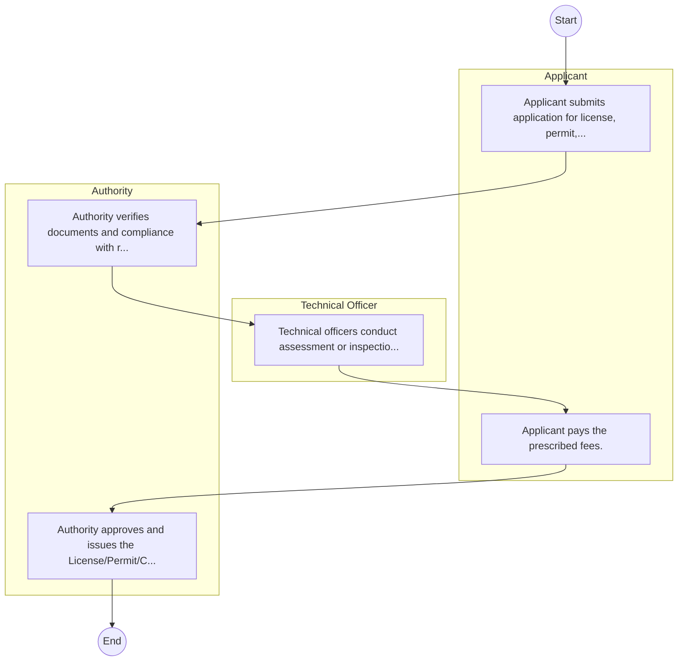

# STANDARD BPM TEMPLATE – Board of Registration of Architects and Quantity Surveyors

## Cover Page
- **Ministry/Department/Agency (MDA):** Board of Registration of Architects and Quantity Surveyors
- **Process Name:** To regulate and oversee the professions of Architecture and Quantity Surveying; to register Architects, Quantity Surveyors, and architectural/quantity surveying firms; to conduct and administer professional examinations for aspiring Architects and Quantity Surveyors; to organize and accredit Continuous Professional Development (CPD) seminars for registered professionals; to define professional conduct and make by-laws to address unprofessional conduct, including inquiry procedures and penalties; to set standards for the development and general practice of architecture and quantity surveying in Kenya; to advise on matters related to the welfare of practicing Architects and Quantity Surveyors, and on research and publication related to the practice; and to collaborate with training institutions (universities and colleges) to ensure quality education and training.
- **Document Version:** 1.0
- **Date:** 2026-02-14
- **Classification:** Official

---

## Executive Summary
The Board of Registration of Architects and Quantity Surveyors (BORAQS) is the primary regulatory body for the professions of Architecture and Quantity Surveying in Kenya. Established under an Act of Parliament, its core mandate is to regulate training, registration, and enhance ethical and professional practice within these fields. BORAQS plays a crucial role in ensuring high standards for the built environment, protecting public interest, and promoting competence among professionals in the construction industry.

---

## Process Flowchart (BPMN 2.0 - Mermaid)
*Guidance: This diagram visualizes the process flow across different actors (Swimlanes).*

---

## Process Overview
### Process Name
To regulate and oversee the professions of Architecture and Quantity Surveying; to register Architects, Quantity Surveyors, and architectural/quantity surveying firms; to conduct and administer professional examinations for aspiring Architects and Quantity Surveyors; to organize and accredit Continuous Professional Development (CPD) seminars for registered professionals; to define professional conduct and make by-laws to address unprofessional conduct, including inquiry procedures and penalties; to set standards for the development and general practice of architecture and quantity surveying in Kenya; to advise on matters related to the welfare of practicing Architects and Quantity Surveyors, and on research and publication related to the practice; and to collaborate with training institutions (universities and colleges) to ensure quality education and training.

### Service Category
- G2C (Government to Citizen)

### Process Objective
- To regulate and oversee the professions of Architecture and Quantity Surveying; to register Architects, Quantity Surveyors, and architectural/quantity surveying firms; to conduct and administer professional examinations for aspiring Architects and Quantity Surveyors; to organize and accredit Continuous Professional Development (CPD) seminars for registered professionals; to define professional conduct and make by-laws to address unprofessional conduct, including inquiry procedures and penalties; to set standards for the development and general practice of architecture and quantity surveying in Kenya; to advise on matters related to the welfare of practicing Architects and Quantity Surveyors, and on research and publication related to the practice; and to collaborate with training institutions (universities and colleges) to ensure quality education and training.

### Scope
- **In Scope:** End-to-end processing within Board of Registration of Architects and Quantity Surveyors.
- **Out of Scope:** External agency approvals.

### Triggers
- Submission of application/request by Applicant.

### End States
- **Successful:** License / Permit / Certificate, Compliance Inspection Report, Official Receipt, Gazette Notice
- **Unsuccessful:** Application rejected due to non-compliance.

### Policy Context
- The Board of Registration of Architects and Quantity Surveyors Act; The Constitution of Kenya 2010; Data Protection Act 2019.

---

## Stakeholders
| Stakeholder | Role | Responsibilities |
|---|---|---|
| Applicant | Process Actor | Performs actions as defined in steps. |
| Authority | Process Actor | Performs actions as defined in steps. |
| Technical Officer | Process Actor | Performs actions as defined in steps. |

---

## Inputs & Outputs
- **Inputs:** Application Form (License/Permit), Compliance Documents (Tax Compliance, CR12), Technical Reports / Site Plans, Proof of Payment
- **Outputs:** License / Permit / Certificate, Compliance Inspection Report, Official Receipt, Gazette Notice

---

## Detailed Process (AS-IS)
| Step | Role | Action | Tool | Notes |
|---|---|---|---|---|
| 1 | Applicant | Applicant submits application for license, permit, or service. | Manual | |
| 2 | Authority | Authority verifies documents and compliance with regulations. | Manual | |
| 3 | Technical Officer | Technical officers conduct assessment or inspection. | Manual | |
| 4 | Applicant | Applicant pays the prescribed fees. | Manual | |
| 5 | Authority | Authority approves and issues the License/Permit/Certificate. | Manual | |

---

## Pain Points & Opportunities
### Pain Points
- Manual document verification takes time.
- High cost and time for physical inspections.
- Risk of counterfeit licenses/certificates.
- Lack of real-time monitoring of licensees.

### Opportunities
- Online Licensing Management System (LMS).
- Integration with IPRS and BRS for auto-verification.
- Mobile field inspection apps with GIS.
- QR-coded verifiable certificates.

---

## KPIs
| KPI | Baseline | Target |
|---|---|---|
| Turnaround Time | 30 Days | 5 Days |
| CSAT | 50% | 90% |
