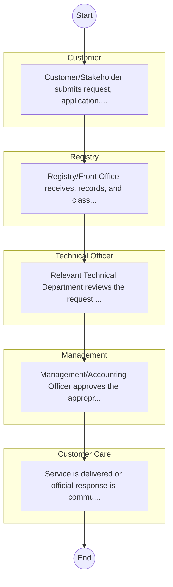

# STANDARD BPM TEMPLATE – Bomas of Kenya

## Cover Page
- **Ministry/Department/Agency (MDA):** Bomas of Kenya
- **Process Name:** To promote and preserve Kenya's diverse cultural heritage; to host national celebrations, conferences, and forums that foster national unity and identity; to organize traditional music, dance, and theatrical performances showcasing over 50 dances from different ethnic communities; to provide a platform for cultural exhibitions that highlight various Kenyan communities and their traditions, including displays of cultural artifacts and traditional homesteads (bomas); to facilitate cultural education programs and workshops for schools and communities to enhance awareness of Kenya's heritage; to act as a tourist attraction, drawing both local and international visitors to experience Kenyan culture; to collaborate with local and international organizations to promote cultural exchange and development initiatives; to train and empower artists and cultural practitioners; to conduct research on cultural practices and traditions; and to provide state-of-the-art facilities for various events, including corporate functions, weddings, and conferences.
- **Document Version:** 1.0
- **Date:** 2026-02-14
- **Classification:** Official

---

## Executive Summary
Bomas of Kenya is a cultural center established in 1971 by the Kenyan government, operating under the Bomas of Kenya Act, 2004. Its primary mandate is to promote and preserve Kenya's rich and diverse cultural heritage, foster national unity through cultural exchange, and act as the only national body with a specific mandate in cultural tourism. Bomas of Kenya serves as a vibrant platform for showcasing the country's traditions, hosting various national events, cultural performances, and exhibitions, thereby contributing significantly to cultural education, tourism, and national identity.

---

## Process Flowchart (BPMN 2.0 - Mermaid)
*Guidance: This diagram visualizes the process flow across different actors (Swimlanes).*

---

## Process Overview
### Process Name
To promote and preserve Kenya's diverse cultural heritage; to host national celebrations, conferences, and forums that foster national unity and identity; to organize traditional music, dance, and theatrical performances showcasing over 50 dances from different ethnic communities; to provide a platform for cultural exhibitions that highlight various Kenyan communities and their traditions, including displays of cultural artifacts and traditional homesteads (bomas); to facilitate cultural education programs and workshops for schools and communities to enhance awareness of Kenya's heritage; to act as a tourist attraction, drawing both local and international visitors to experience Kenyan culture; to collaborate with local and international organizations to promote cultural exchange and development initiatives; to train and empower artists and cultural practitioners; to conduct research on cultural practices and traditions; and to provide state-of-the-art facilities for various events, including corporate functions, weddings, and conferences.

### Service Category
- G2C/G2B

### Process Objective
- To promote and preserve Kenya's diverse cultural heritage; to host national celebrations, conferences, and forums that foster national unity and identity; to organize traditional music, dance, and theatrical performances showcasing over 50 dances from different ethnic communities; to provide a platform for cultural exhibitions that highlight various Kenyan communities and their traditions, including displays of cultural artifacts and traditional homesteads (bomas); to facilitate cultural education programs and workshops for schools and communities to enhance awareness of Kenya's heritage; to act as a tourist attraction, drawing both local and international visitors to experience Kenyan culture; to collaborate with local and international organizations to promote cultural exchange and development initiatives; to train and empower artists and cultural practitioners; to conduct research on cultural practices and traditions; and to provide state-of-the-art facilities for various events, including corporate functions, weddings, and conferences.

### Scope
- **In Scope:** End-to-end processing within Bomas of Kenya.
- **Out of Scope:** External agency approvals.

### Triggers
- Submission of application/request by Customer.

### End States
- **Successful:** License / Permit / Certificate, Compliance Inspection Report, Official Receipt, Gazette Notice
- **Unsuccessful:** Application rejected due to non-compliance.

### Policy Context
- The Bomas of Kenya Act; The Constitution of Kenya 2010; Data Protection Act 2019.

---

## Stakeholders
| Stakeholder | Role | Responsibilities |
|---|---|---|
| Registry | Process Actor | Performs actions as defined in steps. |
| Customer Care | Process Actor | Performs actions as defined in steps. |
| Management | Process Actor | Performs actions as defined in steps. |
| Customer | Process Actor | Performs actions as defined in steps. |
| Technical Officer | Process Actor | Performs actions as defined in steps. |

---

## Inputs & Outputs
- **Inputs:** Application Form (License/Permit), Compliance Documents (Tax Compliance, CR12), Technical Reports / Site Plans, Proof of Payment
- **Outputs:** License / Permit / Certificate, Compliance Inspection Report, Official Receipt, Gazette Notice

---

## Detailed Process (AS-IS)
| Step | Role | Action | Tool | Notes |
|---|---|---|---|---|
| 1 | Customer | Customer/Stakeholder submits request, application, or inquiry via official channels (Email, Letter, or Portal). | Digital | |
| 2 | Registry | Registry/Front Office receives, records, and classifies the request. | Manual | |
| 3 | Technical Officer | Relevant Technical Department reviews the request against internal policies and regulations. | Manual | |
| 4 | Management | Management/Accounting Officer approves the appropriate action or service delivery. | Manual | |
| 5 | Customer Care | Service is delivered or official response is communicated to the customer. | Manual | |

---

## Pain Points & Opportunities
### Pain Points
- Manual document verification takes time.
- High cost and time for physical inspections.
- Risk of counterfeit licenses/certificates.
- Lack of real-time monitoring of licensees.

### Opportunities
- Online Licensing Management System (LMS).
- Integration with IPRS and BRS for auto-verification.
- Mobile field inspection apps with GIS.
- QR-coded verifiable certificates.

---

## KPIs
| KPI | Baseline | Target |
|---|---|---|
| Turnaround Time | 30 Days | 5 Days |
| CSAT | 50% | 90% |
