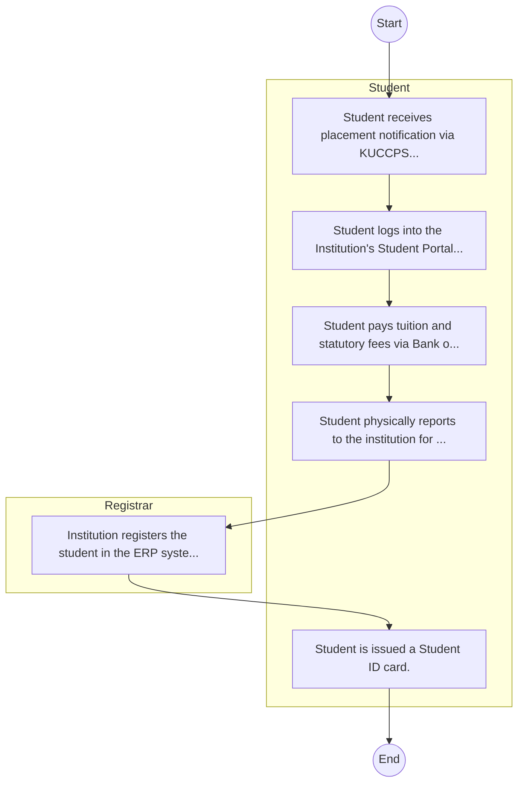

# STANDARD BPM TEMPLATE – Bomet University College

## Cover Page
- **Ministry/Department/Agency (MDA):** Bomet University College
- **Process Name:** To provide quality education and foster innovation across a diverse range of academic programs, including certificate, diploma, undergraduate, and postgraduate courses, in various schools such as Arts and Social Sciences, Pure & Applied Sciences, Business and Entrepreneurship, and Education; to develop creativity and innovation in students to prepare them for the job market; to adopt a practical learning approach emphasizing attachments and fieldwork, and integrating ICT into student training; to champion quality education, sustainability, and innovation within Kenya's higher education sector; to foster creative and critical thinking, contributing to the discovery, preservation, and dissemination of knowledge; to stimulate students' intellectual engagement in economic, socio-cultural, scientific, and technological development; and to operate with a niche in 'Green Economy for Sustainability' and a motto of 'Green University for Sustainability'.
- **Document Version:** 1.0
- **Date:** 2026-02-14
- **Classification:** Official

---

## Executive Summary
Bomet University (formerly Bomet University College) is a public university in Kenya, established as a Constituent College of Moi University in 2017 and later granted a Charter on February 4, 2026, making it an independent university and the 36th public university in Kenya. It is the first public university in Bomet County. Its vision is to be a premier Green University fostering research excellence in Science, Technology, and Innovation for sustainability, providing quality education, and nurturing critical inquiry, creativity, and engagement for social transformation and the advancement of humanity.

---

## Process Flowchart (BPMN 2.0 - Mermaid)
*Guidance: This diagram visualizes the process flow across different actors (Swimlanes).*

---

## Process Overview
### Process Name
To provide quality education and foster innovation across a diverse range of academic programs, including certificate, diploma, undergraduate, and postgraduate courses, in various schools such as Arts and Social Sciences, Pure & Applied Sciences, Business and Entrepreneurship, and Education; to develop creativity and innovation in students to prepare them for the job market; to adopt a practical learning approach emphasizing attachments and fieldwork, and integrating ICT into student training; to champion quality education, sustainability, and innovation within Kenya's higher education sector; to foster creative and critical thinking, contributing to the discovery, preservation, and dissemination of knowledge; to stimulate students' intellectual engagement in economic, socio-cultural, scientific, and technological development; and to operate with a niche in 'Green Economy for Sustainability' and a motto of 'Green University for Sustainability'.

### Service Category
- G2C (Government to Citizen)

### Process Objective
- To provide quality education and foster innovation across a diverse range of academic programs, including certificate, diploma, undergraduate, and postgraduate courses, in various schools such as Arts and Social Sciences, Pure & Applied Sciences, Business and Entrepreneurship, and Education; to develop creativity and innovation in students to prepare them for the job market; to adopt a practical learning approach emphasizing attachments and fieldwork, and integrating ICT into student training; to champion quality education, sustainability, and innovation within Kenya's higher education sector; to foster creative and critical thinking, contributing to the discovery, preservation, and dissemination of knowledge; to stimulate students' intellectual engagement in economic, socio-cultural, scientific, and technological development; and to operate with a niche in 'Green Economy for Sustainability' and a motto of 'Green University for Sustainability'.

### Scope
- **In Scope:** End-to-end processing within Bomet University College.
- **Out of Scope:** External agency approvals.

### Triggers
- Submission of application/request by Student.

### End States
- **Successful:** Admission Letter, Student ID Card, Academic Transcripts, Degree/Diploma Certificate
- **Unsuccessful:** Application rejected due to non-compliance.

### Policy Context
- The Bomet University College Act; The Constitution of Kenya 2010; Data Protection Act 2019.

---

## Stakeholders
| Stakeholder | Role | Responsibilities |
|---|---|---|
| Student | Process Actor | Performs actions as defined in steps. |
| Registrar | Process Actor | Performs actions as defined in steps. |

---

## Inputs & Outputs
- **Inputs:** KCSE/Academic Result Slips, National ID / Birth Certificate, Student Personal Details Form, Fee Payment Receipts
- **Outputs:** Admission Letter, Student ID Card, Academic Transcripts, Degree/Diploma Certificate

---

## Detailed Process (AS-IS)
| Step | Role | Action | Tool | Notes |
|---|---|---|---|---|
| 1 | Student | Student receives placement notification via KUCCPS or applies directly as Self-Sponsored. | Manual | |
| 2 | Student | Student logs into the Institution's Student Portal to accept admission and download Admission Letter. | Digital | |
| 3 | Student | Student pays tuition and statutory fees via Bank or eCitizen. | Manual | |
| 4 | Student | Student physically reports to the institution for document verification (original slips, certs). | Manual | |
| 5 | Registrar | Institution registers the student in the ERP system. | Manual | |
| 6 | Student | Student is issued a Student ID card. | Manual | |

---

## Pain Points & Opportunities
### Pain Points
- Long queues during admission and registration.
- Manual reconciliation of fee payments.
- Delays in processing exam results and transcripts.
- Fragmented student data across departments.

### Opportunities
- Biometric student registration and attendance.
- Integrated ERP for end-to-end student lifecycle management.
- Smart Campus Cards for access control and payments.
- E-learning and digital library integration.

---

## KPIs
| KPI | Baseline | Target |
|---|---|---|
| Turnaround Time | 30 Days | 5 Days |
| CSAT | 50% | 90% |
