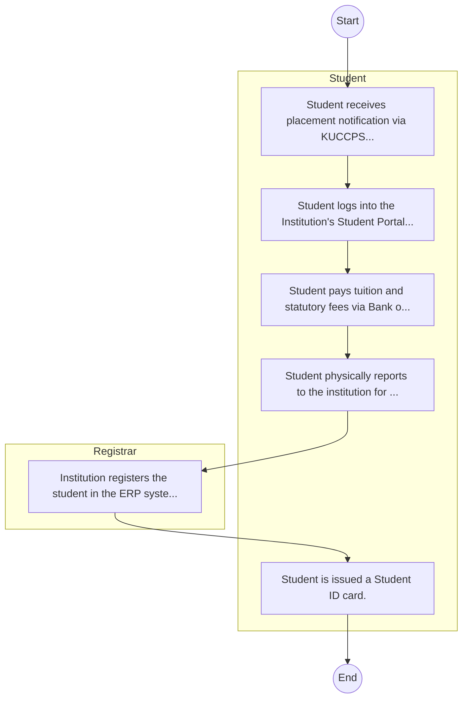

# STANDARD BPM TEMPLATE – Bukura Agricultural College

## Cover Page
- **Ministry/Department/Agency (MDA):** Bukura Agricultural College
- **Process Name:** To provide quality agricultural education through comprehensive training, relevant research, practical innovations, and effective extension services; to improve agricultural productivity and livelihoods among farmers and communities; to offer education in agriculture and related subjects at various levels (e.g., diploma, certificate); to engage in the discovery, transmission, and preservation of agricultural knowledge; to conduct examinations and award diplomas and certificates to qualified graduates; and to collaborate with the government and other stakeholders on agricultural education development and policy implementation.
- **Document Version:** 1.0
- **Date:** 2026-02-14
- **Classification:** Official

---

## Executive Summary
Bukura Agricultural College is a key agricultural training institution in Kenya, established under the Bukura Agricultural College Act, Cap.348 of 1999. Its mandate is 'To provide Agricultural Training through the integration of Research and Extension'. The College aims to provide quality agricultural education, foster innovation, and conduct relevant research to improve agricultural productivity and livelihoods in Kenya. It plays a vital role in developing skilled human resources for the agricultural sector and contributing to national food security.

---

## Process Flowchart (BPMN 2.0 - Mermaid)
*Guidance: This diagram visualizes the process flow across different actors (Swimlanes).*

---

## Process Overview
### Process Name
To provide quality agricultural education through comprehensive training, relevant research, practical innovations, and effective extension services; to improve agricultural productivity and livelihoods among farmers and communities; to offer education in agriculture and related subjects at various levels (e.g., diploma, certificate); to engage in the discovery, transmission, and preservation of agricultural knowledge; to conduct examinations and award diplomas and certificates to qualified graduates; and to collaborate with the government and other stakeholders on agricultural education development and policy implementation.

### Service Category
- G2C/G2B

### Process Objective
- To provide quality agricultural education through comprehensive training, relevant research, practical innovations, and effective extension services; to improve agricultural productivity and livelihoods among farmers and communities; to offer education in agriculture and related subjects at various levels (e.g., diploma, certificate); to engage in the discovery, transmission, and preservation of agricultural knowledge; to conduct examinations and award diplomas and certificates to qualified graduates; and to collaborate with the government and other stakeholders on agricultural education development and policy implementation.

### Scope
- **In Scope:** End-to-end processing within Bukura Agricultural College.
- **Out of Scope:** External agency approvals.

### Triggers
- Submission of application/request by Student.

### End States
- **Successful:** Admission Letter, Student ID Card, Academic Transcripts, Degree/Diploma Certificate
- **Unsuccessful:** Application rejected due to non-compliance.

### Policy Context
- The Bukura Agricultural College Act; The Constitution of Kenya 2010; Data Protection Act 2019.

---

## Stakeholders
| Stakeholder | Role | Responsibilities |
|---|---|---|
| Student | Process Actor | Performs actions as defined in steps. |
| Registrar | Process Actor | Performs actions as defined in steps. |

---

## Inputs & Outputs
- **Inputs:** KCSE/Academic Result Slips, National ID / Birth Certificate, Student Personal Details Form, Fee Payment Receipts
- **Outputs:** Admission Letter, Student ID Card, Academic Transcripts, Degree/Diploma Certificate

---

## Detailed Process (AS-IS)
| Step | Role | Action | Tool | Notes |
|---|---|---|---|---|
| 1 | Student | Student receives placement notification via KUCCPS or applies directly as Self-Sponsored. | Manual | |
| 2 | Student | Student logs into the Institution's Student Portal to accept admission and download Admission Letter. | Digital | |
| 3 | Student | Student pays tuition and statutory fees via Bank or eCitizen. | Manual | |
| 4 | Student | Student physically reports to the institution for document verification (original slips, certs). | Manual | |
| 5 | Registrar | Institution registers the student in the ERP system. | Manual | |
| 6 | Student | Student is issued a Student ID card. | Manual | |

---

## Pain Points & Opportunities
### Pain Points
- Long queues during admission and registration.
- Manual reconciliation of fee payments.
- Delays in processing exam results and transcripts.
- Fragmented student data across departments.

### Opportunities
- Biometric student registration and attendance.
- Integrated ERP for end-to-end student lifecycle management.
- Smart Campus Cards for access control and payments.
- E-learning and digital library integration.

---

## KPIs
| KPI | Baseline | Target |
|---|---|---|
| Turnaround Time | 30 Days | 5 Days |
| CSAT | 50% | 90% |
