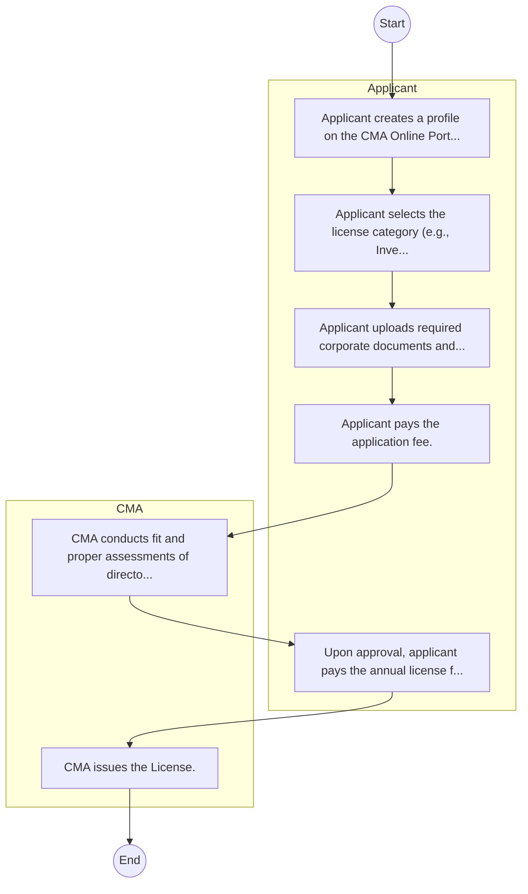

# STANDARD BPM TEMPLATE – Capital Markets Authority

## Cover Page
- **Ministry/Department/Agency (MDA):** Capital Markets Authority
- **Process Name:** To license and supervise all capital market intermediaries, including stockbrokers, investment banks, fund managers, and collective investment schemes; to ensure the proper conduct of all licensed persons and market institutions; to regulate the issuance of capital market products, including bonds, shares, Exchange Traded Funds (ETFs), and Real Estate Investment Trusts (REITs), as well as market activities like online forex trading; to promote market development through research on new products and institutions, fostering product innovation, supporting institutional capacity development, and stimulating robust market infrastructure; to educate investors and raise public awareness to enhance financial literacy; to protect investors' interests from financial loss and ensure market integrity, including operating a compensation fund; to oversee trading activity on the Nairobi Securities Exchange (NSE) and enforce compliance with disclosure standards; to develop a framework to facilitate the use of electronic commerce for the advancement of capital markets in Kenya; and to enforce compliance with capital market laws and regulations, including imposing fines, suspending or revoking licenses, investigating complaints, and pursuing prosecution for financial misconduct.
- **Document Version:** 1.0
- **Date:** 2026-02-14
- **Classification:** Official

---

## Executive Summary
The Capital Markets Authority (CMA) Kenya is an independent public agency established in 1989 by the Capital Markets Act Cap 485A. Its dual mandate is to regulate and facilitate the development of orderly, fair, and efficient capital markets in Kenya. CMA's primary responsibility is to protect the interests of investors, government, employees, issuers of securities, and market intermediaries. By ensuring market integrity, transparency, and investor confidence, CMA plays a vital role in mobilizing and allocating capital resources to finance long-term productive investments for Kenya's economic growth and development.

---

## Process Flowchart (BPMN 2.0 - Mermaid)
*Guidance: This diagram visualizes the process flow across different actors (Swimlanes).*

---

## Process Overview
### Process Name
To license and supervise all capital market intermediaries, including stockbrokers, investment banks, fund managers, and collective investment schemes; to ensure the proper conduct of all licensed persons and market institutions; to regulate the issuance of capital market products, including bonds, shares, Exchange Traded Funds (ETFs), and Real Estate Investment Trusts (REITs), as well as market activities like online forex trading; to promote market development through research on new products and institutions, fostering product innovation, supporting institutional capacity development, and stimulating robust market infrastructure; to educate investors and raise public awareness to enhance financial literacy; to protect investors' interests from financial loss and ensure market integrity, including operating a compensation fund; to oversee trading activity on the Nairobi Securities Exchange (NSE) and enforce compliance with disclosure standards; to develop a framework to facilitate the use of electronic commerce for the advancement of capital markets in Kenya; and to enforce compliance with capital market laws and regulations, including imposing fines, suspending or revoking licenses, investigating complaints, and pursuing prosecution for financial misconduct.

### Service Category
- G2B (Government to Business)

### Process Objective
- To license and supervise all capital market intermediaries, including stockbrokers, investment banks, fund managers, and collective investment schemes; to ensure the proper conduct of all licensed persons and market institutions; to regulate the issuance of capital market products, including bonds, shares, Exchange Traded Funds (ETFs), and Real Estate Investment Trusts (REITs), as well as market activities like online forex trading; to promote market development through research on new products and institutions, fostering product innovation, supporting institutional capacity development, and stimulating robust market infrastructure; to educate investors and raise public awareness to enhance financial literacy; to protect investors' interests from financial loss and ensure market integrity, including operating a compensation fund; to oversee trading activity on the Nairobi Securities Exchange (NSE) and enforce compliance with disclosure standards; to develop a framework to facilitate the use of electronic commerce for the advancement of capital markets in Kenya; and to enforce compliance with capital market laws and regulations, including imposing fines, suspending or revoking licenses, investigating complaints, and pursuing prosecution for financial misconduct.

### Scope
- **In Scope:** End-to-end processing within Capital Markets Authority.
- **Out of Scope:** External agency approvals.

### Triggers
- Submission of application/request by Applicant.

### End States
- **Successful:** License / Permit / Certificate, Compliance Inspection Report, Official Receipt, Gazette Notice
- **Unsuccessful:** Application rejected due to non-compliance.

### Policy Context
- The Capital Markets Authority Act; The Constitution of Kenya 2010; Data Protection Act 2019.

---

## Stakeholders
| Stakeholder | Role | Responsibilities |
|---|---|---|
| Applicant | Process Actor | Performs actions as defined in steps. |
| CMA | Process Actor | Performs actions as defined in steps. |

---

## Inputs & Outputs
- **Inputs:** Application Form (License/Permit), Compliance Documents (Tax Compliance, CR12), Technical Reports / Site Plans, Proof of Payment
- **Outputs:** License / Permit / Certificate, Compliance Inspection Report, Official Receipt, Gazette Notice

---

## Detailed Process (AS-IS)
| Step | Role | Action | Tool | Notes |
|---|---|---|---|---|
| 1 | Applicant | Applicant creates a profile on the CMA Online Portal. | Digital | |
| 2 | Applicant | Applicant selects the license category (e.g., Investment Bank, Broker). | Manual | |
| 3 | Applicant | Applicant uploads required corporate documents and business plan. | Manual | |
| 4 | Applicant | Applicant pays the application fee. | Manual | |
| 5 | CMA | CMA conducts fit and proper assessments of directors/shareholders. | Manual | |
| 6 | Applicant | Upon approval, applicant pays the annual license fee. | Manual | |
| 7 | CMA | CMA issues the License. | Manual | |

---

## Pain Points & Opportunities
### Pain Points
- Manual document verification takes time.
- High cost and time for physical inspections.
- Risk of counterfeit licenses/certificates.
- Lack of real-time monitoring of licensees.

### Opportunities
- Online Licensing Management System (LMS).
- Integration with IPRS and BRS for auto-verification.
- Mobile field inspection apps with GIS.
- QR-coded verifiable certificates.

---

## KPIs
| KPI | Baseline | Target |
|---|---|---|
| Turnaround Time | 30 Days | 5 Days |
| CSAT | 50% | 90% |
