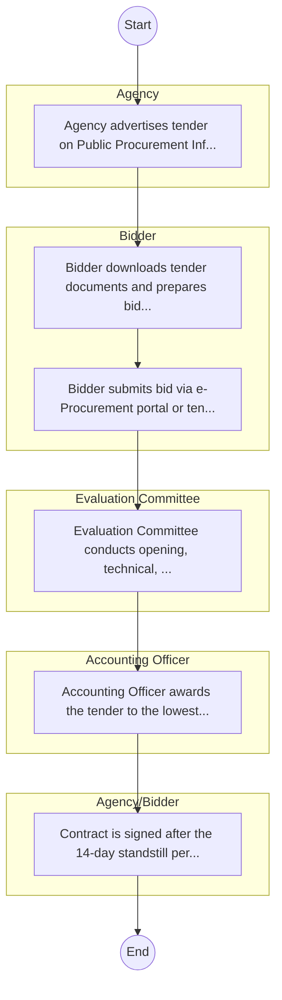

# STANDARD BPM TEMPLATE – Central Rift Valley Water Works Development Agency

## Cover Page
- **Ministry/Department/Agency (MDA):** Central Rift Valley Water Works Development Agency
- **Process Name:** To undertake the development, maintenance, and management of national public water works within its designated service area (Nakuru, Narok, Laikipia, Baringo, and Nyandarua counties); to operate water works as a water service provider until the responsibility for operation and management is handed over to a designated water services provider, county government, joint committee, or authority of county governments; to provide water services when ordered by the Regulatory Board, particularly in cases where a defaulting water services provider's functions are transferred; to offer technical services and capacity building to county governments and water services providers upon request; and to provide technical support to the Cabinet Secretary in discharging duties under the Constitution and the Water Act, 2016.
- **Document Version:** 1.0
- **Date:** 2026-02-14
- **Classification:** Official

---

## Executive Summary
The Central Rift Valley Water Works Development Agency (CRVWWDA) is one of nine Water Works Development Agencies in Kenya, established under Section 65 of the Water Act, 2016, through Kenya Gazette Notice No. 4 on February 7, 2020. Operating as a state corporation under the Ministry of Water & Sanitation and Irrigation, it is responsible for the development, maintenance, and management of national public water works within its jurisdiction, which includes Nakuru, Narok, Laikipia, Baringo, and Nyandarua counties. The Agency aims to plan, develop, and deliver efficient and reliable water and sanitation infrastructure to ensure sustainable access for all stakeholders.

---

## Process Flowchart (BPMN 2.0 - Mermaid)
*Guidance: This diagram visualizes the process flow across different actors (Swimlanes).*

---

## Process Overview
### Process Name
To undertake the development, maintenance, and management of national public water works within its designated service area (Nakuru, Narok, Laikipia, Baringo, and Nyandarua counties); to operate water works as a water service provider until the responsibility for operation and management is handed over to a designated water services provider, county government, joint committee, or authority of county governments; to provide water services when ordered by the Regulatory Board, particularly in cases where a defaulting water services provider's functions are transferred; to offer technical services and capacity building to county governments and water services providers upon request; and to provide technical support to the Cabinet Secretary in discharging duties under the Constitution and the Water Act, 2016.

### Service Category
- G2C/G2B

### Process Objective
- To undertake the development, maintenance, and management of national public water works within its designated service area (Nakuru, Narok, Laikipia, Baringo, and Nyandarua counties); to operate water works as a water service provider until the responsibility for operation and management is handed over to a designated water services provider, county government, joint committee, or authority of county governments; to provide water services when ordered by the Regulatory Board, particularly in cases where a defaulting water services provider's functions are transferred; to offer technical services and capacity building to county governments and water services providers upon request; and to provide technical support to the Cabinet Secretary in discharging duties under the Constitution and the Water Act, 2016.

### Scope
- **In Scope:** End-to-end processing within Central Rift Valley Water Works Development Agency.
- **Out of Scope:** External agency approvals.

### Triggers
- Submission of application/request by Agency.

### End States
- **Successful:** License / Permit / Certificate, Compliance Inspection Report, Official Receipt, Gazette Notice
- **Unsuccessful:** Application rejected due to non-compliance.

### Policy Context
- The Central Rift Valley Water Works Development Agency Act; The Constitution of Kenya 2010; Data Protection Act 2019.

---

## Stakeholders
| Stakeholder | Role | Responsibilities |
|---|---|---|
| Evaluation Committee | Process Actor | Performs actions as defined in steps. |
| Accounting Officer | Process Actor | Performs actions as defined in steps. |
| Bidder | Process Actor | Performs actions as defined in steps. |
| Agency/Bidder | Process Actor | Performs actions as defined in steps. |
| Agency | Process Actor | Performs actions as defined in steps. |

---

## Inputs & Outputs
- **Inputs:** Application Form (License/Permit), Compliance Documents (Tax Compliance, CR12), Technical Reports / Site Plans, Proof of Payment
- **Outputs:** License / Permit / Certificate, Compliance Inspection Report, Official Receipt, Gazette Notice

---

## Detailed Process (AS-IS)
| Step | Role | Action | Tool | Notes |
|---|---|---|---|---|
| 1 | Agency | Agency advertises tender on Public Procurement Information Portal (PPIP) and website. | Digital | |
| 2 | Bidder | Bidder downloads tender documents and prepares bid (Technical & Financial). | Manual | |
| 3 | Bidder | Bidder submits bid via e-Procurement portal or tender box. | Digital | |
| 4 | Evaluation Committee | Evaluation Committee conducts opening, technical, and financial evaluation. | Manual | |
| 5 | Accounting Officer | Accounting Officer awards the tender to the lowest responsive bidder. | Manual | |
| 6 | Agency/Bidder | Contract is signed after the 14-day standstill period. | Manual | |

---

## Pain Points & Opportunities
### Pain Points
- Manual document verification takes time.
- High cost and time for physical inspections.
- Risk of counterfeit licenses/certificates.
- Lack of real-time monitoring of licensees.

### Opportunities
- Online Licensing Management System (LMS).
- Integration with IPRS and BRS for auto-verification.
- Mobile field inspection apps with GIS.
- QR-coded verifiable certificates.

---

## KPIs
| KPI | Baseline | Target |
|---|---|---|
| Turnaround Time | 30 Days | 5 Days |
| CSAT | 50% | 90% |
