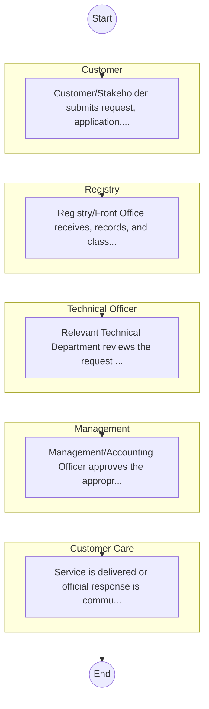

# STANDARD BPM TEMPLATE – Centre for Mathematics, Science and Technology Education in Africa

## Cover Page
- **Ministry/Department/Agency (MDA):** Centre for Mathematics, Science and Technology Education in Africa
- **Process Name:** To provide continuous professional development (CPD) for teachers in Science, Technology, Engineering, and Mathematics (STEM) education, aligning with policies set by the Ministry of Education, the Teachers Service Commission (TSC), and other relevant stakeholders; to conduct research to inform Teacher Professional Development programs, internal quality assurance processes, and policy development; to organize and host seminars, workshops, conferences, and symposia related to STEM education and teacher capacity development; to publish and distribute information and research findings concerning STEM education and teacher capacity development; to offer advisory and consultancy services in the field of STEM education and teacher capacity development; to foster local and international partnerships and collaborations with government agencies, institutions, and organizations interested in STEM education; to serve as the Secretariat for the Strengthening of Mathematics and Science Education in Africa (SMASE-Africa) Network and ADEA's Inter-Country Quality Node on Mathematics and Science Education (ICQN-MSE); to support the implementation of STEM initiatives across Africa; to contribute to the development and review of mathematics, science, and technology curricula; to build the capacity of educators and administrators in STEM subjects; and to advocate for the significance of STEM education to promote national and regional development.
- **Document Version:** 1.0
- **Date:** 2026-02-14
- **Classification:** Official

---

## Executive Summary
The Centre for Mathematics, Science and Technology Education in Africa (CEMASTEA) is a State Corporation under the Ministry of Education in Kenya, transformed in 2022. Its principal mandate is to provide continuous professional development for teachers in Science, Technology, Engineering, and Mathematics (STEM) education, not only in Kenya but across Africa. CEMASTEA aims to enhance the quality of STEM education, conduct research to inform pedagogical practices and policy, and foster local and international collaborations to promote national and regional development through a skilled human resource base.

---

## Process Flowchart (BPMN 2.0 - Mermaid)
*Guidance: This diagram visualizes the process flow across different actors (Swimlanes).*

---

## Process Overview
### Process Name
To provide continuous professional development (CPD) for teachers in Science, Technology, Engineering, and Mathematics (STEM) education, aligning with policies set by the Ministry of Education, the Teachers Service Commission (TSC), and other relevant stakeholders; to conduct research to inform Teacher Professional Development programs, internal quality assurance processes, and policy development; to organize and host seminars, workshops, conferences, and symposia related to STEM education and teacher capacity development; to publish and distribute information and research findings concerning STEM education and teacher capacity development; to offer advisory and consultancy services in the field of STEM education and teacher capacity development; to foster local and international partnerships and collaborations with government agencies, institutions, and organizations interested in STEM education; to serve as the Secretariat for the Strengthening of Mathematics and Science Education in Africa (SMASE-Africa) Network and ADEA's Inter-Country Quality Node on Mathematics and Science Education (ICQN-MSE); to support the implementation of STEM initiatives across Africa; to contribute to the development and review of mathematics, science, and technology curricula; to build the capacity of educators and administrators in STEM subjects; and to advocate for the significance of STEM education to promote national and regional development.

### Service Category
- G2C/G2B

### Process Objective
- To provide continuous professional development (CPD) for teachers in Science, Technology, Engineering, and Mathematics (STEM) education, aligning with policies set by the Ministry of Education, the Teachers Service Commission (TSC), and other relevant stakeholders; to conduct research to inform Teacher Professional Development programs, internal quality assurance processes, and policy development; to organize and host seminars, workshops, conferences, and symposia related to STEM education and teacher capacity development; to publish and distribute information and research findings concerning STEM education and teacher capacity development; to offer advisory and consultancy services in the field of STEM education and teacher capacity development; to foster local and international partnerships and collaborations with government agencies, institutions, and organizations interested in STEM education; to serve as the Secretariat for the Strengthening of Mathematics and Science Education in Africa (SMASE-Africa) Network and ADEA's Inter-Country Quality Node on Mathematics and Science Education (ICQN-MSE); to support the implementation of STEM initiatives across Africa; to contribute to the development and review of mathematics, science, and technology curricula; to build the capacity of educators and administrators in STEM subjects; and to advocate for the significance of STEM education to promote national and regional development.

### Scope
- **In Scope:** End-to-end processing within Centre for Mathematics, Science and Technology Education in Africa.
- **Out of Scope:** External agency approvals.

### Triggers
- Submission of application/request by Customer.

### End States
- **Successful:** License / Permit / Certificate, Compliance Inspection Report, Official Receipt, Gazette Notice
- **Unsuccessful:** Application rejected due to non-compliance.

### Policy Context
- The Centre for Mathematics, Science and Technology Education in Africa Act; The Constitution of Kenya 2010; Data Protection Act 2019.

---

## Stakeholders
| Stakeholder | Role | Responsibilities |
|---|---|---|
| Registry | Process Actor | Performs actions as defined in steps. |
| Customer Care | Process Actor | Performs actions as defined in steps. |
| Management | Process Actor | Performs actions as defined in steps. |
| Customer | Process Actor | Performs actions as defined in steps. |
| Technical Officer | Process Actor | Performs actions as defined in steps. |

---

## Inputs & Outputs
- **Inputs:** Application Form (License/Permit), Compliance Documents (Tax Compliance, CR12), Technical Reports / Site Plans, Proof of Payment
- **Outputs:** License / Permit / Certificate, Compliance Inspection Report, Official Receipt, Gazette Notice

---

## Detailed Process (AS-IS)
| Step | Role | Action | Tool | Notes |
|---|---|---|---|---|
| 1 | Customer | Customer/Stakeholder submits request, application, or inquiry via official channels (Email, Letter, or Portal). | Digital | |
| 2 | Registry | Registry/Front Office receives, records, and classifies the request. | Manual | |
| 3 | Technical Officer | Relevant Technical Department reviews the request against internal policies and regulations. | Manual | |
| 4 | Management | Management/Accounting Officer approves the appropriate action or service delivery. | Manual | |
| 5 | Customer Care | Service is delivered or official response is communicated to the customer. | Manual | |

---

## Pain Points & Opportunities
### Pain Points
- Manual document verification takes time.
- High cost and time for physical inspections.
- Risk of counterfeit licenses/certificates.
- Lack of real-time monitoring of licensees.

### Opportunities
- Online Licensing Management System (LMS).
- Integration with IPRS and BRS for auto-verification.
- Mobile field inspection apps with GIS.
- QR-coded verifiable certificates.

---

## KPIs
| KPI | Baseline | Target |
|---|---|---|
| Turnaround Time | 30 Days | 5 Days |
| CSAT | 50% | 90% |
