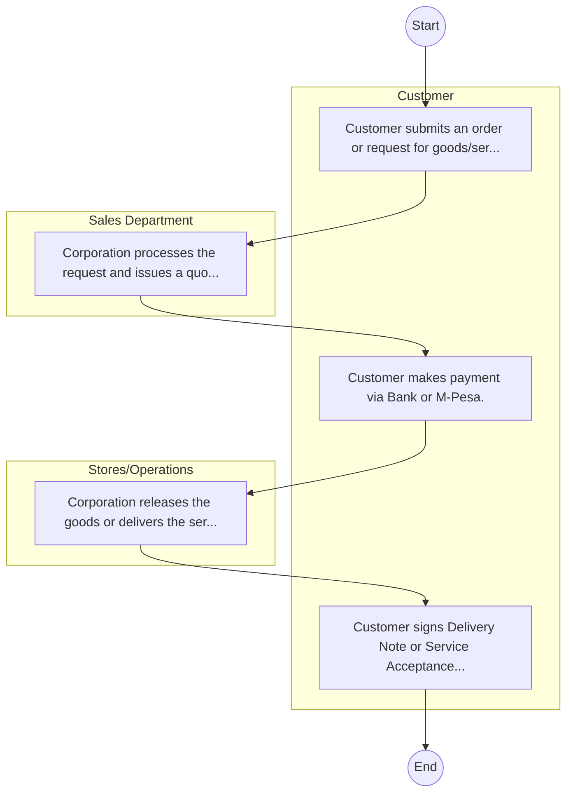

# STANDARD BPM TEMPLATE – Chemelil Sugar Company Limited

## Cover Page
- **Ministry/Department/Agency (MDA):** Chemelil Sugar Company Limited
- **Process Name:** To mill sugarcane into refined sugar for both domestic and industrial markets; to provide farmers with improved cane varieties, technical support, and agricultural inputs for sustainable sugarcane development; to promote and distribute sugar across local and regional markets; to offer financial assistance, extension services, and input provision to contracted sugarcane farmers; to generate direct and indirect employment opportunities within the factory, farms, and transportation sectors; to conduct research to develop better cane varieties, enhance disease resistance, and improve processing methods; to develop and maintain transport and logistical infrastructure to facilitate efficient cane delivery; to diversify its operations by exploring and producing by-products such as molasses and ethanol; to contribute to the national economy through sugar sales, tax revenue, and reducing sugar imports; to promote sustainable farming practices, waste recycling, and minimizing the environmental impact of its operations; and to implement and maintain quality management systems and adhere to corporate governance principles.
- **Document Version:** 1.0
- **Date:** 2026-02-14
- **Classification:** Official

---

## Executive Summary
Chemelil Sugar Company Limited is a state-owned sugar milling company in Kenya, established in 1973 under the Companies Act (Cap 486) and becoming a parastatal in 1974. Its principal activity and mission are to manufacture sugar and co-products from sugarcane, and to establish and manage sugarcane plantations. Chemelil Sugar aims to be a preferred choice in sugar production and marketing, as well as in sugarcane development within the region, thereby contributing significantly to national self-sufficiency in sugar production and the economic well-being of sugarcane farmers and local communities.

---

## Process Flowchart (BPMN 2.0 - Mermaid)
*Guidance: This diagram visualizes the process flow across different actors (Swimlanes).*

---

## Process Overview
### Process Name
To mill sugarcane into refined sugar for both domestic and industrial markets; to provide farmers with improved cane varieties, technical support, and agricultural inputs for sustainable sugarcane development; to promote and distribute sugar across local and regional markets; to offer financial assistance, extension services, and input provision to contracted sugarcane farmers; to generate direct and indirect employment opportunities within the factory, farms, and transportation sectors; to conduct research to develop better cane varieties, enhance disease resistance, and improve processing methods; to develop and maintain transport and logistical infrastructure to facilitate efficient cane delivery; to diversify its operations by exploring and producing by-products such as molasses and ethanol; to contribute to the national economy through sugar sales, tax revenue, and reducing sugar imports; to promote sustainable farming practices, waste recycling, and minimizing the environmental impact of its operations; and to implement and maintain quality management systems and adhere to corporate governance principles.

### Service Category
- G2B (Government to Business)

### Process Objective
- To mill sugarcane into refined sugar for both domestic and industrial markets; to provide farmers with improved cane varieties, technical support, and agricultural inputs for sustainable sugarcane development; to promote and distribute sugar across local and regional markets; to offer financial assistance, extension services, and input provision to contracted sugarcane farmers; to generate direct and indirect employment opportunities within the factory, farms, and transportation sectors; to conduct research to develop better cane varieties, enhance disease resistance, and improve processing methods; to develop and maintain transport and logistical infrastructure to facilitate efficient cane delivery; to diversify its operations by exploring and producing by-products such as molasses and ethanol; to contribute to the national economy through sugar sales, tax revenue, and reducing sugar imports; to promote sustainable farming practices, waste recycling, and minimizing the environmental impact of its operations; and to implement and maintain quality management systems and adhere to corporate governance principles.

### Scope
- **In Scope:** End-to-end processing within Chemelil Sugar Company Limited.
- **Out of Scope:** External agency approvals.

### Triggers
- Submission of application/request by Customer.

### End States
- **Successful:** Loan Disbursement / Service Delivery, Statement of Account, Contract / Agreement, Receipt / Invoice
- **Unsuccessful:** Application rejected due to non-compliance.

### Policy Context
- The Chemelil Sugar Company Limited Act; The Constitution of Kenya 2010; Data Protection Act 2019.

---

## Stakeholders
| Stakeholder | Role | Responsibilities |
|---|---|---|
| Customer | Process Actor | Performs actions as defined in steps. |
| Sales Department | Process Actor | Performs actions as defined in steps. |
| Stores/Operations | Process Actor | Performs actions as defined in steps. |

---

## Inputs & Outputs
- **Inputs:** Loan/Service Application Form, Business Proposal / Plan, Financial Statements / Bank Records, Collateral / Security Documents
- **Outputs:** Loan Disbursement / Service Delivery, Statement of Account, Contract / Agreement, Receipt / Invoice

---

## Detailed Process (AS-IS)
| Step | Role | Action | Tool | Notes |
|---|---|---|---|---|
| 1 | Customer | Customer submits an order or request for goods/services. | Manual | |
| 2 | Sales Department | Corporation processes the request and issues a quotation/proforma invoice. | Manual | |
| 3 | Customer | Customer makes payment via Bank or M-Pesa. | Manual | |
| 4 | Stores/Operations | Corporation releases the goods or delivers the service. | Manual | |
| 5 | Customer | Customer signs Delivery Note or Service Acceptance Form. | Manual | |

---

## Pain Points & Opportunities
### Pain Points
- Lengthy credit appraisal processes.
- Manual debt collection and reconciliation.
- High paperwork for loan processing.
- Lack of 360-degree customer view.

### Opportunities
- Automated Credit Scoring and Appraisal.
- Mobile-based loan application and repayment.
- Customer Relationship Management (CRM) systems.
- Data analytics for risk management.

---

## KPIs
| KPI | Baseline | Target |
|---|---|---|
| Turnaround Time | 30 Days | 5 Days |
| CSAT | 50% | 90% |
