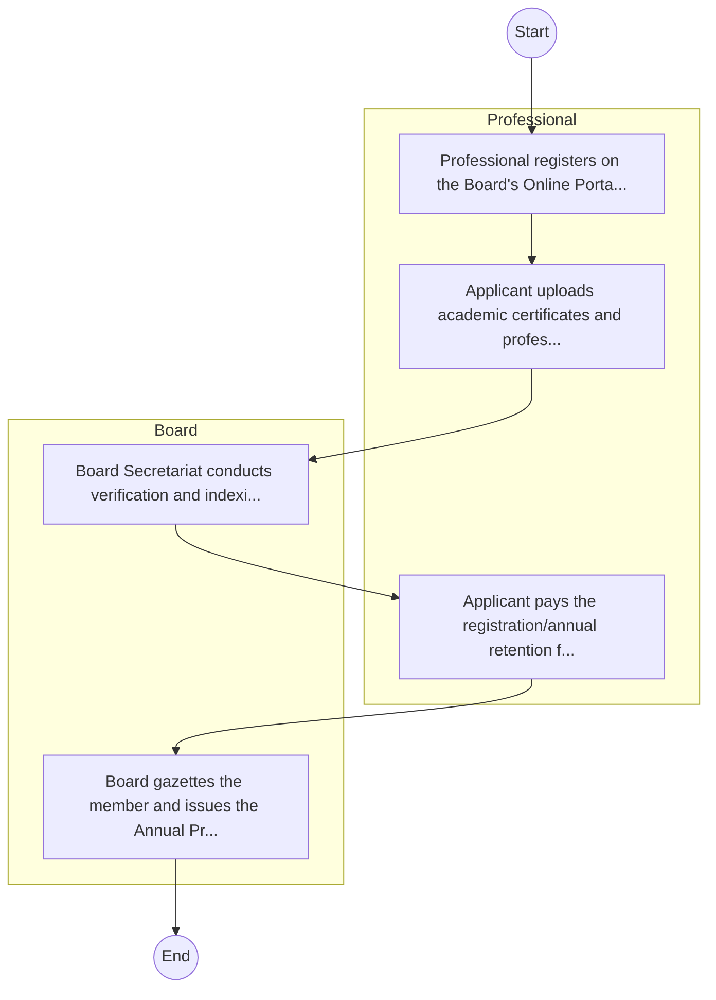

# STANDARD BPM TEMPLATE – Child Welfare Society of Kenya

## Cover Page
- **Ministry/Department/Agency (MDA):** Child Welfare Society of Kenya
- **Process Name:** To ensure child protection by safeguarding children from abuse, neglect, and exploitation; to provide emergency preparedness, rapid response, and rescue services for separated, lost, or distressed children; to facilitate alternative family care, including child adoption, foster care for orphans and vulnerable children, and guardianship placements, to ensure children grow up in stable family environments; to offer rehabilitation services for children in need, including those affected by abuse, neglect, or those in conflict with the law; to advocate for children's rights and promote their needs at community, county, and national levels; to support vulnerable groups, such as children affected by HIV/AIDS, child labor, and street children, through identification, rescue, rehabilitation, and family tracing; to provide education and skills development through early childhood education support, primary, secondary, and university education sponsorships, and vocational skills training; to offer counseling and family support, including psychological support, crisis intervention, and family tracing and reunification services; to counter child trafficking by supporting victims and building capacity among stakeholders; and to operate rescue shelters and safe houses for children in immediate need of care and protection.
- **Document Version:** 1.0
- **Date:** 2026-02-14
- **Classification:** Official

---

## Executive Summary
The Child Welfare Society of Kenya (CWSK) is a national non-governmental organization, established and gazetted in 1955 and governed by an irrevocable Trust Deed of 1970. CWSK serves as the National Adoption Society for Kenya and the National Emergency Response, Welfare, and Rescue Organization for children. Its mandate is to promote and secure the rights of children and young persons, provide comprehensive services to marginalized children across social sectors, and protect vulnerable children on behalf of the government, with the overarching aim for all children to lead happy, fulfilling, and fruitful lives.

---

## Process Flowchart (BPMN 2.0 - Mermaid)
*Guidance: This diagram visualizes the process flow across different actors (Swimlanes).*

---

## Process Overview
### Process Name
To ensure child protection by safeguarding children from abuse, neglect, and exploitation; to provide emergency preparedness, rapid response, and rescue services for separated, lost, or distressed children; to facilitate alternative family care, including child adoption, foster care for orphans and vulnerable children, and guardianship placements, to ensure children grow up in stable family environments; to offer rehabilitation services for children in need, including those affected by abuse, neglect, or those in conflict with the law; to advocate for children's rights and promote their needs at community, county, and national levels; to support vulnerable groups, such as children affected by HIV/AIDS, child labor, and street children, through identification, rescue, rehabilitation, and family tracing; to provide education and skills development through early childhood education support, primary, secondary, and university education sponsorships, and vocational skills training; to offer counseling and family support, including psychological support, crisis intervention, and family tracing and reunification services; to counter child trafficking by supporting victims and building capacity among stakeholders; and to operate rescue shelters and safe houses for children in immediate need of care and protection.

### Service Category
- G2C/G2B

### Process Objective
- To ensure child protection by safeguarding children from abuse, neglect, and exploitation; to provide emergency preparedness, rapid response, and rescue services for separated, lost, or distressed children; to facilitate alternative family care, including child adoption, foster care for orphans and vulnerable children, and guardianship placements, to ensure children grow up in stable family environments; to offer rehabilitation services for children in need, including those affected by abuse, neglect, or those in conflict with the law; to advocate for children's rights and promote their needs at community, county, and national levels; to support vulnerable groups, such as children affected by HIV/AIDS, child labor, and street children, through identification, rescue, rehabilitation, and family tracing; to provide education and skills development through early childhood education support, primary, secondary, and university education sponsorships, and vocational skills training; to offer counseling and family support, including psychological support, crisis intervention, and family tracing and reunification services; to counter child trafficking by supporting victims and building capacity among stakeholders; and to operate rescue shelters and safe houses for children in immediate need of care and protection.

### Scope
- **In Scope:** End-to-end processing within Child Welfare Society of Kenya.
- **Out of Scope:** External agency approvals.

### Triggers
- Submission of application/request by Professional.

### End States
- **Successful:** License / Permit / Certificate, Compliance Inspection Report, Official Receipt, Gazette Notice
- **Unsuccessful:** Application rejected due to non-compliance.

### Policy Context
- The Child Welfare Society of Kenya Act; The Constitution of Kenya 2010; Data Protection Act 2019.

---

## Stakeholders
| Stakeholder | Role | Responsibilities |
|---|---|---|
| Professional | Process Actor | Performs actions as defined in steps. |
| Board | Process Actor | Performs actions as defined in steps. |

---

## Inputs & Outputs
- **Inputs:** Application Form (License/Permit), Compliance Documents (Tax Compliance, CR12), Technical Reports / Site Plans, Proof of Payment
- **Outputs:** License / Permit / Certificate, Compliance Inspection Report, Official Receipt, Gazette Notice

---

## Detailed Process (AS-IS)
| Step | Role | Action | Tool | Notes |
|---|---|---|---|---|
| 1 | Professional | Professional registers on the Board's Online Portal. | Digital | |
| 2 | Professional | Applicant uploads academic certificates and professional testimonials. | Manual | |
| 3 | Board | Board Secretariat conducts verification and indexing. | Manual | |
| 4 | Professional | Applicant pays the registration/annual retention fee. | Manual | |
| 5 | Board | Board gazettes the member and issues the Annual Practicing Certificate. | Manual | |

---

## Pain Points & Opportunities
### Pain Points
- Manual document verification takes time.
- High cost and time for physical inspections.
- Risk of counterfeit licenses/certificates.
- Lack of real-time monitoring of licensees.

### Opportunities
- Online Licensing Management System (LMS).
- Integration with IPRS and BRS for auto-verification.
- Mobile field inspection apps with GIS.
- QR-coded verifiable certificates.

---

## KPIs
| KPI | Baseline | Target |
|---|---|---|
| Turnaround Time | 30 Days | 5 Days |
| CSAT | 50% | 90% |
