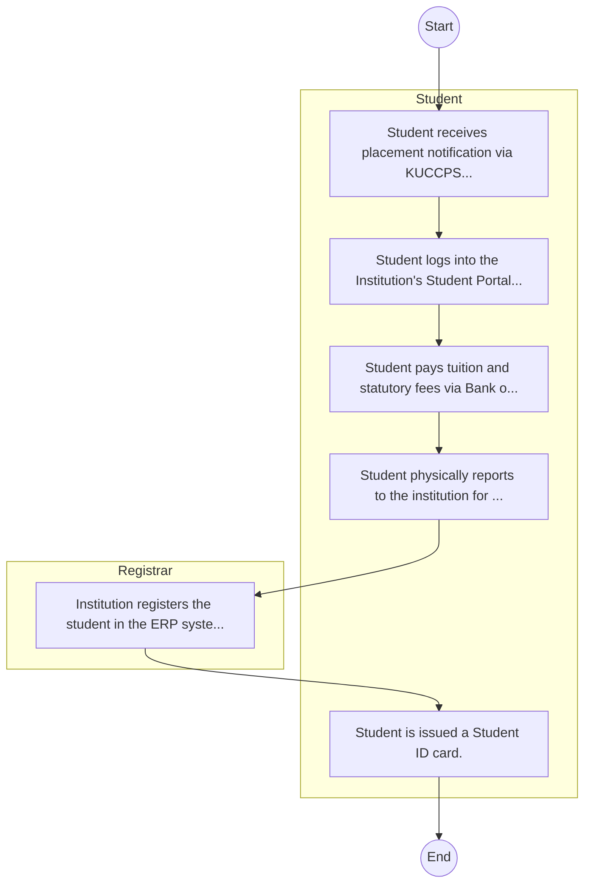

# STANDARD BPM TEMPLATE – Chuka University

## Cover Page
- **Ministry/Department/Agency (MDA):** Chuka University
- **Process Name:** To provide facilities for quality university education across various disciplines, encompassing technological, scientific, and professional fields; to advance university education and training to qualified candidates, leading to the conferment of degrees, diplomas, and certificates, thereby contributing to sustainable national economic and social development; to offer programs, products, and services that uphold principles of equity and social justice; to facilitate the development and provision of relevant academic programs and community services; to maintain and enhance the quality of teaching, learning, research, creativity, innovation, and community outreach activities; and to expand its academic programs, particularly in science and technology (e.g., Food Science and Technology), to develop human resources capable of adding value to agricultural products and ensuring food and nutrition security in Kenya.
- **Document Version:** 1.0
- **Date:** 2026-02-14
- **Classification:** Official

---

## Executive Summary
Chuka University is a premier public university in Kenya, established with a mission to generate, preserve, and share knowledge for effective leadership in higher education, training, research, and outreach. It aims to deliver quality university education across technological, scientific, and professional fields, fostering an intellectual culture that combines theoretical understanding with practical application, innovation, and entrepreneurship. Chuka University contributes significantly to sustainable national and global development by producing skilled human resources, generating new knowledge, and engaging with communities to address societal challenges.

---

## Process Flowchart (BPMN 2.0 - Mermaid)
*Guidance: This diagram visualizes the process flow across different actors (Swimlanes).*

---

## Process Overview
### Process Name
To provide facilities for quality university education across various disciplines, encompassing technological, scientific, and professional fields; to advance university education and training to qualified candidates, leading to the conferment of degrees, diplomas, and certificates, thereby contributing to sustainable national economic and social development; to offer programs, products, and services that uphold principles of equity and social justice; to facilitate the development and provision of relevant academic programs and community services; to maintain and enhance the quality of teaching, learning, research, creativity, innovation, and community outreach activities; and to expand its academic programs, particularly in science and technology (e.g., Food Science and Technology), to develop human resources capable of adding value to agricultural products and ensuring food and nutrition security in Kenya.

### Service Category
- G2C (Government to Citizen)

### Process Objective
- To provide facilities for quality university education across various disciplines, encompassing technological, scientific, and professional fields; to advance university education and training to qualified candidates, leading to the conferment of degrees, diplomas, and certificates, thereby contributing to sustainable national economic and social development; to offer programs, products, and services that uphold principles of equity and social justice; to facilitate the development and provision of relevant academic programs and community services; to maintain and enhance the quality of teaching, learning, research, creativity, innovation, and community outreach activities; and to expand its academic programs, particularly in science and technology (e.g., Food Science and Technology), to develop human resources capable of adding value to agricultural products and ensuring food and nutrition security in Kenya.

### Scope
- **In Scope:** End-to-end processing within Chuka University.
- **Out of Scope:** External agency approvals.

### Triggers
- Submission of application/request by Student.

### End States
- **Successful:** Admission Letter, Student ID Card, Academic Transcripts, Degree/Diploma Certificate
- **Unsuccessful:** Application rejected due to non-compliance.

### Policy Context
- The Chuka University Act; The Constitution of Kenya 2010; Data Protection Act 2019.

---

## Stakeholders
| Stakeholder | Role | Responsibilities |
|---|---|---|
| Student | Process Actor | Performs actions as defined in steps. |
| Registrar | Process Actor | Performs actions as defined in steps. |

---

## Inputs & Outputs
- **Inputs:** KCSE/Academic Result Slips, National ID / Birth Certificate, Student Personal Details Form, Fee Payment Receipts
- **Outputs:** Admission Letter, Student ID Card, Academic Transcripts, Degree/Diploma Certificate

---

## Detailed Process (AS-IS)
| Step | Role | Action | Tool | Notes |
|---|---|---|---|---|
| 1 | Student | Student receives placement notification via KUCCPS or applies directly as Self-Sponsored. | Manual | |
| 2 | Student | Student logs into the Institution's Student Portal to accept admission and download Admission Letter. | Digital | |
| 3 | Student | Student pays tuition and statutory fees via Bank or eCitizen. | Manual | |
| 4 | Student | Student physically reports to the institution for document verification (original slips, certs). | Manual | |
| 5 | Registrar | Institution registers the student in the ERP system. | Manual | |
| 6 | Student | Student is issued a Student ID card. | Manual | |

---

## Pain Points & Opportunities
### Pain Points
- Long queues during admission and registration.
- Manual reconciliation of fee payments.
- Delays in processing exam results and transcripts.
- Fragmented student data across departments.

### Opportunities
- Biometric student registration and attendance.
- Integrated ERP for end-to-end student lifecycle management.
- Smart Campus Cards for access control and payments.
- E-learning and digital library integration.

---

## KPIs
| KPI | Baseline | Target |
|---|---|---|
| Turnaround Time | 30 Days | 5 Days |
| CSAT | 50% | 90% |
