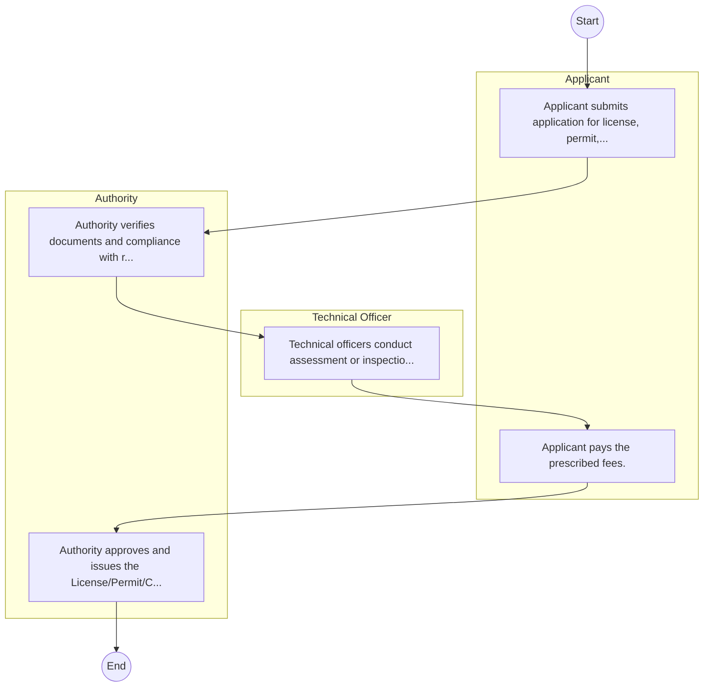

# STANDARD BPM TEMPLATE – Citizen Services

## Cover Page
- **Ministry/Department/Agency (MDA):** Citizen Services
- **Process Name:** To manage the Integrated Population Registration System (IPRS) and operate/maintain a national population register for all Kenyan citizens and foreign residents; to identify and register all Kenyan citizens aged 18 and above, issuing secure identification documents (National Identity Cards), and maintaining a comprehensive database of registered individuals; to regulate and control the entry and exit of all individuals, including the removal of prohibited immigrants, and managing border points (airports, seaports, and land borders); to issue Kenyan passports and other necessary travel documents; to oversee residency through the issuance and renewal of entry and work permits, various passes, and entry visas, and managing citizenship applications for eligible foreign nationals; to register births and deaths, ensuring the preservation and security of related certificates, and processing vital statistics; to handle the registration and status determination of refugees, coordinating service provision, issuing identification and movement passes, and managing refugee camps; to enforce relevant laws and regulations pertaining to immigration and citizenship; and to develop national migration policies and review existing immigration laws and regulations.
- **Document Version:** 1.0
- **Date:** 2026-02-14
- **Classification:** Official

---

## Executive Summary
The Department of Citizen Services operates under the State Department for Immigration and Citizen Services within the Ministry of Interior and National Administration in Kenya. Its mandate, rooted in the Constitution of Kenya and relevant legislation, is to provide comprehensive citizen services, including population registration, identification and documentation, immigration control, issuance of travel documents, residency management, civil registration, and refugee affairs. Largely facilitated by digital platforms like eCitizen, the Department aims to enhance national security, socio-economic development, and efficient service delivery to both Kenyan citizens and foreign nationals.

---

## Process Flowchart (BPMN 2.0 - Mermaid)
*Guidance: This diagram visualizes the process flow across different actors (Swimlanes).*

---

## Process Overview
### Process Name
To manage the Integrated Population Registration System (IPRS) and operate/maintain a national population register for all Kenyan citizens and foreign residents; to identify and register all Kenyan citizens aged 18 and above, issuing secure identification documents (National Identity Cards), and maintaining a comprehensive database of registered individuals; to regulate and control the entry and exit of all individuals, including the removal of prohibited immigrants, and managing border points (airports, seaports, and land borders); to issue Kenyan passports and other necessary travel documents; to oversee residency through the issuance and renewal of entry and work permits, various passes, and entry visas, and managing citizenship applications for eligible foreign nationals; to register births and deaths, ensuring the preservation and security of related certificates, and processing vital statistics; to handle the registration and status determination of refugees, coordinating service provision, issuing identification and movement passes, and managing refugee camps; to enforce relevant laws and regulations pertaining to immigration and citizenship; and to develop national migration policies and review existing immigration laws and regulations.

### Service Category
- G2C/G2B

### Process Objective
- To manage the Integrated Population Registration System (IPRS) and operate/maintain a national population register for all Kenyan citizens and foreign residents; to identify and register all Kenyan citizens aged 18 and above, issuing secure identification documents (National Identity Cards), and maintaining a comprehensive database of registered individuals; to regulate and control the entry and exit of all individuals, including the removal of prohibited immigrants, and managing border points (airports, seaports, and land borders); to issue Kenyan passports and other necessary travel documents; to oversee residency through the issuance and renewal of entry and work permits, various passes, and entry visas, and managing citizenship applications for eligible foreign nationals; to register births and deaths, ensuring the preservation and security of related certificates, and processing vital statistics; to handle the registration and status determination of refugees, coordinating service provision, issuing identification and movement passes, and managing refugee camps; to enforce relevant laws and regulations pertaining to immigration and citizenship; and to develop national migration policies and review existing immigration laws and regulations.

### Scope
- **In Scope:** End-to-end processing within Citizen Services.
- **Out of Scope:** External agency approvals.

### Triggers
- Submission of application/request by Applicant.

### End States
- **Successful:** License / Permit / Certificate, Compliance Inspection Report, Official Receipt, Gazette Notice
- **Unsuccessful:** Application rejected due to non-compliance.

### Policy Context
- The Citizen Services Act; The Constitution of Kenya 2010; Data Protection Act 2019.

---

## Stakeholders
| Stakeholder | Role | Responsibilities |
|---|---|---|
| Applicant | Process Actor | Performs actions as defined in steps. |
| Authority | Process Actor | Performs actions as defined in steps. |
| Technical Officer | Process Actor | Performs actions as defined in steps. |

---

## Inputs & Outputs
- **Inputs:** Application Form (License/Permit), Compliance Documents (Tax Compliance, CR12), Technical Reports / Site Plans, Proof of Payment
- **Outputs:** License / Permit / Certificate, Compliance Inspection Report, Official Receipt, Gazette Notice

---

## Detailed Process (AS-IS)
| Step | Role | Action | Tool | Notes |
|---|---|---|---|---|
| 1 | Applicant | Applicant submits application for license, permit, or service. | Manual | |
| 2 | Authority | Authority verifies documents and compliance with regulations. | Manual | |
| 3 | Technical Officer | Technical officers conduct assessment or inspection. | Manual | |
| 4 | Applicant | Applicant pays the prescribed fees. | Manual | |
| 5 | Authority | Authority approves and issues the License/Permit/Certificate. | Manual | |

---

## Pain Points & Opportunities
### Pain Points
- Manual document verification takes time.
- High cost and time for physical inspections.
- Risk of counterfeit licenses/certificates.
- Lack of real-time monitoring of licensees.

### Opportunities
- Online Licensing Management System (LMS).
- Integration with IPRS and BRS for auto-verification.
- Mobile field inspection apps with GIS.
- QR-coded verifiable certificates.

---

## KPIs
| KPI | Baseline | Target |
|---|---|---|
| Turnaround Time | 30 Days | 5 Days |
| CSAT | 50% | 90% |
