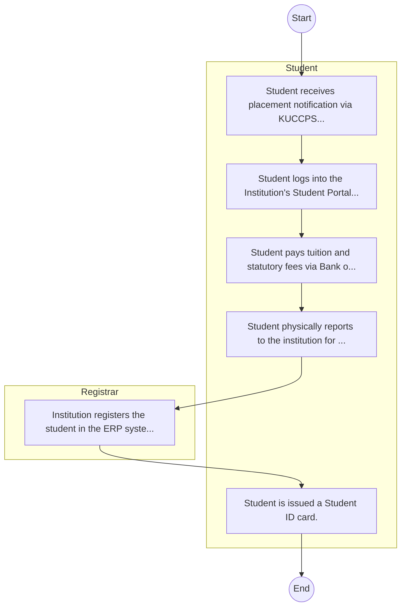

# STANDARD BPM TEMPLATE – Co-operative University of Kenya

## Cover Page
- **Ministry/Department/Agency (MDA):** Co-operative University of Kenya
- **Process Name:** To provide quality university education, training, research, and consultancy in co-operative development, business, and related fields; to advance learning and knowledge through rigorous research and innovation; to offer comprehensive academic programs across Diploma, Undergraduate, and Postgraduate levels; to support student services including access to student portals, e-learning platforms, and library resources; to facilitate community engagement and outreach programs, empowering communities through specialized consultancy services; to disseminate knowledge for effective leadership in higher education, training, research, and outreach; and to foster an intellectual culture that combines theoretical understanding with practical application, innovation, and entrepreneurship, contributing to sustainable national and global development.
- **Document Version:** 1.0
- **Date:** 2026-02-14
- **Classification:** Official

---

## Executive Summary
The Co-operative University of Kenya (CUK) is a premier public university in Kenya, established with a mission to provide quality education, training, research, and consultancy, particularly in co-operative development, business, and related fields. CUK aims to be a leading institution in cooperative training, education, research, and innovation, nurturing an intellectual culture that combines theoretical understanding with practical application, innovation, and entrepreneurship. Through its specialized focus, CUK contributes significantly to national and global development by strengthening the cooperative movement and producing skilled human capital.

---

## Process Flowchart (BPMN 2.0 - Mermaid)
*Guidance: This diagram visualizes the process flow across different actors (Swimlanes).*

---

## Process Overview
### Process Name
To provide quality university education, training, research, and consultancy in co-operative development, business, and related fields; to advance learning and knowledge through rigorous research and innovation; to offer comprehensive academic programs across Diploma, Undergraduate, and Postgraduate levels; to support student services including access to student portals, e-learning platforms, and library resources; to facilitate community engagement and outreach programs, empowering communities through specialized consultancy services; to disseminate knowledge for effective leadership in higher education, training, research, and outreach; and to foster an intellectual culture that combines theoretical understanding with practical application, innovation, and entrepreneurship, contributing to sustainable national and global development.

### Service Category
- G2C (Government to Citizen)

### Process Objective
- To provide quality university education, training, research, and consultancy in co-operative development, business, and related fields; to advance learning and knowledge through rigorous research and innovation; to offer comprehensive academic programs across Diploma, Undergraduate, and Postgraduate levels; to support student services including access to student portals, e-learning platforms, and library resources; to facilitate community engagement and outreach programs, empowering communities through specialized consultancy services; to disseminate knowledge for effective leadership in higher education, training, research, and outreach; and to foster an intellectual culture that combines theoretical understanding with practical application, innovation, and entrepreneurship, contributing to sustainable national and global development.

### Scope
- **In Scope:** End-to-end processing within Co-operative University of Kenya.
- **Out of Scope:** External agency approvals.

### Triggers
- Submission of application/request by Student.

### End States
- **Successful:** Admission Letter, Student ID Card, Academic Transcripts, Degree/Diploma Certificate
- **Unsuccessful:** Application rejected due to non-compliance.

### Policy Context
- The Co-operative University of Kenya Act; The Constitution of Kenya 2010; Data Protection Act 2019.

---

## Stakeholders
| Stakeholder | Role | Responsibilities |
|---|---|---|
| Student | Process Actor | Performs actions as defined in steps. |
| Registrar | Process Actor | Performs actions as defined in steps. |

---

## Inputs & Outputs
- **Inputs:** KCSE/Academic Result Slips, National ID / Birth Certificate, Student Personal Details Form, Fee Payment Receipts
- **Outputs:** Admission Letter, Student ID Card, Academic Transcripts, Degree/Diploma Certificate

---

## Detailed Process (AS-IS)
| Step | Role | Action | Tool | Notes |
|---|---|---|---|---|
| 1 | Student | Student receives placement notification via KUCCPS or applies directly as Self-Sponsored. | Manual | |
| 2 | Student | Student logs into the Institution's Student Portal to accept admission and download Admission Letter. | Digital | |
| 3 | Student | Student pays tuition and statutory fees via Bank or eCitizen. | Manual | |
| 4 | Student | Student physically reports to the institution for document verification (original slips, certs). | Manual | |
| 5 | Registrar | Institution registers the student in the ERP system. | Manual | |
| 6 | Student | Student is issued a Student ID card. | Manual | |

---

## Pain Points & Opportunities
### Pain Points
- Long queues during admission and registration.
- Manual reconciliation of fee payments.
- Delays in processing exam results and transcripts.
- Fragmented student data across departments.

### Opportunities
- Biometric student registration and attendance.
- Integrated ERP for end-to-end student lifecycle management.
- Smart Campus Cards for access control and payments.
- E-learning and digital library integration.

---

## KPIs
| KPI | Baseline | Target |
|---|---|---|
| Turnaround Time | 30 Days | 5 Days |
| CSAT | 50% | 90% |
