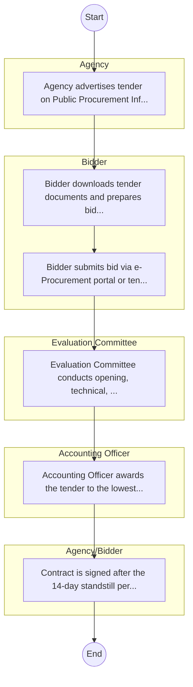

# STANDARD BPM TEMPLATE – Coast Development Authority

## Cover Page
- **Ministry/Department/Agency (MDA):** Coast Development Authority
- **Process Name:** To oversee the sustainable utilization and conservation of natural resources in Kenya's coastal region; to promote agricultural productivity through initiatives like irrigation schemes, modern farming practices, and value addition; to implement projects to enhance water supply for domestic, agricultural, and industrial use, including promoting alternative sources of freshwater like rainwater harvesting; to protect coastal ecosystems, combat soil erosion, and promote reforestation efforts, and increase resilience to climate change in shoreline and mangrove ecosystems; to plan and develop infrastructure such as roads, bridges, and water systems to support regional growth; to engage and empower local communities through capacity-building programs and development initiatives; to foster industrial and commercial ventures, especially those leveraging the region's natural resources; to support the development of eco-tourism and sustainable tourism activities in the coastal region; to conduct research and studies on natural resources, climate change, and development challenges to inform decision-making; and to align and implement national policies related to regional planning, environmental protection, and resource management.
- **Document Version:** 1.0
- **Date:** 2026-02-14
- **Classification:** Official

---

## Executive Summary
The Coast Development Authority (CDA) is a State Corporation in Kenya, established by an Act of Parliament (No. 20 of 1990, Cap 449). Its primary mandate is to provide integrated development planning, coordination, and implementation of projects and programs throughout the entire Coast Region of Kenya, including the exclusive economic zone. CDA focuses on sustainable utilization and conservation of natural resources, promoting economic growth, and empowering local communities, thereby contributing to national development strategies, particularly those related to the Blue Economy.

---

## Process Flowchart (BPMN 2.0 - Mermaid)
*Guidance: This diagram visualizes the process flow across different actors (Swimlanes).*

---

## Process Overview
### Process Name
To oversee the sustainable utilization and conservation of natural resources in Kenya's coastal region; to promote agricultural productivity through initiatives like irrigation schemes, modern farming practices, and value addition; to implement projects to enhance water supply for domestic, agricultural, and industrial use, including promoting alternative sources of freshwater like rainwater harvesting; to protect coastal ecosystems, combat soil erosion, and promote reforestation efforts, and increase resilience to climate change in shoreline and mangrove ecosystems; to plan and develop infrastructure such as roads, bridges, and water systems to support regional growth; to engage and empower local communities through capacity-building programs and development initiatives; to foster industrial and commercial ventures, especially those leveraging the region's natural resources; to support the development of eco-tourism and sustainable tourism activities in the coastal region; to conduct research and studies on natural resources, climate change, and development challenges to inform decision-making; and to align and implement national policies related to regional planning, environmental protection, and resource management.

### Service Category
- G2B (Government to Business)

### Process Objective
- To oversee the sustainable utilization and conservation of natural resources in Kenya's coastal region; to promote agricultural productivity through initiatives like irrigation schemes, modern farming practices, and value addition; to implement projects to enhance water supply for domestic, agricultural, and industrial use, including promoting alternative sources of freshwater like rainwater harvesting; to protect coastal ecosystems, combat soil erosion, and promote reforestation efforts, and increase resilience to climate change in shoreline and mangrove ecosystems; to plan and develop infrastructure such as roads, bridges, and water systems to support regional growth; to engage and empower local communities through capacity-building programs and development initiatives; to foster industrial and commercial ventures, especially those leveraging the region's natural resources; to support the development of eco-tourism and sustainable tourism activities in the coastal region; to conduct research and studies on natural resources, climate change, and development challenges to inform decision-making; and to align and implement national policies related to regional planning, environmental protection, and resource management.

### Scope
- **In Scope:** End-to-end processing within Coast Development Authority.
- **Out of Scope:** External agency approvals.

### Triggers
- Submission of application/request by Agency.

### End States
- **Successful:** License / Permit / Certificate, Compliance Inspection Report, Official Receipt, Gazette Notice
- **Unsuccessful:** Application rejected due to non-compliance.

### Policy Context
- The Coast Development Authority Act; The Constitution of Kenya 2010; Data Protection Act 2019.

---

## Stakeholders
| Stakeholder | Role | Responsibilities |
|---|---|---|
| Evaluation Committee | Process Actor | Performs actions as defined in steps. |
| Accounting Officer | Process Actor | Performs actions as defined in steps. |
| Bidder | Process Actor | Performs actions as defined in steps. |
| Agency/Bidder | Process Actor | Performs actions as defined in steps. |
| Agency | Process Actor | Performs actions as defined in steps. |

---

## Inputs & Outputs
- **Inputs:** Application Form (License/Permit), Compliance Documents (Tax Compliance, CR12), Technical Reports / Site Plans, Proof of Payment
- **Outputs:** License / Permit / Certificate, Compliance Inspection Report, Official Receipt, Gazette Notice

---

## Detailed Process (AS-IS)
| Step | Role | Action | Tool | Notes |
|---|---|---|---|---|
| 1 | Agency | Agency advertises tender on Public Procurement Information Portal (PPIP) and website. | Digital | |
| 2 | Bidder | Bidder downloads tender documents and prepares bid (Technical & Financial). | Manual | |
| 3 | Bidder | Bidder submits bid via e-Procurement portal or tender box. | Digital | |
| 4 | Evaluation Committee | Evaluation Committee conducts opening, technical, and financial evaluation. | Manual | |
| 5 | Accounting Officer | Accounting Officer awards the tender to the lowest responsive bidder. | Manual | |
| 6 | Agency/Bidder | Contract is signed after the 14-day standstill period. | Manual | |

---

## Pain Points & Opportunities
### Pain Points
- Manual document verification takes time.
- High cost and time for physical inspections.
- Risk of counterfeit licenses/certificates.
- Lack of real-time monitoring of licensees.

### Opportunities
- Online Licensing Management System (LMS).
- Integration with IPRS and BRS for auto-verification.
- Mobile field inspection apps with GIS.
- QR-coded verifiable certificates.

---

## KPIs
| KPI | Baseline | Target |
|---|---|---|
| Turnaround Time | 30 Days | 5 Days |
| CSAT | 50% | 90% |
