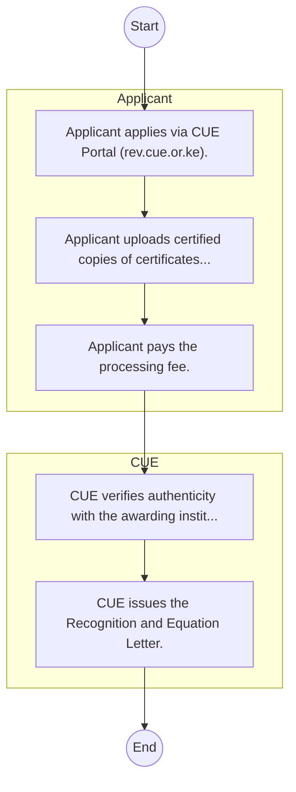

# STANDARD BPM TEMPLATE – Commission for University Education

## Cover Page
- **Ministry/Department/Agency (MDA):** Commission for University Education
- **Process Name:** To promote the objectives of university education; to advise the Cabinet Secretary on policy matters related to university education; to promote, advance, publicize, and set standards relevant to the quality of university education, including supporting internationally recognized standards; to regulate university education in Kenya by setting frameworks for governance, curriculum delivery, and academic services; to accredit universities in Kenya by granting Charters or Letters of Interim Authority, and approving and inspecting university programs; to monitor and evaluate the state of university education systems in relation to national development goals, assessing program quality, and teaching methodologies; to license student recruitment agencies operating in Kenya and activities by foreign institutions; to develop policy for criteria and requirements for admission to universities; to recognize and equate degrees, diplomas, and certificates conferred or awarded by foreign universities and institutions according to established standards and guidelines; to undertake regular inspections, monitoring, and evaluation of universities to ensure compliance with the provisions of the Universities Act; to collect, disseminate, and maintain data on university education; and to promote quality research and innovation within universities.
- **Document Version:** 1.0
- **Date:** 2026-02-14
- **Classification:** Official

---

## Executive Summary
The Commission for University Education (CUE) Kenya is a statutory body established under the Universities Act No. 42 of 2012, becoming fully operational in 2013 as the successor to the Commission for Higher Education (CHE). CUE's primary mandate is to promote the objectives of university education by regulating and assuring the quality of university education in Kenya, including accreditation of universities and their programs. It plays a crucial role in protecting the interests of students and the public, ensuring that universities provide relevant and high-quality education aligned with national development priorities.

---

## Process Flowchart (BPMN 2.0 - Mermaid)
*Guidance: This diagram visualizes the process flow across different actors (Swimlanes).*

---

## Process Overview
### Process Name
To promote the objectives of university education; to advise the Cabinet Secretary on policy matters related to university education; to promote, advance, publicize, and set standards relevant to the quality of university education, including supporting internationally recognized standards; to regulate university education in Kenya by setting frameworks for governance, curriculum delivery, and academic services; to accredit universities in Kenya by granting Charters or Letters of Interim Authority, and approving and inspecting university programs; to monitor and evaluate the state of university education systems in relation to national development goals, assessing program quality, and teaching methodologies; to license student recruitment agencies operating in Kenya and activities by foreign institutions; to develop policy for criteria and requirements for admission to universities; to recognize and equate degrees, diplomas, and certificates conferred or awarded by foreign universities and institutions according to established standards and guidelines; to undertake regular inspections, monitoring, and evaluation of universities to ensure compliance with the provisions of the Universities Act; to collect, disseminate, and maintain data on university education; and to promote quality research and innovation within universities.

### Service Category
- G2C (Government to Citizen)

### Process Objective
- To promote the objectives of university education; to advise the Cabinet Secretary on policy matters related to university education; to promote, advance, publicize, and set standards relevant to the quality of university education, including supporting internationally recognized standards; to regulate university education in Kenya by setting frameworks for governance, curriculum delivery, and academic services; to accredit universities in Kenya by granting Charters or Letters of Interim Authority, and approving and inspecting university programs; to monitor and evaluate the state of university education systems in relation to national development goals, assessing program quality, and teaching methodologies; to license student recruitment agencies operating in Kenya and activities by foreign institutions; to develop policy for criteria and requirements for admission to universities; to recognize and equate degrees, diplomas, and certificates conferred or awarded by foreign universities and institutions according to established standards and guidelines; to undertake regular inspections, monitoring, and evaluation of universities to ensure compliance with the provisions of the Universities Act; to collect, disseminate, and maintain data on university education; and to promote quality research and innovation within universities.

### Scope
- **In Scope:** End-to-end processing within Commission for University Education.
- **Out of Scope:** External agency approvals.

### Triggers
- Submission of application/request by Applicant.

### End States
- **Successful:** Admission Letter, Student ID Card, Academic Transcripts, Degree/Diploma Certificate
- **Unsuccessful:** Application rejected due to non-compliance.

### Policy Context
- The Commission for University Education Act; The Constitution of Kenya 2010; Data Protection Act 2019.

---

## Stakeholders
| Stakeholder | Role | Responsibilities |
|---|---|---|
| Applicant | Process Actor | Performs actions as defined in steps. |
| CUE | Process Actor | Performs actions as defined in steps. |

---

## Inputs & Outputs
- **Inputs:** KCSE/Academic Result Slips, National ID / Birth Certificate, Student Personal Details Form, Fee Payment Receipts
- **Outputs:** Admission Letter, Student ID Card, Academic Transcripts, Degree/Diploma Certificate

---

## Detailed Process (AS-IS)
| Step | Role | Action | Tool | Notes |
|---|---|---|---|---|
| 1 | Applicant | Applicant applies via CUE Portal (rev.cue.or.ke). | Digital | |
| 2 | Applicant | Applicant uploads certified copies of certificates and transcripts. | Manual | |
| 3 | Applicant | Applicant pays the processing fee. | Manual | |
| 4 | CUE | CUE verifies authenticity with the awarding institution/foreign regulator. | Manual | |
| 5 | CUE | CUE issues the Recognition and Equation Letter. | Manual | |

---

## Pain Points & Opportunities
### Pain Points
- Long queues during admission and registration.
- Manual reconciliation of fee payments.
- Delays in processing exam results and transcripts.
- Fragmented student data across departments.

### Opportunities
- Biometric student registration and attendance.
- Integrated ERP for end-to-end student lifecycle management.
- Smart Campus Cards for access control and payments.
- E-learning and digital library integration.

---

## KPIs
| KPI | Baseline | Target |
|---|---|---|
| Turnaround Time | 30 Days | 5 Days |
| CSAT | 50% | 90% |
