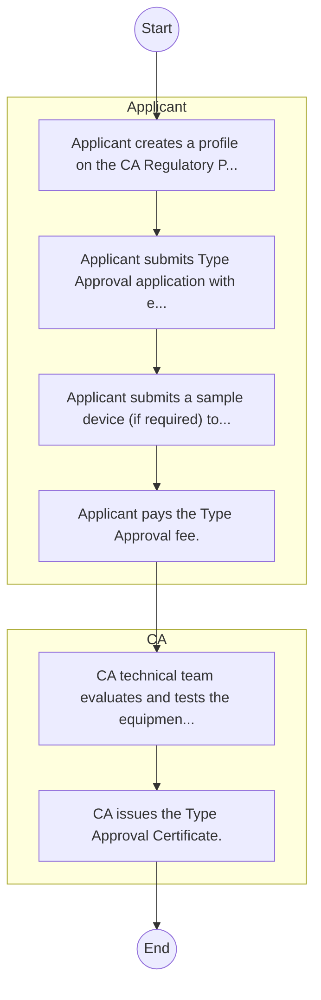

# STANDARD BPM TEMPLATE – Communications Authority of Kenya

## Cover Page
- **Ministry/Department/Agency (MDA):** Communications Authority of Kenya
- **Process Name:** To license all systems and services in the communications industry, including telecommunications, postal, courier, and broadcasting services; to manage the country's frequency spectrum and numbering resources efficiently; to facilitate the development of e-commerce and the overall information and communications sectors, including broadcasting, cybersecurity, multimedia, telecommunications, and postal/courier services; to type approve and accept communications equipment for use in the country; to protect consumer rights within the communications environment; to manage competition within the sector to ensure a level playing field for all players; to regulate retail and wholesale tariffs for communications services; to administer the Universal Service Fund (USF) to facilitate widespread access to communications services by all in Kenya; to promote capacity building and innovation in ICT services; and to facilitate the development and management of a national cybersecurity framework.
- **Document Version:** 1.0
- **Date:** 2026-02-14
- **Classification:** Official

---

## Executive Summary
The Communications Authority of Kenya (CA) is the independent regulatory agency for the Information, Communications and Technology (ICT) industry in Kenya, established in 1999 by the Kenya Information and Communications Act, 1998. Its mandate encompasses licensing, spectrum management, market development, consumer protection, and cybersecurity. The CA aims to ensure a vibrant, accessible, secure, and well-regulated ICT sector that fosters innovation, economic growth, and social development, while upholding consumer rights and promoting fair competition.

---

## Process Flowchart (BPMN 2.0 - Mermaid)
*Guidance: This diagram visualizes the process flow across different actors (Swimlanes).*

---

## Process Overview
### Process Name
To license all systems and services in the communications industry, including telecommunications, postal, courier, and broadcasting services; to manage the country's frequency spectrum and numbering resources efficiently; to facilitate the development of e-commerce and the overall information and communications sectors, including broadcasting, cybersecurity, multimedia, telecommunications, and postal/courier services; to type approve and accept communications equipment for use in the country; to protect consumer rights within the communications environment; to manage competition within the sector to ensure a level playing field for all players; to regulate retail and wholesale tariffs for communications services; to administer the Universal Service Fund (USF) to facilitate widespread access to communications services by all in Kenya; to promote capacity building and innovation in ICT services; and to facilitate the development and management of a national cybersecurity framework.

### Service Category
- G2B (Government to Business)

### Process Objective
- To license all systems and services in the communications industry, including telecommunications, postal, courier, and broadcasting services; to manage the country's frequency spectrum and numbering resources efficiently; to facilitate the development of e-commerce and the overall information and communications sectors, including broadcasting, cybersecurity, multimedia, telecommunications, and postal/courier services; to type approve and accept communications equipment for use in the country; to protect consumer rights within the communications environment; to manage competition within the sector to ensure a level playing field for all players; to regulate retail and wholesale tariffs for communications services; to administer the Universal Service Fund (USF) to facilitate widespread access to communications services by all in Kenya; to promote capacity building and innovation in ICT services; and to facilitate the development and management of a national cybersecurity framework.

### Scope
- **In Scope:** End-to-end processing within Communications Authority of Kenya.
- **Out of Scope:** External agency approvals.

### Triggers
- Submission of application/request by Applicant.

### End States
- **Successful:** License / Permit / Certificate, Compliance Inspection Report, Official Receipt, Gazette Notice
- **Unsuccessful:** Application rejected due to non-compliance.

### Policy Context
- The Communications Authority of Kenya Act; The Constitution of Kenya 2010; Data Protection Act 2019.

---

## Stakeholders
| Stakeholder | Role | Responsibilities |
|---|---|---|
| Applicant | Process Actor | Performs actions as defined in steps. |
| CA | Process Actor | Performs actions as defined in steps. |

---

## Inputs & Outputs
- **Inputs:** Application Form (License/Permit), Compliance Documents (Tax Compliance, CR12), Technical Reports / Site Plans, Proof of Payment
- **Outputs:** License / Permit / Certificate, Compliance Inspection Report, Official Receipt, Gazette Notice

---

## Detailed Process (AS-IS)
| Step | Role | Action | Tool | Notes |
|---|---|---|---|---|
| 1 | Applicant | Applicant creates a profile on the CA Regulatory Portal. | Digital | |
| 2 | Applicant | Applicant submits Type Approval application with equipment specs and test reports. | Manual | |
| 3 | Applicant | Applicant submits a sample device (if required) to CA. | Manual | |
| 4 | Applicant | Applicant pays the Type Approval fee. | Manual | |
| 5 | CA | CA technical team evaluates and tests the equipment. | Manual | |
| 6 | CA | CA issues the Type Approval Certificate. | Manual | |

---

## Pain Points & Opportunities
### Pain Points
- Manual document verification takes time.
- High cost and time for physical inspections.
- Risk of counterfeit licenses/certificates.
- Lack of real-time monitoring of licensees.

### Opportunities
- Online Licensing Management System (LMS).
- Integration with IPRS and BRS for auto-verification.
- Mobile field inspection apps with GIS.
- QR-coded verifiable certificates.

---

## KPIs
| KPI | Baseline | Target |
|---|---|---|
| Turnaround Time | 30 Days | 5 Days |
| CSAT | 50% | 90% |
