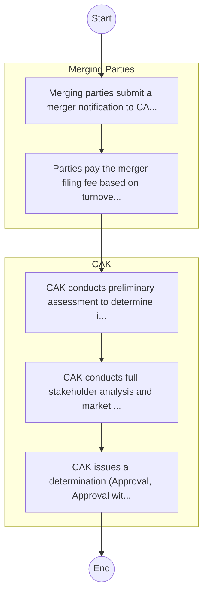

# STANDARD BPM TEMPLATE – Competition Authority of Kenya

## Cover Page
- **Ministry/Department/Agency (MDA):** Competition Authority of Kenya
- **Process Name:** To promote and enforce compliance with the Competition Act; receive and investigate complaints; promote public awareness of competition law and consumer rights; control mergers and acquisitions to prevent market concentration; deter anti-competitive conduct like abuse of dominance and price fixing; and advise the government on competition and consumer welfare matters.
- **Document Version:** 1.0
- **Date:** 2026-02-14
- **Classification:** Official

---

## Executive Summary
The Competition Authority of Kenya (CAK) is established under the Competition Act CAP 504. Its primary mandate is to enforce competition law, promote and safeguard effective competition in markets, prevent misleading market conduct, and protect consumer welfare throughout Kenya, thereby enhancing the welfare of the Kenyan people.

---

## Process Flowchart (BPMN 2.0 - Mermaid)
*Guidance: This diagram visualizes the process flow across different actors (Swimlanes).*

---

## Process Overview
### Process Name
To promote and enforce compliance with the Competition Act; receive and investigate complaints; promote public awareness of competition law and consumer rights; control mergers and acquisitions to prevent market concentration; deter anti-competitive conduct like abuse of dominance and price fixing; and advise the government on competition and consumer welfare matters.

### Service Category
- G2B (Government to Business)

### Process Objective
- To promote and enforce compliance with the Competition Act; receive and investigate complaints; promote public awareness of competition law and consumer rights; control mergers and acquisitions to prevent market concentration; deter anti-competitive conduct like abuse of dominance and price fixing; and advise the government on competition and consumer welfare matters.

### Scope
- **In Scope:** End-to-end processing within Competition Authority of Kenya.
- **Out of Scope:** External agency approvals.

### Triggers
- Submission of application/request by Merging Parties.

### End States
- **Successful:** License / Permit / Certificate, Compliance Inspection Report, Official Receipt, Gazette Notice
- **Unsuccessful:** Application rejected due to non-compliance.

### Policy Context
- The Competition Authority of Kenya Act; The Constitution of Kenya 2010; Data Protection Act 2019.

---

## Stakeholders
| Stakeholder | Role | Responsibilities |
|---|---|---|
| CAK | Process Actor | Performs actions as defined in steps. |
| Merging Parties | Process Actor | Performs actions as defined in steps. |

---

## Inputs & Outputs
- **Inputs:** Application Form (License/Permit), Compliance Documents (Tax Compliance, CR12), Technical Reports / Site Plans, Proof of Payment
- **Outputs:** License / Permit / Certificate, Compliance Inspection Report, Official Receipt, Gazette Notice

---

## Detailed Process (AS-IS)
| Step | Role | Action | Tool | Notes |
|---|---|---|---|---|
| 1 | Merging Parties | Merging parties submit a merger notification to CAK. | Manual | |
| 2 | Merging Parties | Parties pay the merger filing fee based on turnover. | Manual | |
| 3 | CAK | CAK conducts preliminary assessment to determine if full analysis is needed. | Manual | |
| 4 | CAK | CAK conducts full stakeholder analysis and market testing. | Manual | |
| 5 | CAK | CAK issues a determination (Approval, Approval with conditions, or Rejection). | Manual | |

---

## Pain Points & Opportunities
### Pain Points
- Manual document verification takes time.
- High cost and time for physical inspections.
- Risk of counterfeit licenses/certificates.
- Lack of real-time monitoring of licensees.

### Opportunities
- Online Licensing Management System (LMS).
- Integration with IPRS and BRS for auto-verification.
- Mobile field inspection apps with GIS.
- QR-coded verifiable certificates.

---

## KPIs
| KPI | Baseline | Target |
|---|---|---|
| Turnaround Time | 30 Days | 5 Days |
| CSAT | 50% | 90% |
