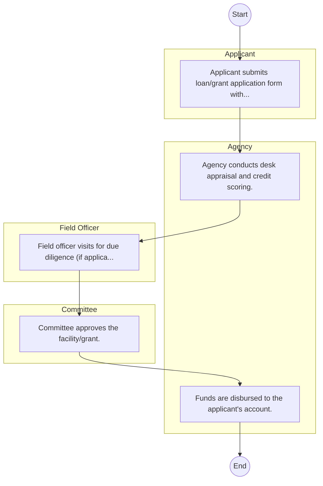

# STANDARD BPM TEMPLATE – Consolidated Bank of Kenya

## Cover Page
- **Ministry/Department/Agency (MDA):** Consolidated Bank of Kenya
- **Process Name:** To provide a diverse range of personal banking products, including various account types (e.g., E-Cash, Solid Plus, Current, Dream Saver, Junior Saver, Diamond, Ace Salary Accounts) and loan products (e.g., Personal Loan, Mortgage Loan, Solid Scholar Loan, Asset Finance); to offer comprehensive business banking solutions, including deposit products and loan products (e.g., Business Term Loan, Commercial Construction Loan, Insurance Financing); to provide trade finance facilities such as Bid Bonds, Performance Bonds, Bills Discounting, and Invoice Discounting; to facilitate e-banking and m-banking services, allowing for convenient balance inquiries, fund transfers, airtime purchases, and MPESA transactions; and to act as a commercial bank, fostering economic growth and financial inclusion in Kenya by providing accessible and relevant financial services to a wide range of customers.
- **Document Version:** 1.0
- **Date:** 2026-02-14
- **Classification:** Official

---

## Executive Summary
Consolidated Bank of Kenya is a commercial bank regulated by the Central Bank of Kenya, providing a comprehensive range of banking services and products to individuals and businesses across the country. Its offerings encompass various account types, loan products, trade finance facilities, and modern e-banking and m-banking services. The bank aims to support economic growth, foster financial inclusion, and contribute to the stability and development of the Kenyan financial sector, while striving to achieve profitability for its stakeholders.

---

## Process Flowchart (BPMN 2.0 - Mermaid)
*Guidance: This diagram visualizes the process flow across different actors (Swimlanes).*

---

## Process Overview
### Process Name
To provide a diverse range of personal banking products, including various account types (e.g., E-Cash, Solid Plus, Current, Dream Saver, Junior Saver, Diamond, Ace Salary Accounts) and loan products (e.g., Personal Loan, Mortgage Loan, Solid Scholar Loan, Asset Finance); to offer comprehensive business banking solutions, including deposit products and loan products (e.g., Business Term Loan, Commercial Construction Loan, Insurance Financing); to provide trade finance facilities such as Bid Bonds, Performance Bonds, Bills Discounting, and Invoice Discounting; to facilitate e-banking and m-banking services, allowing for convenient balance inquiries, fund transfers, airtime purchases, and MPESA transactions; and to act as a commercial bank, fostering economic growth and financial inclusion in Kenya by providing accessible and relevant financial services to a wide range of customers.

### Service Category
- G2C/G2B

### Process Objective
- To provide a diverse range of personal banking products, including various account types (e.g., E-Cash, Solid Plus, Current, Dream Saver, Junior Saver, Diamond, Ace Salary Accounts) and loan products (e.g., Personal Loan, Mortgage Loan, Solid Scholar Loan, Asset Finance); to offer comprehensive business banking solutions, including deposit products and loan products (e.g., Business Term Loan, Commercial Construction Loan, Insurance Financing); to provide trade finance facilities such as Bid Bonds, Performance Bonds, Bills Discounting, and Invoice Discounting; to facilitate e-banking and m-banking services, allowing for convenient balance inquiries, fund transfers, airtime purchases, and MPESA transactions; and to act as a commercial bank, fostering economic growth and financial inclusion in Kenya by providing accessible and relevant financial services to a wide range of customers.

### Scope
- **In Scope:** End-to-end processing within Consolidated Bank of Kenya.
- **Out of Scope:** External agency approvals.

### Triggers
- Submission of application/request by Applicant.

### End States
- **Successful:** Loan Disbursement / Service Delivery, Statement of Account, Contract / Agreement, Receipt / Invoice
- **Unsuccessful:** Application rejected due to non-compliance.

### Policy Context
- The Consolidated Bank of Kenya Act; The Constitution of Kenya 2010; Data Protection Act 2019.

---

## Stakeholders
| Stakeholder | Role | Responsibilities |
|---|---|---|
| Applicant | Process Actor | Performs actions as defined in steps. |
| Field Officer | Process Actor | Performs actions as defined in steps. |
| Committee | Process Actor | Performs actions as defined in steps. |
| Agency | Process Actor | Performs actions as defined in steps. |

---

## Inputs & Outputs
- **Inputs:** Loan/Service Application Form, Business Proposal / Plan, Financial Statements / Bank Records, Collateral / Security Documents
- **Outputs:** Loan Disbursement / Service Delivery, Statement of Account, Contract / Agreement, Receipt / Invoice

---

## Detailed Process (AS-IS)
| Step | Role | Action | Tool | Notes |
|---|---|---|---|---|
| 1 | Applicant | Applicant submits loan/grant application form with business proposal. | Manual | |
| 2 | Agency | Agency conducts desk appraisal and credit scoring. | Manual | |
| 3 | Field Officer | Field officer visits for due diligence (if applicable). | Manual | |
| 4 | Committee | Committee approves the facility/grant. | Manual | |
| 5 | Agency | Funds are disbursed to the applicant's account. | Manual | |

---

## Pain Points & Opportunities
### Pain Points
- Lengthy credit appraisal processes.
- Manual debt collection and reconciliation.
- High paperwork for loan processing.
- Lack of 360-degree customer view.

### Opportunities
- Automated Credit Scoring and Appraisal.
- Mobile-based loan application and repayment.
- Customer Relationship Management (CRM) systems.
- Data analytics for risk management.

---

## KPIs
| KPI | Baseline | Target |
|---|---|---|
| Turnaround Time | 30 Days | 5 Days |
| CSAT | 50% | 90% |
