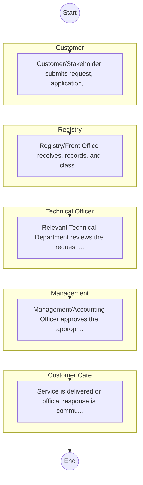

# STANDARD BPM TEMPLATE – Cooperatives

## Cover Page
- **Ministry/Department/Agency (MDA):** Cooperatives
- **Process Name:** To formulate and implement policy and legal frameworks for the development and growth of all co-operatives; to register and liquidate co-operative enterprises, and establish uniform standards for their operations; to recognize county and cross-county co-operative enterprises; to regulate co-operative audit services, including social and value-for-money audits; to carry out inquiries, inspections, and investigations into co-operative affairs; to provide oversight to apex, federations, secondary, and cross-county co-operative enterprises; to promote good governance and ethics within co-operative enterprises; to promote co-operative ventures, production, marketing, and value addition; to carry out capacity building for County Governments and co-operative leaders; to develop policies related to co-operative savings, credit, and other financial services; to promote public-private partnerships and joint ventures for co-operative growth; to facilitate regional and international co-operative relations; to establish and maintain a data and information center for co-operatives and promote research and development in the sector; and to provide accessible online services such as name searches, registration of cooperative societies, cooperative audits, official searches, and registration of amendments of bylaws.
- **Document Version:** 1.0
- **Date:** 2026-02-14
- **Classification:** Official

---

## Executive Summary
The Ministry of Co-operatives And Micro, Small And Medium Enterprises (MSMEs) Development is a key government Ministry in Kenya. Its primary mandate is to formulate, adopt, and implement policy and legal frameworks for the development and growth of all co-operatives, aligning with national development policies and priorities. The Ministry is responsible for the registration, regulation, oversight, promotion, and capacity building of the cooperative sector, aiming to enhance economic growth, financial inclusion, wealth creation, and improved livelihoods for millions of Kenyans through a robust cooperative movement.

---

## Process Flowchart (BPMN 2.0 - Mermaid)
*Guidance: This diagram visualizes the process flow across different actors (Swimlanes).*

---

## Process Overview
### Process Name
To formulate and implement policy and legal frameworks for the development and growth of all co-operatives; to register and liquidate co-operative enterprises, and establish uniform standards for their operations; to recognize county and cross-county co-operative enterprises; to regulate co-operative audit services, including social and value-for-money audits; to carry out inquiries, inspections, and investigations into co-operative affairs; to provide oversight to apex, federations, secondary, and cross-county co-operative enterprises; to promote good governance and ethics within co-operative enterprises; to promote co-operative ventures, production, marketing, and value addition; to carry out capacity building for County Governments and co-operative leaders; to develop policies related to co-operative savings, credit, and other financial services; to promote public-private partnerships and joint ventures for co-operative growth; to facilitate regional and international co-operative relations; to establish and maintain a data and information center for co-operatives and promote research and development in the sector; and to provide accessible online services such as name searches, registration of cooperative societies, cooperative audits, official searches, and registration of amendments of bylaws.

### Service Category
- G2C/G2B

### Process Objective
- To formulate and implement policy and legal frameworks for the development and growth of all co-operatives; to register and liquidate co-operative enterprises, and establish uniform standards for their operations; to recognize county and cross-county co-operative enterprises; to regulate co-operative audit services, including social and value-for-money audits; to carry out inquiries, inspections, and investigations into co-operative affairs; to provide oversight to apex, federations, secondary, and cross-county co-operative enterprises; to promote good governance and ethics within co-operative enterprises; to promote co-operative ventures, production, marketing, and value addition; to carry out capacity building for County Governments and co-operative leaders; to develop policies related to co-operative savings, credit, and other financial services; to promote public-private partnerships and joint ventures for co-operative growth; to facilitate regional and international co-operative relations; to establish and maintain a data and information center for co-operatives and promote research and development in the sector; and to provide accessible online services such as name searches, registration of cooperative societies, cooperative audits, official searches, and registration of amendments of bylaws.

### Scope
- **In Scope:** End-to-end processing within Cooperatives.
- **Out of Scope:** External agency approvals.

### Triggers
- Submission of application/request by Customer.

### End States
- **Successful:** License / Permit / Certificate, Compliance Inspection Report, Official Receipt, Gazette Notice
- **Unsuccessful:** Application rejected due to non-compliance.

### Policy Context
- The Cooperatives Act; The Constitution of Kenya 2010; Data Protection Act 2019.

---

## Stakeholders
| Stakeholder | Role | Responsibilities |
|---|---|---|
| Registry | Process Actor | Performs actions as defined in steps. |
| Customer Care | Process Actor | Performs actions as defined in steps. |
| Management | Process Actor | Performs actions as defined in steps. |
| Customer | Process Actor | Performs actions as defined in steps. |
| Technical Officer | Process Actor | Performs actions as defined in steps. |

---

## Inputs & Outputs
- **Inputs:** Application Form (License/Permit), Compliance Documents (Tax Compliance, CR12), Technical Reports / Site Plans, Proof of Payment
- **Outputs:** License / Permit / Certificate, Compliance Inspection Report, Official Receipt, Gazette Notice

---

## Detailed Process (AS-IS)
| Step | Role | Action | Tool | Notes |
|---|---|---|---|---|
| 1 | Customer | Customer/Stakeholder submits request, application, or inquiry via official channels (Email, Letter, or Portal). | Digital | |
| 2 | Registry | Registry/Front Office receives, records, and classifies the request. | Manual | |
| 3 | Technical Officer | Relevant Technical Department reviews the request against internal policies and regulations. | Manual | |
| 4 | Management | Management/Accounting Officer approves the appropriate action or service delivery. | Manual | |
| 5 | Customer Care | Service is delivered or official response is communicated to the customer. | Manual | |

---

## Pain Points & Opportunities
### Pain Points
- Manual document verification takes time.
- High cost and time for physical inspections.
- Risk of counterfeit licenses/certificates.
- Lack of real-time monitoring of licensees.

### Opportunities
- Online Licensing Management System (LMS).
- Integration with IPRS and BRS for auto-verification.
- Mobile field inspection apps with GIS.
- QR-coded verifiable certificates.

---

## KPIs
| KPI | Baseline | Target |
|---|---|---|
| Turnaround Time | 30 Days | 5 Days |
| CSAT | 50% | 90% |
