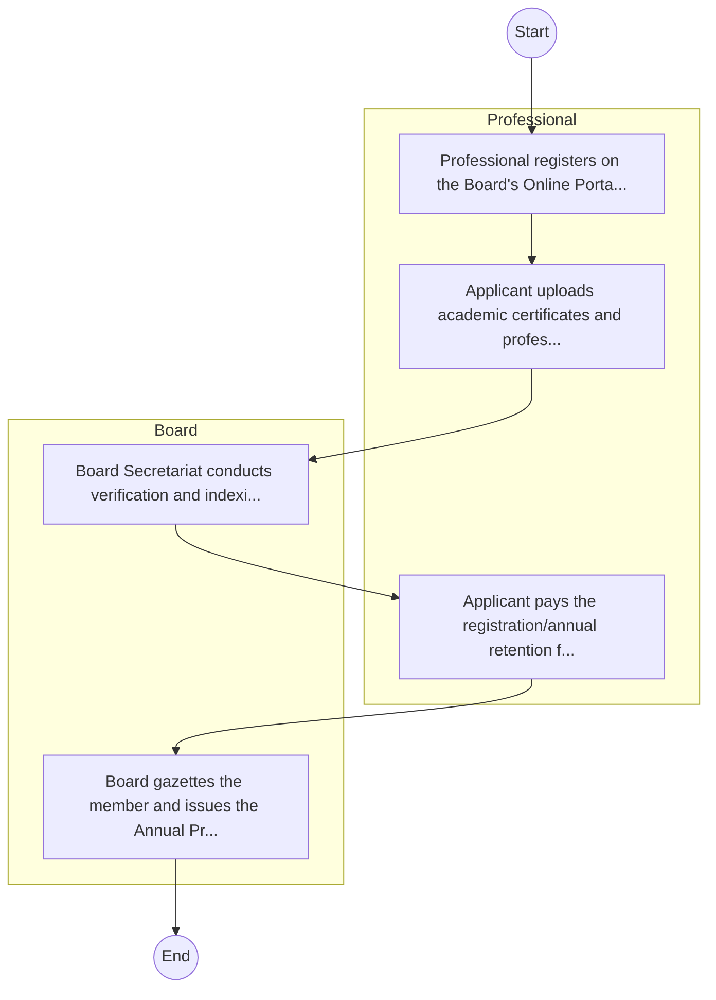

# STANDARD BPM TEMPLATE – Council of Legal Education

## Cover Page
- **Ministry/Department/Agency (MDA):** Council of Legal Education
- **Process Name:** To regulate legal education and training offered by legal education providers in Kenya; to license and supervise legal education providers; to advise the Government on matters related to legal education and training; to recognize and approve qualifications obtained outside Kenya for admission to the Roll of Advocates; to administer the Advocates Training Programme (ATP) examination; to make regulations concerning admission requirements for legal education programs; to establish criteria for recognizing and equating academic qualifications in legal education; to formulate a system for recognizing prior learning and experience in law; to establish a system of equivalencies for legal educational qualifications and credit transfers; and to oversee the accreditation of legal education providers, curricula and mode of instruction, mode and quality of examinations, harmonization of legal education programs, and monitoring and evaluation of providers and programs.
- **Document Version:** 1.0
- **Date:** 2026-02-14
- **Classification:** Official

---

## Executive Summary
The Council of Legal Education (CLE) in Kenya is a state corporation established in 2014 under the Legal Education Act No. 27 of 2012. Its primary mandate is to regulate legal education and training offered by legal education providers in Kenya, including licensing and supervising these providers, advising the Government on legal education matters, and administering the Advocates Training Programme (ATP) examination. CLE plays a critical role in ensuring high standards of legal training and professional competence, thereby upholding the integrity of the legal profession and ensuring access to justice in the country.

---

## Process Flowchart (BPMN 2.0 - Mermaid)
*Guidance: This diagram visualizes the process flow across different actors (Swimlanes).*

---

## Process Overview
### Process Name
To regulate legal education and training offered by legal education providers in Kenya; to license and supervise legal education providers; to advise the Government on matters related to legal education and training; to recognize and approve qualifications obtained outside Kenya for admission to the Roll of Advocates; to administer the Advocates Training Programme (ATP) examination; to make regulations concerning admission requirements for legal education programs; to establish criteria for recognizing and equating academic qualifications in legal education; to formulate a system for recognizing prior learning and experience in law; to establish a system of equivalencies for legal educational qualifications and credit transfers; and to oversee the accreditation of legal education providers, curricula and mode of instruction, mode and quality of examinations, harmonization of legal education programs, and monitoring and evaluation of providers and programs.

### Service Category
- G2C/G2B

### Process Objective
- To regulate legal education and training offered by legal education providers in Kenya; to license and supervise legal education providers; to advise the Government on matters related to legal education and training; to recognize and approve qualifications obtained outside Kenya for admission to the Roll of Advocates; to administer the Advocates Training Programme (ATP) examination; to make regulations concerning admission requirements for legal education programs; to establish criteria for recognizing and equating academic qualifications in legal education; to formulate a system for recognizing prior learning and experience in law; to establish a system of equivalencies for legal educational qualifications and credit transfers; and to oversee the accreditation of legal education providers, curricula and mode of instruction, mode and quality of examinations, harmonization of legal education programs, and monitoring and evaluation of providers and programs.

### Scope
- **In Scope:** End-to-end processing within Council of Legal Education.
- **Out of Scope:** External agency approvals.

### Triggers
- Submission of application/request by Professional.

### End States
- **Successful:** License / Permit / Certificate, Compliance Inspection Report, Official Receipt, Gazette Notice
- **Unsuccessful:** Application rejected due to non-compliance.

### Policy Context
- The Council of Legal Education Act; The Constitution of Kenya 2010; Data Protection Act 2019.

---

## Stakeholders
| Stakeholder | Role | Responsibilities |
|---|---|---|
| Professional | Process Actor | Performs actions as defined in steps. |
| Board | Process Actor | Performs actions as defined in steps. |

---

## Inputs & Outputs
- **Inputs:** Application Form (License/Permit), Compliance Documents (Tax Compliance, CR12), Technical Reports / Site Plans, Proof of Payment
- **Outputs:** License / Permit / Certificate, Compliance Inspection Report, Official Receipt, Gazette Notice

---

## Detailed Process (AS-IS)
| Step | Role | Action | Tool | Notes |
|---|---|---|---|---|
| 1 | Professional | Professional registers on the Board's Online Portal. | Digital | |
| 2 | Professional | Applicant uploads academic certificates and professional testimonials. | Manual | |
| 3 | Board | Board Secretariat conducts verification and indexing. | Manual | |
| 4 | Professional | Applicant pays the registration/annual retention fee. | Manual | |
| 5 | Board | Board gazettes the member and issues the Annual Practicing Certificate. | Manual | |

---

## Pain Points & Opportunities
### Pain Points
- Manual document verification takes time.
- High cost and time for physical inspections.
- Risk of counterfeit licenses/certificates.
- Lack of real-time monitoring of licensees.

### Opportunities
- Online Licensing Management System (LMS).
- Integration with IPRS and BRS for auto-verification.
- Mobile field inspection apps with GIS.
- QR-coded verifiable certificates.

---

## KPIs
| KPI | Baseline | Target |
|---|---|---|
| Turnaround Time | 30 Days | 5 Days |
| CSAT | 50% | 90% |
